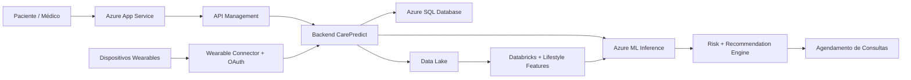

# ☁️ Arquitetura Cloud — CarePredict (Versão Revisada)

Este documento descreve a arquitetura cloud do **CarePredict**, sistema de medicina preventiva baseado em Machine Learning desenvolvido para a CarePlus.

O sistema integra dados clínicos com dados contínuos de **dispositivos wearables** (Apple HealthKit, Google Fit, Fitbit, Garmin, Oura Ring) para compor uma visão 360° do paciente e elevar a precisão dos modelos preditivos em **15–25%**.

A arquitetura foi projetada utilizando **Microsoft Azure** e segue princípios de:

- escalabilidade
- segurança de dados de saúde
- governança de dados
- MLOps
- integração contínua com dispositivos wearables
- conformidade LGPD com consentimento explícito

---

# 📊 Diagrama da Arquitetura Cloud

```mermaid
flowchart TB

%% USERS

Paciente[Paciente - Portal/App]
Medico[Médico - Dashboard]
Admin[Administrador]

%% FRONTEND

subgraph Frontend

WebApp[Azure App Service - Web Application]

end

%% API LAYER

subgraph API

APIM[Azure API Management]
Backend[Backend CarePredict API]
Auth[Azure Entra ID]

end

%% SECURITY

subgraph Security

KeyVault[Azure Key Vault]

end

%% DATA INGESTION

subgraph Ingestion

EventHub[Azure Event Hub]
DataFactory[Azure Data Factory]
PublicData[Ingestão de Dados Públicos]
WearableConn[Wearable Data Connector]
WearableOAuth[OAuth 2.0 Manager]

end

%% PRIVACY

subgraph Privacy

Anonymization[Data Anonymization Service]

end

%% DATA STORAGE

subgraph Storage

DataLake[Azure Data Lake Storage Gen2]
SQLDB[Azure SQL Database]
WearableTables[Wearable Tables - Azure SQL]

end

%% DATA PROCESSING

subgraph Processing

Databricks[Azure Databricks]
Synapse[Azure Synapse Analytics]

end

%% FEATURE STORE

subgraph FeatureLayer

FeatureStore[Feature Store]
LifestyleFeatures[Lifestyle Features Engine]

end

%% MACHINE LEARNING

subgraph MachineLearning

MLWorkspace[Azure Machine Learning]
Training[Model Training]
Registry[Model Registry]
Inference[ML Inference Endpoint]

end

%% APPLICATION SERVICES

subgraph Services

RiskEngine[Risk Scoring Engine]
ClinicalValidator[Clinical Guidelines Validator]
Recommendation[Recommendation Engine]
Scheduling[Scheduling Service]

end

%% MONITORING

subgraph Observability

Monitor[Azure Monitor]
AppInsights[Application Insights]

end

%% USERS

Paciente --> WebApp
Medico --> WebApp
Admin --> WebApp

%% FRONTEND → API

WebApp --> APIM
APIM --> Backend
Backend --> Auth

%% SECURITY

Backend --> KeyVault
Databricks --> KeyVault
MLWorkspace --> KeyVault
WearableOAuth --> KeyVault

%% DATA FLOW

Backend --> SQLDB
Backend --> WearableTables

%% EVENT STREAM

Backend --> EventHub

%% WEARABLE INGESTION (BATCH ONLY - OPÇÃO A)

Backend --> WearableConn
WearableConn --> WearableOAuth
WearableOAuth --> WearableTables
WearableConn --> Anonymization

%% DATA INGESTION

PublicData --> DataFactory
DataFactory --> Anonymization

Anonymization --> DataLake

%% DATA PROCESSING

DataLake --> Databricks
Databricks --> Synapse

%% FEATURE ENGINEERING

Synapse --> LifestyleFeatures
LifestyleFeatures --> FeatureStore

%% MACHINE LEARNING

FeatureStore --> Training
Training --> Registry
Registry --> Inference

%% APPLICATION LOGIC

Backend --> Inference
Inference --> RiskEngine
RiskEngine --> ClinicalValidator
ClinicalValidator --> Recommendation

Recommendation --> Scheduling

Scheduling --> Backend

%% MONITORING

Backend --> AppInsights
Inference --> Monitor
Databricks --> Monitor
WearableConn --> Monitor
````

---

## Sincronização de Wearables — OPÇÃO A (Batch Only)

A partir desta versão, a sincronização de dados wearables segue o modelo **Batch Only** (OPÇÃO A):

### Fluxo

```
Wearable Connector (cron diário, ex: 00:00 UTC)
    ↓
[Recupera tokens do Key Vault]
    ↓
[Consulta cada plataforma wearable dos últimos 24h]
    ↓
[Valida integridade + Normaliza unidades + Detecção de anomalias]
    ↓
[Envia lote para AnonymizationService]
    ↓
[AnonymizationService processa: Remove PII, Pseudonimização, Data Masking]
    ↓
[Armazena em Wearable Tables + Data Lake]
    ↓
[Atualiza Feature Store com novas features]
```

### Características

| Aspecto | Descrição |
|---------|-----------|
| **Frequência** | Uma vez ao dia (configurável: diária, a cada 12h, etc) |
| **Latência** | ~24h para dados estarem disponíveis em análise |
| **Processamento** | Batch consolidado (não streaming) |
| **Sem EventHub** | Dados wearables vão **direto** de WearableConnector → AnonymizationService |
| **Anonimização** | Batch processing conforme regras LGPD |
| **Vantagem** | Simples, previsível, menor overhead de infraestrutura |
| **Desvantagem** | Lag de até 24h em dados mais recentes |

### Nota: Remover EventHub

A arquitetura **não utiliza Azure Event Hub para dados wearables**. EventHub pode ser removido ou manter apenas para outros propósitos (logging/monitoring), mas **não participa do fluxo de ingestão de wearables**.

---

# 🧩 Explicação das Camadas

# 1️⃣ Camada de Aplicação

Usuários acessam o sistema através de:

* portal do paciente
* dashboard médico
* painel administrativo

Hospedagem:

**Azure App Service**

---

# 2️⃣ API Layer

Gerencia comunicação entre frontend e backend.

Componentes:

**Azure API Management**

* gateway de APIs
* controle de acesso
* rate limiting

**Backend CarePredict API**

* lógica de negócio
* integração com serviços de ML
* integração com sistemas externos

**Azure Entra ID**

* autenticação segura
* controle de identidade

---

# 3️⃣ Segurança

Dados de saúde exigem alto nível de segurança.

O sistema utiliza:

**Azure Key Vault**

para armazenar:

* segredos
* credenciais
* tokens de API
* chaves de criptografia

---

# 4️⃣ Ingestão de Dados

Dados entram no sistema por diferentes canais.

**Azure Data Factory**

* pipelines ETL batch para dados clínicos e populacionais
* ingestão de dados externos e transformação

**Dados Públicos — OPÇÃO B (On-Demand no Fluxo de Análise)** *(novo)*

Integração **On-Demand** durante análise preventiva:

* **Quando**: Durante a análise de risco, buscar dados públicos relevantes **contextualmente** para o paciente
* **Dados**: PopulationData baseado em **idade, gênero, região** do paciente
  - DATASUS: Incidência regional de doenças
  - IBGE: Dados estruturais populacionais
  - ANS: Dados regulatórios de saúde suplementar
* **Armazenamento**: Cache rápido (Redis/Memory, TTL: 24h)
* **Latência**: ~200ms para consulta (API call síncrona durante análise)
* **Vantagem**: Dados sempre atualizados, contextual ao paciente
* **Desvantagem**: Latência adicional por consulta, dependência de APIs externas
* **Aplicação**: Cloud Production

### Fluxo On-Demand
```
Análise preventiva do paciente (idade 45, região SP, gênero M)
        ↓
[FeatureEngineer solicita dados populacionais]
        ↓
[PopulationDataService consulta cache]
        ↓
cache miss → [Consulta DATASUS SP, IBGE 45+ male, ANS-SP]
        ↓
[Caché por 24h: "pop_data:SP:M:45-50" → dados epidemiológicos]
        ↓
[Retorna indicadores: prevalência HTN 28%, Diabetes 18%, etc]
        ↓
[FeatureEngineer incorpora aos features]
        ↓
[ML model executa com contexto populacional]
```

### Implementação
```python
class PopulationDataService:
    def __init__(self, redis_client, external_apis):
        self.cache = redis_client
        self.apis = external_apis  # DATASUS, IBGE, ANS
    
    def get_population_context(self, patient: Patient) -> PopulationContext:
        """
        Busca dados públicos contextualizados para o paciente.
        On-demand, com cache de 24h.
        """
        cache_key = f"pop_data:{patient.region}:{patient.gender}:{patient.age_range}"
        
        # Tenta cache
        cached = self.cache.get(cache_key)
        if cached:
            return PopulationContext.from_json(cached)
        
        # Cache miss: consulta APIs externas (em paralelo)
        datasus_data = self.apis.datasus.get_regional_diseases(
            region=patient.region,
            age_range=patient.age_range
        )
        ibge_data = self.apis.ibge.get_demographic_data(
            region=patient.region,
            demographics={
                "gender": patient.gender,
                "age": patient.age
            }
        )
        ans_data = self.apis.ans.get_health_insurance_indicators(
            region=patient.region
        )
        
        # Consolida contexto
        context = PopulationContext(
            regional_disease_prevalence=datasus_data,
            demographic_indicators=ibge_data,
            insurance_indicators=ans_data,
            timestamp=datetime.now()
        )
        
        # Armazena em cache
        self.cache.setex(cache_key, 86400, context.to_json())  # 24h TTL
        
        return context

class PopulationContext:
    regional_disease_prevalence: Dict[str, float]  # {"HTN": 0.28, "DM2": 0.18}
    demographic_indicators: Dict[str, Any]
    insurance_indicators: Dict[str, Any]
    timestamp: datetime
```

### No Fluxo de Análise
```python
def analisar_preventiva(patient: Patient):
    # Coleta dados clínicos
    clinical_data = get_clinical_history(patient)
    wearable_data = get_wearable_data(patient)
    
    # ✨ NOVO: Consulta população ON-DEMAND
    population_context = PopulationDataService.get_population_context(patient)
    
    # Merge de features
    features = FeatureEngineer.build(
        clinical=clinical_data,
        behavioral=wearable_data,
        population=population_context  # ← contexto atualizado
    )
    
    # ML executa com contexto atual
    predicoes = MLService.predict(features)
    return predicoes  # mais acuradas por contexto populacional
```

**Wearable Data Connector** *(novo - OPÇÃO A: Batch Only)*

Responsável pela ingestão de dados de dispositivos wearables em **batch diário**:

* Executa uma vez ao dia (cron configurável)
* Gerencia fluxo OAuth 2.0 com cada plataforma (Apple HealthKit, Google Fit, Fitbit, Garmin, Oura Ring)
* Coleta dados dos últimos 24h: atividade, frequência cardíaca, sono e estresse
* Sincronização batch: recupera histórico consolidado, valida, normaliza
* Tokens de acesso armazenados com segurança no **Azure Key Vault**
* Envia lote processado direto para **AnonymizationService** (sem EventHub)

**OAuth 2.0 Manager** *(novo)*

* Autorização por plataforma com factory pattern
* Refresh automático de tokens expirados
* Revogação de acesso via painel do paciente (LGPD)
* Auditoria de todas as operações de autorizacão

---

# 5️⃣ Privacidade e LGPD

Conformidade com **LGPD** é integrada em múltiplos níveis do sistema.

**Requisitos gerais:**

* Consentimento explícito para coleta e processamento de dados
* Direito ao esquecimento: paciente pode revogar autorização e agendar purge
* Auditoria de acesso: todos os acessos são registrados
* Criptografia: dados em trânsito (TLS) e em repouso (AES-256)

**Requisitos adicionais para wearables:**

* Consentimento explícito e **granular por plataforma** wearable (Apple, Google Fit, Fitbit, etc. — opt-in individual)
* Revogação de acesso: remove tokens OAuth e agenda purge dos dados históricos
* Dados brutos isolados em **zona PHI do Data Lake** (máxima restrição de acesso)
* Pseudonimização **antes** de qualquer pipeline analítico (patient_id → token_anonimo)
* Logs auditáveis de todas as operações: conexão, sincronização, revogação

---

# 5️⃣A Data Anonymization Service (Novo!)

Microserviço dedicado responsável por aplicar privacidade nos dados antes de persistência.

**Responsabilidades:**

1. **Pseudonimização** — Substitui patient_id por token pseudônimo
2. **Data Masking** — Remove ou mascara campos sensíveis
   - Nome, CPF, email (substitui por hash)
   - Endereço (mantém apenas UF e faixa etária)
3. **Data Suppression** — Remove dados desnecessários
   - Timestamps exatos → apenas data (sem hora)
   - IPs de origem → removidos completamente
4. **Auditoria** — Registra cada transformação aplicada

**Fluxo de Ativação:**

```
Evento com dados sensíveis (EventHub)
        ↓
[Data Anonymization Service intercepta]
        ↓
[Aplica regras de transformação conforme tipo de dado]
        ↓
[Emite evento anonimizado]
        ↓
[Persiste em Azure SQL ou Data Lake]
        ↓
[Log de auditoria → Azure Monitor]
```

**Integração com EventHub:**

- Todos os eventos de dados sensíveis passam por AnonymizationService
- Dados clínicos ✅ Anonimizados
- Dados de wearables ✅ Anonimizados (pseudonimizados)
- Dados públicos ❌ Já anonimizados na origem
- Dados transacionais (agenda, recomendações) ✅ Anonimizados

**Configuração por Tipo de Dado:**

| Tipo | Regra | Exemplo |
|---|---|---|
| **Patient ID** | Pseudonimização | `pac_12345` → `anon_a7f3` |
| **Nome** | Remoção | `João Silva` → `REMOVED` |
| **CPF** | Hash + mascaramento | `123.456.789-00` → `***-***-789-00` |
| **Email** | Hash | `john@example.com` → `f7d3e...` |
| **Timestamp** | Data apenas | `2026-03-25 14:32:15` → `2026-03-25` |
| **IP/Location** | Remoção | `192.168.1.1` → `REMOVED` |
| **Dados wearables** | Pseudonimizados | Vinculado a `anon_a7f3`, não ao paciente |

**Falha Segura:**

Se AnonymizationService não responder:
- Evento é enfileirado em Dead Letter Queue
- Não persiste dados sensíveis
- Alerta é disparado
- Operador revisa manualmente

**Performance:**

- Latência alvo: <100ms por evento
- Taxa: suporta 10k eventos/seg por instância
- Escalabilidade: múltiplas instâncias via Azure Service Bus

**Compliance:**

✅ LGPD-compliant — Anonimização "de facto" per LGPD artigo 6°
✅ Auditável — Cada transformação registrada
✅ Reversível — Hash mantém rastreabilidade interna (não expõe ao paciente)
✅ Seguro — Chaves de criptografia em Azure Key Vault

---

# 6️⃣ Armazenamento

Dois tipos de armazenamento são utilizados (OPÇÃO A — Azure SQL Cloud + PostgreSQL MVP).

### Azure SQL Database — Cloud Production

Banco de dados relacional gerenciado pela Microsoft. Armazena **todos os dados transacionais e operacionais** da Cloud:

**Dados Clínicos**:
- pacientes
- consultas
- exames
- diagnósticos
- recomendações

**Dados de Wearables** (últimas 4 semanas):
- `wearable_devices` — dispositivos conectados e tokens OAuth
- `wearable_heartrate` — séries de FC, HRV, FC em repouso
- `wearable_activity` — passos, distância, exercícios, calorias
- `wearable_sleep` — duração, sono profundo/REM, qualidade
- `wearable_stress` — nível de estresse, recuperação, burnout

**Características**:
- ✅ LGPD-compliant (encryption at rest + transit)
- ✅ Backup automático
- ✅ Compliance: SOC 2, HIPAA
- ✅ Schema idêntico ao MVP (PostgreSQL) para portabilidade

### PostgreSQL — MVP Local

Banco de dados open-source usado no **ambiente local de desenvolvimento** (Docker Compose). Mesmo schema que Azure SQL para facilitar migração Cloud ↔️ MVP:

- 100% compatível com dados da Cloud
- Funcionalidade idêntica
- Fácil para testes e desenvolvimento local

---

### Azure Data Lake Storage

dados analíticos organizados em zonas:

| Zona | Conteúdo |
|---|---|
| PHI Zone | Dados brutos sensíveis — acesso restrito |
| Raw | Dados normalizados (clínicos + wearables) |
| Processed | Dados limpos e enriched |
| Curated | Features de ML e lifestyle features prontas |

---

# 7️⃣ Processamento de Dados

**Azure Databricks**

responsável por:

* processamento de dados clínicos e wearables
* limpeza e validação (detecção de outliers em séries wearable)
* normalização (conversão de unidades, alinhamento de fuso horário)
* enriquecimento (médias móveis, detecção de padrões)
* feature engineering de lifestyle features

**Processamento específico de wearables:**

1. Validação — outliers, dados ausentes, consistência entre fontes
2. Normalização — unidades padronizadas, UTC, formato canônico
3. Enriquecimento — médias de 7/30 dias, scores compostos
4. Feature engineering — 13+ lifestyle features para o Feature Store

**Azure Synapse**

utilizado para:

* analytics sobre dados clínicos + comportamentais
* consultas analíticas para BI e relatórios
* alimentação do Lifestyle Features Engine

---

# 8️⃣ Feature Store — Repositório Centralizado de Features

O **Feature Store** é um repositório centralizado que armazena, versions e governa features (variáveis) utilizadas pelos modelos de Machine Learning.

## Propósito

Eliminar:
- ❌ Duplicação de lógica de feature engineering
- ❌ Inconsistência entre treino e produção (skew)
- ❌ Perda de rastreabilidade (qual feature foi usada onde?)
- ❌ Recálculos redundantes

Permitir:
- ✅ Versionamento automático de features
- ✅ Reutilização entre múltiplos modelos
- ✅ Lineage tracking (rastreabilidade completa)
- ✅ Governança de ML (auditoria de features)

---

## Implementação na Cloud: Azure Databricks Feature Store

**Plataforma escolhida**: Azure Databricks (integrada com Synapse, SQL, ML)

### Estrutura

```
┌─────────────────────────────────────────────────────┐
│         Databricks Feature Store                     │
├─────────────────────────────────────────────────────┤
│                                                      │
│  FeatureSet: Clinical_Features                      │
│  ├─ age ✅ version: 3                               │
│  ├─ imc ✅ version: 2                               │
│  ├─ diabetes_history ✅ version: 1                  │
│  └─ [+ 15 mais]                                     │
│                                                      │
│  FeatureSet: Lifestyle_Features  (NOVO!)            │
│  ├─ avg_weekly_steps ✅ version: 2                  │
│  ├─ sleep_quality_score ✅ version: 2              │
│  ├─ stress_level_avg ✅ version: 1                 │
│  └─ [+ 10 mais]                                     │
│                                                      │
│  FeatureSet: Population_Features                    │
│  ├─ diabetes_incidence_region ✅ version: 1         │
│  ├─ age_group_risk ✅ version: 1                    │
│  └─ [+ 8 mais]                                      │
│                                                      │
└─────────────────────────────────────────────────────┘
         ↓
    [Metadata: descrição, dono, SLA, qualidade]
         ↓
    [Lineage: qual job computou? há quanto tempo?]
         ↓
    [Access Log: qual modelo usou quando?]
```

### Dois Tipos de Features

#### **1. On-Demand Features** (Tempo Real)

Computadas quando solicitadas, não pré-calculadas:

```
[API solicitação de análise para paciente X]
     ↓
[Feature Store: Quais features precisam ser computadas NOW?]
     ↓
[On-Demand Engine calcula live]
     ↓
[Retorna ao modelo para inference imediata]
```

**Exemplos:**
- `current_heart_rate` — FC em tempo real
- `steps_today` — Passos até agora hoje
- `sleep_hours_last_night` — Sono da noite passada

**Performance**: <100ms para calcular

#### **2. Batch Features** (Pré-calculadas)

Computadas em batch diário/horário, armazenadas no Feature Store:

```
[Wearable Sync Worker coleta dados]
     ↓
[Databricks Job: Feature Engineering]
     ↓
[Calcula 13+ lifestyle features]
     ↓
[Armazena no Feature Store + versiona melhor]
     ↓
[Modelos consultam Feature Store para inference]
```

**Exemplos:**
- `avg_weekly_steps` — Agregado da semana
- `sleep_quality_score` — Score 0-100
- `burnout_risk` — Flag booleano

**Performance**: Acesso em <10ms from cache

### 13+ Lifestyle Features Comportamentais (NOVO!)

Computadas do Wearable Data Lake pelo Lifestyle Features Engine:

| ID | Feature | Tipo | Frequência | Descrição |
|----|---------|------|-----------|-----------|
| 1 | `avg_weekly_steps` | Float | Batch (diário) | Média de passos últimos 7 dias |
| 2 | `active_days_ratio` | Float | Batch (diário) | % de dias com atividade >30min |
| 3 | `exercise_consistency` | Float | Batch (diário) | Regularidade exercícios (StdDev) |
| 4 | `activity_trend` | Float | Batch (diário) | Slope (crescente/decrescente) |
| 5 | `avg_resting_hr` | Float | On-Demand | FC repouso última hora |
| 6 | `hrv_avg` | Float | Batch (diário) | Variabilidade FC 7 dias |
| 7 | `hrv_trend` | Float | Batch (diário) | Tendência HRV |
| 8 | `avg_sleep_duration` | Float | Batch (diário) | Horas sono último mês |
| 9 | `sleep_quality_score` | Int 0-100 | Batch (diário) | Score qualidade (deep% + REM%) |
| 10 | `sleep_consistency` | Float | Batch (diário) | StdDev horários sono |
| 11 | `insomnia_flag` | Bool | Batch (diário) | 1 se <6h nos últimos 7 dias |
| 12 | `stress_level_avg` | Int 0-100 | Batch (diário) | Nível estresse semanal |
| 13 | `burnout_risk` | Bool | Batch (diário) | 1 se stress>70 E sono<6h |
| 14 | `recovery_days_ratio` | Float | Batch (diário) | % dias com HRV acima baseline |
| 15 | `lifestyle_compliance_score` | Int 0-100 | Batch (diário) | Composite: (activity + sleep + recovery) / 3 |

Essas features são combinadas com **features clínicas + populacionais** para alimentar os modelos de ML, gerando **15–25% de melhoria na precisão preditiva**.

### Versionamento de Features

```
Feature: avg_weekly_steps
├─ Version 1 (2026-01-01): Cálculo simples (mean)
├─ Version 2 (2026-02-01): Cálculo com outlier removal ← Atual
└─ Version 3 (Planejado): Cálculo com anomaly detection

Rastreabilidade:
- Modelo v2.1 usa: avg_weekly_steps v1, sleep_quality_score v2
- Modelo v2.2 usa: avg_weekly_steps v2, sleep_quality_score v2 ← Melhor acurácia!
```

### Lineage Tracking (Rastreabilidade)

Para cada feature armazenada:

```json
{
  "feature_name": "avg_weekly_steps",
  "version": 2,
  "last_computed": "2026-03-25T10:00:00Z",
  "computed_by_job": "wearable-sync-worker-daily",
  "source_data": ["wearable_activity table"],
  "owner": "data-engineering@careplus",
  "sla_freshness": "24 hours",
  "quality_metrics": {
    "completeness": 0.98,
    "accuracy": 0.99,
    "timeliness": 0.995
  },
  "models_using_this": [
    "risk_prediction_v2.1",
    "lifestyle_coaching_v1.0"
  ],
  "last_accessed": "2026-03-25T14:32:15Z",
  "access_log": [
    "risk_prediction_v2.1 at 2026-03-25 09:15",
    "risk_prediction_v2.1 at 2026-03-25 14:32"
  ]
}
```

### API de Acesso

```python
# Python SDK
from databricks import feature_store

with feature_store.FeatureStoreCatalog() as fs:
    # Acesso offline (para treino)
    features_df = fs.read_table(
        name="carepredict.clinical_features",
        as_of_delta_timestamp="2026-02-01"  # Versão específica
    )
    
    # Acesso online (para inferência)
    patient_features = fs.read_feature(
        feature_lookups=[
            FeatureLookup(table_name="carepredict.lifestyle_features", 
                         lookup_key="patient_id"),
            FeatureLookup(table_name="carepredict.clinical_features",
                         lookup_key="patient_id")
        ],
        filter=f"patient_id = '{patient_id}'"
    )
```

---

## Lifestyle Features Engine (NOVO!)

Componente específico que **calcula, valida e publica** as 15 lifestyle features.

### Arquitetura

```
[Wearable Data Lake (Curated Zone)]
        ↓
    [Validação de Qualidade]
        ↓
    [Cálculo de Agregações]
    - Médias móveis (7, 14, 30 dias)
    - Desvios padrão
    - Tendências (slopes)
    - Flags booleanos
        ↓
    [Publicação para Feature Store]
        ↓
    [Metadata: versão, timestamp, qualidade]
        ↓
[Azure Databricks Feature Store]
```

### Job Diário

```yaml
# Databricks Job: lifestyle_features_daily
schedule: "0 2 * * *"  # 2 AM UTC diariamente
notebook: lifestyle_features_engine.py
parameters:
  lookback_days: 30
  min_data_points: 20  # Require 20+ days de dados
timeout_seconds: 3600

on_success:
  - Alert: Feature Store updated
  - Log: Success to Application Insights

on_failure:
  - Alert: Feature computation failed
  - Rollback: Keep previous version
  - Retries: 3x com backoff exponencial
```

---

## Governança de Features

### Data Quality Checks

Antes de publicar feature:

```python
assert df['avg_weekly_steps'].min() >= 0, "Passos não podem ser negativos"
assert df['avg_weekly_steps'].max() <= 100000, "Passos > 100k é anomalia"
assert df['sleep_quality_score'].between(0, 100).all(), "Score fora da range"
assert df['patient_id'].nunique() > 1000, "Too few patients processed"
assert df['_modified_time'].max() > datetime.now() - timedelta(hours=2), "Data too old"
```

Falhas: Rejeitam publicação, mantém versão anterior, alertam operador.

### Access Control

```
┌─────────────────────────────────┐
│ Feature Store Access Levels      │
├─────────────────────────────────┤
│ View: Cientistas de Dados       │
│ Modify: Data Engineers + MLOps  │
│ Admin: Engineering Manager      │
└─────────────────────────────────┘

Auditoria: Cada acesso é registrado
  - Quem: User identity
  - Quando: Timestamp
  - O quê: Qual feature, qual versão
  - Por quê: Qual modelo
```

---

# 9️⃣ Plataforma de Machine Learning

Implementada com **Azure Machine Learning**.

Componentes:

### Model Training

Treinamento dos modelos com três categorias de features:

* **Features clínicas** — histórico de exames, diagnósticos, medicamentos
* **Lifestyle features** — 13+ features comportamentais de wearables
* **Features populacionais** — benchmarks DATASUS/IBGE por perfil demográfico

### Model Registry

Controle de versões com rastreamento de:

* versão do modelo
* conjunto de features utilizadas
* métricas de avaliação (com e sem wearables)
* data de corte do dataset de treinamento

### Inference Endpoint

API de predição em produção com suporte a:

* inferência em tempo real (paciente individual)
* inferência batch (cohortes para campanhas preventivas)
* fallback gracioso quando dados wearables estão ausentes (modelo clinico-only)

---

# 🔟 Motor de Risco e Recomendação (OPÇÃO B — Clinical Guidelines Validator)

O fluxo de recomendações segue um modelo de **3 passos** com validação clínica formal:

```
┌──────────────┐     ┌────────────────────┐     ┌──────────────────┐     ┌─────────────┐
│ ML Service   │────▶│ Risk Scoring       │────▶│ Clinical         │────▶│ Recommend.  │
│ (Predições)  │     │ Engine             │     │ Guidelines       │     │ Engine      │
└──────────────┘     │ (PredicaoRisco +   │     │ Validator        │     │ (Output)    │
                     │  HealthScore)      │     │ (Validação)      │     └─────────────┘
                     └────────────────────┘     └──────────────────┘
```

## Passo 1️⃣: Risk Scoring Engine

**Entrada**: Feature vector completo
- Clínicos: diagnósticos anteriores, medicações, comorbidades
- Comportamentais: atividade média, qualidade de sono, variabilidade FC, estresse
- Populacionais: epidemiologia local, prevalência

**Processamento**:
```python
class RiskScoringEngine:
    def calcular(self, features: LifestyleFeatures, patient_history: ClinicalHistory):
        # Executar modelo ML
        predicoes_brutas = self.ml_service.predict(features)
        
        # Montar array de riscos
        predicoes_risco = []
        for doenca, probabilidade in predicoes_brutas.items():
            predicoes_risco.append(PredicaoRisco(
                doenca=doenca,
                probabilidade=probabilidade,
                confianca=self._calcular_confianca(features, doenca),
                features_criticas=self._features_para_doenca(doenca)
            ))
        
        # Calcular score único agregado
        health_score = self._calcular_health_score(predicoes_risco)
        
        return predicoes_risco, health_score

class PredicaoRisco:
    doenca: str                # Ex: "Diabetes Tipo 2"
    probabilidade: float       # Ex: 0.34 (34%)
    confianca: float          # Ex: 0.87 (87%)
    features_criticas: List[str]  # Features que mais influenciaram
    data_analise: datetime
```

**Saída**:
```json
{
  "predicoes_risco": [
    {
      "doenca": "Diabetes Tipo 2",
      "probabilidade": 0.34,
      "confianca": 0.87,
      "features_criticas": ["avg_weekly_steps", "imc"]
    },
    {
      "doenca": "Síndrome Metabólica",
      "probabilidade": 0.42,
      "confianca": 0.79,
      "features_criticas": ["imc", "stress_level_avg"]
    }
  ],
  "health_score": {
    "valor": 71,
    "categoria": "Risco Baixo",
    "timestamp": "2026-03-25T10:30:00Z"
  }
}
```

---

## Passo 2️⃣: Clinical Guidelines Validator (NOVO — OPÇÃO B)

**Responsabilidade**: Validar a **apropriação clínica** de cada predição antes da recomendação

**Entrada**: PredicaoRisco array + HealthScore + dados do paciente

**Validação Aplicada**:

```python
class ClinicalGuidelinesValidator:
    
    def validar_predicoes(self, 
                         predicoes_risco: List[PredicaoRisco],
                         patient: Patient) -> ValidacaoCinica:
        """
        Valida se cada risco é clinicamente apropriado para o paciente
        """
        validacoes = []
        
        for predicao in predicoes_risco:
            # 1. Verificar protocolo de rastreamento por idade
            exames_para_idade = self._protocolos_por_idade[patient.age][predicao.doenca]
            
            # 2. Verificar contraindições clínicas
            contradicoes = self._verificar_contradicoes(patient, predicao.doenca)
            
            # 3. Verificar diretrizes de acompanhamento
            frequencia = self._frequencia_rastreamento(predicao.probabilidade, 
                                                        patient.medical_history)
            
            # 4. Filtrar se probabilidade < threshold clínico
            if predicao.probabilidade < 0.15:
                validacoes.append({
                    "doenca": predicao.doenca,
                    "valida": False,
                    "motivo": "Probabilidade abaixo do threshold clínico (15%)"
                })
                continue
            
            # 5. Aprovar com protocolo
            validacoes.append({
                "doenca": predicao.doenca,
                "valida": True,
                "protocolo": exames_para_idade[0],  # Primeiro exame recomendado
                "frequencia": frequencia,
                "contradicoes": contradicoes
            })
        
        return ValidacaoCinica(
            predicoes_validadas=[v for v in validacoes if v["valida"]],
            predicoes_rejeitadas=[v for v in validacoes if not v["valida"]],
            timestamp=datetime.now()
        )

class ValidacaoCinica:
    predicoes_validadas: List[Dict]  # Riscos aprovados para recomendação
    predicoes_rejeitadas: List[Dict] # Riscos filtrados (abaixo threshold, contradicao, etc)
    timestamp: datetime
```

**Saída**:
```json
{
  "predicoes_validadas": [
    {
      "doenca": "Hipertensão",
      "protocolo": "Medição de PA em duas ocasiões diferentes",
      "frequencia": "Anual caso HealthScore > 60",
      "contradicoes": []
    }
  ],
  "predicoes_rejeitadas": [
    {
      "doenca": "Apneia do Sono",
      "motivo": "Probabilidade 0.12 abaixo do threshold (0.15)"
    }
  ]
}
```

---

## Passo 3️⃣: Recommendation Engine

**Entrada**: ValidacaoCinica + LifestyleFeatures + HealthScore

**Processamento**:

```python
def gerar_recomendacoes(validacao_clinica: ValidacaoCinica,
                       patient_features: LifestyleFeatures,
                       health_score: HealthScore):
    
    recomendacoes = []
    
    # PRIORIDADE 1: Exames baseados em riscos validados
    for risco_validado in validacao_clinica.predicoes_validadas:
        recomendacoes.append({
            "tipo": "exame",
            "descricao": risco_validado["protocolo"],
            "prioridade": "alta",
            "doenca": risco_validado["doenca"],
            "frequencia": risco_validado["frequencia"]
        })
    
    # PRIORIDADE 2: Lifestyle baseado em features baixas
    if patient_features.avg_weekly_steps < 7000:
        recomendacoes.append({
            "tipo": "lifestyle",
            "descricao": "Aumentar atividade física para 7000+ passos/semana",
            "prioridade": "media",
            "baseado": "avg_weekly_steps baixo",
            "duracao": "Contínuo"
        })
    
    if patient_features.sleep_quality_score < 60:
        recomendacoes.append({
            "tipo": "lifestyle",
            "descricao": "Melhorar higiene do sono (horários regulares, reduzir luz azul)",
            "prioridade": "media",
            "baseado": "sleep_quality_score baixo"
        })
    
    # PRIORIDADE 3: Consultas com especialistas
    if health_score.valor < 50:
        recomendacoes.append({
            "tipo": "consulta",
            "especialidade": "Medicina Preventiva",
            "prioridade": "alta",
            "motivo": f"HealthScore {health_score.valor} (Risco Alto)"
        })
    
    return recomendacoes
```

**Saída Final**:
```json
{
  "health_score": 71,
  "categoria_risco": "Risco Baixo",
  "recomendacoes": [
    {
      "tipo": "exame",
      "descricao": "Medição de PA em duas ocasiões diferentes",
      "prioridade": "alta",
      "doenca": "Hipertensão",
      "frequencia": "Anual"
    },
    {
      "tipo": "lifestyle",
      "descricao": "Aumentar atividade física para 7000+ passos/semana",
      "prioridade": "media"
    },
    {
      "tipo": "consulta",
      "especialidade": "Nutrição",
      "prioridade": "media",
      "motivo": "Síndrome Metabólica 42% — recomendação nutricional"
    }
  ],
  "validacao": {
    "predicoes_validadas": 2,
    "predicoes_rejeitadas": 1,
    "motivos_rejeicao": ["Probabilidade abaixo do threshold"]
  }
}
```

---

### Fluxo Completo (OPÇÃO B)

| Etapa | Componente | Entrada | Processamento | Saída |
|-------|-----------|---------|----------------|-------|
| 1 | **Risk Scoring Engine** | Features + Histórico | Modelo ML enriquecido | `PredicaoRisco[]` + `HealthScore` |
| 2 | **Clinical Guidelines Validator** | Predições brutas | Valida vs protocolos médicos | `PredicoesValidadas[]` + `Rejeitadas[]` |
| 3 | **Recommendation Engine** | Predições validadas | Gera exames + lifestyle + consultas | Recomendações priorizadas |

**Por que OPÇÃO B é mais segura**:
✅ Validação clínica formal antes de recomendar
✅ Documentação de por que um risco foi rejeitado (auditável)
✅ Conformidade com protocolos médicos nacionais/internacionais
✅ Reduz recomendações desnecessárias
✅ Apropriado para ambiente de saúde (accountability médica)

---

# 11️⃣ Serviço de Agendamento

Responsável por:

* consultar agenda médica
* agendar consultas
* agendar exames

Pode integrar com sistemas externos de agenda.

---

# 12️⃣ Observabilidade

Monitoramento do sistema.

**Azure Monitor**

* métricas de infraestrutura
* logs centralizados
* alertas e dashboards
* métricas de sincronização wearables (taxa de sucesso, latência, features geradas)

**Application Insights**

* monitoramento de APIs (incluindo Wearable Connector)
* performance da aplicação
* rastreamento de requests ponta a ponta

**Monitoramento específico de wearables:**

* taxa de tokens válidos por plataforma
* volume de dados sincronizados por dia
* alertas de degradação de qualidade de dados (ex: menos de 70% dos dias com dados)
* auditoria de consentimentos e revogações (LGPD)

---

# 📊 Arquitetura Simplificada (boa para slides)



---

# 📋 Tabela Comparativa — Com e Sem Wearables

| Dimensão | Sem Wearables | Com Wearables |
|---|---|---|
| Frequência de dados | Pontual (consultas) | Contínua (24/7) |
| Granularidade | Diagnósticos e exames | Comportamento diário |
| Precisão dos modelos | Baseline | +15–25% |
| Personalização | Perfil clínico | Perfil clínico + comportamental |
| Detecção precoce | Reativa | Proativa (tendências) |
| Engajamento do paciente | Baixo | Alto (dados próprios visíveis) |

---

# 🎯 Notas Arquiteturais

## Decisões de Armazenamento de Dados

### Estratégia Dual Storage para Wearables

✅ **Azure SQL Database**: Dados transacionais recentes de wearables (últimas 4 semanas)
- Tabelas: `wearable_devices`, `wearable_heartrate`, `wearable_activity`, `wearable_sleep`, `wearable_stress`
- Acesso: Tempo real para APIs, queries rápidas
- Retenção: Operacional (últimas 4 semanas)

✅ **Azure Data Lake**: Histórico completo em zonas estratificadas
- PHI Zone: Dados brutos sensíveis, isolados com criptografia AES-256
- Raw/Processed/Curated: Transformações progressivas para ML
- Acesso: Batch processing, analytics, feature engineering
- Retenção: Histórico completo (7+ anos para compliance)

### Modo de Sincronização

✅ **Batch Only (OPÇÃO A)**
- **Batch Diário**: Reconciliação completa e feature engineering (via Wearable Sync Worker)
- **Sem Streaming**: EventHub não participa do fluxo de ingestão de wearables
- **Previsível**: Janela diária padronizada para processamento e auditoria

### Componentes críticos

✅ **Data Anonymization Service**: Microserviço separado entre EventHub e DataLake
- Aplica anonimização e pseudonimização de dados sensíveis
- Auditável, LGPD-compliant

✅ **Feature Store Dedicado**: Azure Databricks/ML Feature Store
- Versionamento automático de features
- Rastreabilidade entre treino e produção

✅ **Dados Públicos**: On-Demand com cache (OPÇÃO B)
- Consulta durante análise preventiva por idade/gênero/região
- Cache TTL 24h para reduzir latência e chamadas externas
- Integração com DATASUS, IBGE e ANS para enriquecimento demográfico

---

## Alinhamento MVP ↔️ Cloud

Este documento descreve a **arquitetura Cloud Production**.

O **MVP Local** (ver `ARQUITETURA CLOUD - MVP LOCAL DOCKER.md`) é uma **versão simplificada intencional**:
- PostgreSQL em vez de Azure SQL (mas schema compatível)
- MinIO em vez de Azure Data Lake + Databricks (mas mesma lógica de camadas)
- Anonimização ausente (dados não sensíveis no MVP)
- Batch apenas (sem streaming em tempo real)
- Sem dados públicos (MVP focado em fluxo clínico + wearables)

A transição MVP → Cloud é **incremental**: componentes são substituídos, lógica permanece.

---