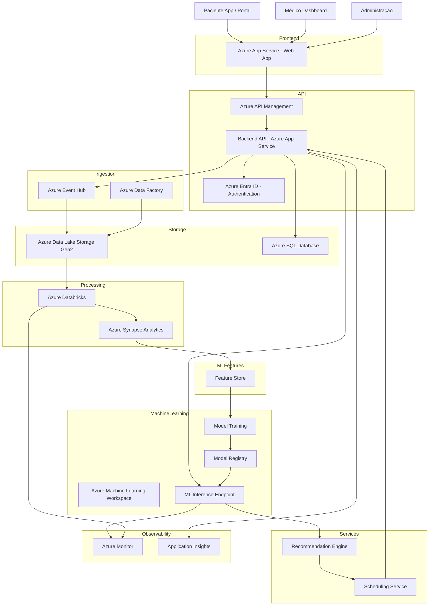
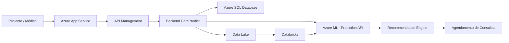

# ☁️ Arquitetura Cloud — CarePredict (Azure)

---

# 🧩 Explicação da Arquitetura

## 1️⃣ Camada de Aplicação

Usuários acessam:

* portal do paciente
* dashboard do médico
* painel administrativo

Hospedagem:

* **Azure App Service**

---

# 2️⃣ API Layer

Gerencia acesso aos serviços.

Componentes:

**Azure API Management**

* gateway de APIs
* segurança
* controle de acesso

**Backend API**

* lógica do CarePredict
* integração com ML

**Azure Entra ID**

* autenticação segura

---

# 3️⃣ Ingestão de Dados

Entrada de dados clínicos.

**Azure Event Hub**

* streaming de eventos

**Azure Data Factory**

* pipelines ETL

Exemplos de dados:

* exames
* consultas
* histórico clínico

---

# 4️⃣ Armazenamento

**Azure Data Lake Storage Gen2**

armazenamento de dados clínicos e históricos.

**Azure SQL Database**

dados transacionais:

* pacientes
* consultas
* exames
* recomendações

---

# 5️⃣ Processamento de Dados

**Azure Databricks**

* processamento de dados
* feature engineering

**Azure Synapse**

* analytics
* consultas analíticas

---

# 6️⃣ Machine Learning

Pipeline de ML usando **Azure Machine Learning**.

Componentes:

**Training**

treinamento dos modelos.

**Model Registry**

controle de versões.

**Inference Endpoint**

API de predição em produção.

---

# 7️⃣ Recommendation Engine

Transforma previsões em ações:

* sugerir exames
* recomendar consultas
* priorizar pacientes

---

# 8️⃣ Scheduling Service

Responsável por:

* consultar agenda médica
* agendar exames
* agendar consultas

---

# 9️⃣ Observabilidade

Monitoramento do sistema.

**Azure Monitor**

* métricas
* logs

**Application Insights**

* performance das APIs
* erros

---

# 🔐 Segurança (Essencial em Saúde)

Arquitetura deve incluir:

* **Azure Key Vault** → segredos e chaves
* **criptografia de dados**
* **controle de acesso por RBAC**
* **compliance LGPD**

---

# 📊 Arquitetura Simplificada (boa para slide)

