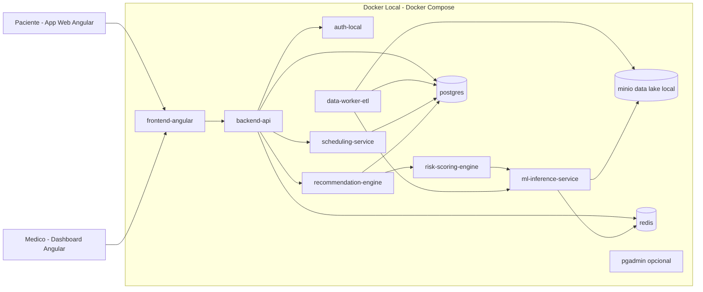

# Arquitetura Cloud - MVP Local com Docker (CarePredict)

Este documento define uma arquitetura simplificada para o MVP do CarePredict executando 100% localmente com Docker.

Objetivo: validar fluxo funcional de medicina preventiva (ingestao -> processamento -> inferencia -> recomendacao -> agendamento) sem dependencia inicial de cloud publica.

---

## 1. Objetivos do MVP

- Entregar um ambiente reproduzivel em maquina de desenvolvimento.
- Permitir testes ponta a ponta com dados sinteticos.
- Reduzir custo de infraestrutura na fase inicial.
- Preparar base para migracao futura para Azure.

---

## 2. Principios de Arquitetura

- Simplicidade primeiro: menos servicos, mais foco em fluxo de negocio.
- Isolamento por containers: cada responsabilidade em um servico.
- Persistencia local: dados mantidos em volumes Docker.
- Observabilidade minima: logs centralizados por servico.
- Seguranca basica desde o inicio: secrets por env vars e segregacao de dados sensiveis.

---

## 3. Visao Geral da Arquitetura



---

## 4. Componentes do MVP

### 4.1 Frontend Angular

- Portal do paciente e dashboard medico.
- Consome apenas o backend API.
- Build e execucao via container Node/Nginx.

### 4.2 Backend API

- Orquestra casos de uso de paciente, medico e recomendacao.
- Expone endpoints REST para frontend.
- Integracao com banco, motor de recomendacao e agendamento.

### 4.3 Servico de Inferencia ML

- Recebe features e retorna probabilidades de risco.
- Inicialmente com modelo versionado em arquivo local.
- Interface HTTP simples para integracao rapida.

### 4.4 Risk Scoring Engine

- Traduz probabilidades em score de risco por paciente.
- Consolida sinais clinicos e gera Health Score.

### 4.5 Recommendation Engine

- Aplica regras clinicas sobre score e fatores de risco.
- Retorna recomendacoes de exames e consultas.

### 4.6 Scheduling Service

- Simula integracao com agenda externa.
- Permite criar e consultar horarios para consultas/exames.

### 4.7 Data Worker (ETL)

- Ingestao batch de dados clinicos e dados publicos.
- Normalizacao e escrita em camadas locais (raw/processed/curated).
- Atualiza features para inferencia.

### 4.8 Persistencia

- Postgres: dados transacionais (pacientes, consultas, recomendacoes).
- MinIO: data lake local (raw, processed, curated).
- Redis: cache e filas leves (se necessario).

---

## 5. Fluxos Principais

### 5.1 Fluxo preventivo

1. Frontend solicita analise preventiva para paciente.
2. API consulta historico no Postgres.
3. API envia features para ML Inference Service.
4. Risk Scoring Engine calcula score consolidado.
5. Recommendation Engine gera recomendacoes.
6. API persiste resultado e responde ao frontend.

### 5.2 Fluxo de agendamento

1. Paciente seleciona recomendacao.
2. API consulta Scheduling Service.
3. Horarios disponiveis sao retornados.
4. Agendamento e confirmado e salvo no Postgres.

### 5.3 Fluxo de atualizacao de dados

1. Data Worker processa lotes de entrada.
2. Dados sao gravados no MinIO por camada.
3. Features derivadas sao atualizadas.
4. Novo artefato de modelo pode ser publicado localmente.

---

## 6. Topologia de Rede e Dados

- Rede unica Docker Compose para comunicacao interna.
- Apenas frontend e API expostos ao host.
- Banco e servicos internos acessiveis apenas por rede interna.
- Volumes persistentes para Postgres e MinIO.

Exemplo de portas locais:

- Frontend Angular: 4200
- Backend API: 8080
- ML Inference: 8001
- Postgres: 5432
- MinIO API: 9000
- MinIO Console: 9001
- PgAdmin (opcional): 5050

---

## 7. Estrutura Sugerida de Servicos no Docker Compose

```yaml
services:
  frontend-angular:
    build: ./frontend
    ports: ["4200:4200"]
    depends_on: [backend-api]

  backend-api:
    build: ./backend
    ports: ["8080:8080"]
    depends_on: [postgres, redis, ml-inference-service]

  ml-inference-service:
    build: ./ml/inference
    ports: ["8001:8001"]

  recommendation-engine:
    build: ./services/recommendation
    depends_on: [ml-inference-service, postgres]

  risk-scoring-engine:
    build: ./services/risk
    depends_on: [ml-inference-service]

  scheduling-service:
    build: ./services/scheduling
    depends_on: [postgres]

  data-worker-etl:
    build: ./data/worker
    depends_on: [minio, postgres]

  postgres:
    image: postgres:16
    environment:
      POSTGRES_DB: carepredict
      POSTGRES_USER: carepredict
      POSTGRES_PASSWORD: carepredict
    volumes:
      - pg_data:/var/lib/postgresql/data

  minio:
    image: minio/minio
    command: server /data --console-address ":9001"
    environment:
      MINIO_ROOT_USER: minio
      MINIO_ROOT_PASSWORD: minio123
    volumes:
      - minio_data:/data

  redis:
    image: redis:7-alpine

volumes:
  pg_data:
  minio_data:
```

---

## 8. Seguranca e LGPD no Ambiente Local

- Dados sensiveis apenas para desenvolvimento e testes.
- Preferir dados sinteticos ou anonimizados.
- Segredos via arquivo .env (nao versionar).
- Controle de acesso por perfil na aplicacao (paciente, medico, admin).
- Logs sem dados pessoais identificaveis.

---

## 9. Observabilidade Minima do MVP

- Logs estruturados por servico (JSON quando possivel).
- Correlacao por request-id entre frontend, API e servicos internos.
- Healthcheck por endpoint /health em cada servico.
- Monitoramento inicial por docker compose logs e dashboards simples.

---

## 10. Limites do MVP Local

- Sem alta disponibilidade real.
- Escalabilidade limitada ao host local.
- Sem IAM corporativo completo.
- Sem governanca de dados de nivel produtivo.

Este desenho e proposital para acelerar validacao funcional e tecnica.

---

## 11. Caminho de Evolucao para Cloud

Quando o MVP estiver validado, migrar gradualmente:

- Docker local -> Kubernetes/Container Apps.
- MinIO local -> Data Lake em Azure.
- Postgres local -> Azure SQL/PostgreSQL gerenciado.
- Logs locais -> Azure Monitor/Application Insights.
- Segredos em .env -> Azure Key Vault.

Assim, o time preserva a arquitetura logica e troca apenas a camada de infraestrutura.
