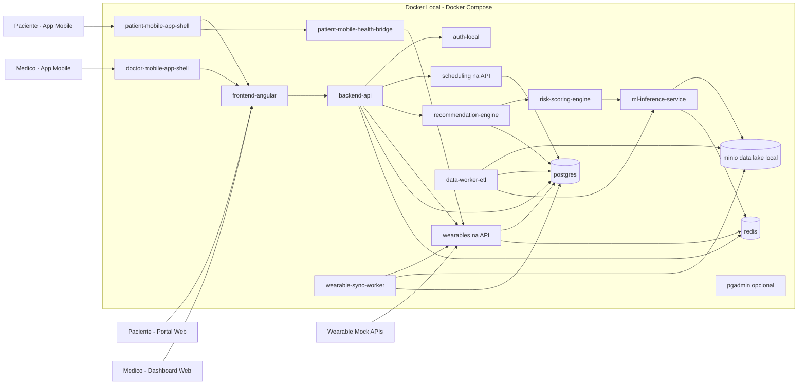

# Arquitetura Cloud - MVP Local com Docker (CarePredict)

Este documento define a arquitetura alvo do MVP do CarePredict executando localmente com Docker.

> O diagrama abaixo representa a direção do MVP local. Nem todos os serviços listados estão ativos ao mesmo tempo no compose real.

Objetivo: validar fluxo funcional de medicina preventiva integrando dados clinicos e dados continuos de dispositivos wearables (ingestao -> processamento -> inferencia -> recomendacao -> agendamento) sem dependencia inicial de cloud publica.

Os protótipos HTML atuais definem a experiência alvo deste MVP:

- [`novoprototipoweb.html`](novoprototipoweb.html) representa o acesso desktop ao portal
- [`novoprototipomobile.html`](novoprototipomobile.html) representa a base dos apps móveis do paciente e do médico, com dashboard em `WebView`; no caso do paciente, também há envio de dados para a API principal

> Referências a `wearable-connector`, `wearable-sync-worker` e `scheduling-service` neste documento representam o desenho inicial do MVP local. No estado atual do código, essas responsabilidades foram consolidadas na API principal.

---

## 1. Objetivos do MVP

- Entregar um ambiente reproduzivel em maquina de desenvolvimento.
- Permitir testes ponta a ponta com dados sinteticos e dados simulados de wearables.
- Validar o fluxo de integracao de wearables com Apple Health e Google Fit no MVP atual.
- Demonstrar a composicao de lifestyle features com dados de atividade, sono, FC e estresse.
- Reduzir custo de infraestrutura na fase inicial.
- Preparar base para migracao futura para Azure.

---

## 2. Principios de Arquitetura

- Simplicidade primeiro: menos servicos, mais foco em fluxo de negocio.
- Isolamento por containers: cada responsabilidade em um servico.
- Persistencia local: dados mantidos em volumes Docker.
- Observabilidade minima: logs centralizados por servico.
- Seguranca basica desde o inicio: secrets por env vars e segregacao de dados sensiveis.
- Wearables como fonte contínua: dados de estilo de vida coletados via bridge mobile e fallback web no MVP.
- Consentimento explícito: fluxo LGPD de autorizacao de wearables simulado desde o inicio.

---

## 3. Visao Geral da Arquitetura



---

## 4. Componentes do MVP

### 4.1 Frontend Angular

- Portal do paciente e dashboard medico.
- Consome apenas o backend API.
- Build e execucao via container Node/Nginx.
- Mantem a experiencia desktop sem alteracoes estruturais.
- Reaproveitado no mobile por meio de `WebView` nos apps do paciente e do medico.

### 4.1.1 Apps Mobile Shell

- Containers nativos responsaveis por hospedar o dashboard do frontend em `WebView`.
- O app do paciente mantem autenticacao, navegacao mobile e pontos de extensao nativos para saude.
- O app do medico mantem autenticacao, navegacao mobile e acesso ao dashboard clinico.
- Nenhum deles substitui o frontend web; ambos o encapsulam para uso no celular.

### 4.2 Backend API

- Orquestra casos de uso de paciente, medico e recomendacao.
- Expone endpoints REST para frontend.
- Integracao com banco, motor de recomendacao e agendamento.
- Consulta status e resultado de conclusão; não executa a conclusão do agendamento.

### 4.3 Servico de Inferencia ML

- Recebe features e retorna probabilidades de risco.
- Inicialmente com modelo versionado em arquivo local.
- Interface HTTP simples para integracao rapida.

### 4.4 Risk Scoring Engine

- Traduz probabilidades em score de risco por paciente.
- Consolida sinais clinicos e gera Health Score.

### 4.5 Recommendation Engine

- Aplica regras clinicas sobre score e fatores de risco.
- Retorna recomendacoes de exames e consultas.

### 4.6 Contexto de Scheduling na API

- Implementado diretamente na API com persistencia real em PostgreSQL.
- Permite criar e consultar horarios para consultas/exames.
- Atualiza conclusao de agendamentos e resultados pós-atendimento sem depender de servico HTTP separado.

### 4.7 Ingestao Wearable na API

- Gerencia a conexao de wearable do MVP com Apple Health e Google Fit.
- Expoe endpoints REST na API para conectar/desconectar dispositivos e consultar consentimento.
- Persiste estado da conexao, tokens OAuth e correlation_id em PostgreSQL.
- Valida e normaliza dados recebidos do app do paciente.
- Assume o app do paciente como fornecedor principal de payloads de saude no MVP.

### 4.8 Sincronizacao Wearable Consolidada

- A sincronizacao wearable do MVP foi consolidada na API e no app do paciente.
- A API recebe metricas ja normalizadas, persiste dados operacionais e expoe o estado do vinculo do dispositivo.
- O pipeline analitico continua podendo derivar lifestyle features a jusante, sem worker HTTP separado no compose atual.

### 4.9 Data Worker (ETL)

- Ingestao batch de dados clinicos e dados publicos.
- Normalizacao e escrita em camadas locais (raw/processed/curated).
- Atualiza features clinicas para inferencia.

### 4.10 Persistencia

- Postgres: dados transacionais (pacientes, consultas, recomendacoes, dispositivos wearables, tokens OAuth).
- MinIO: data lake local (raw, processed, curated — incluindo dados brutos de wearables e lifestyle features).
- Redis: cache de tokens OAuth, filas leves de sync e cache de features recentes.

---

## 5. Fluxos Principais

### 5.1 Fluxo preventivo (com wearables)

1. Frontend solicita analise preventiva para paciente.
2. API consulta historico clinico no Postgres.
3. API busca lifestyle features do paciente (geradas pelo Wearable Sync Worker).
4. API combina features clinicas + lifestyle features e envia para ML Inference Service.
5. Risk Scoring Engine calcula score consolidado (clinico + comportamental).
6. Recommendation Engine gera recomendacoes contextualizadas com padrao de estilo de vida.
7. API persiste resultado e responde ao frontend (incluindo graficos de atividade, sono, FC, estresse).

### 5.2 Fluxo OAuth / Conexao de Wearable (MVP)

1. Paciente solicita conexao de dispositivo no dashboard web ou no app do paciente.
2. No app do paciente, o dashboard roda em `WebView`, enquanto o shell nativo habilita permissoes locais.
3. O SPA usa `FlutterChannel` quando disponivel ou fallback por deep link quando o bridge nao esta disponivel.
4. A API processa a solicitacao com correlation_id e persiste o vinculo localmente.
5. A API devolve o resultado de conexao.
6. O dispositivo aparece como conectado no perfil do paciente.

### 5.3 Fluxo de sincronizacao de wearables

1. O app do paciente coleta dados de saude do dispositivo e prepara o payload local.
2. Wearable Sync Worker executa periodicamente (ex: a cada hora em dev) para complementar e consolidar sincronizacoes.
3. A API recebe dados do app do paciente e/ou dados sinteticos locais.
4. Valida e normaliza os dados recebidos.
5. Grava dados brutos no MinIO (camada raw).
6. Calcula lifestyle features e grava em curated.
7. Atualiza agregacoes locais para uso pelo ML Inference Service.

### 5.4 Fluxo de agendamento

1. Paciente seleciona recomendacao.
2. API consulta o contexto de scheduling consolidado.
3. Horarios disponiveis sao retornados.
4. Agendamento e confirmado e salvo no Postgres.
5. Após atendimento, a conclusão e o resultado são atualizados no serviço de agenda externo.
6. A API principal apenas consulta e exibe esse status atualizado.

### 5.5 Fluxo de atualizacao de dados clinicos

1. Data Worker processa lotes de entrada clinica.
2. Dados sao gravados no MinIO por camada.
3. Features clinicas derivadas sao atualizadas.
4. Novo artefato de modelo pode ser publicado localmente.

---

## 6. Topologia de Rede e Dados

- Rede unica Docker Compose para comunicacao interna.
- Apenas frontend e API expostos ao host no MVP base.
- Banco e servicos internos acessiveis apenas por rede interna.
- Volumes persistentes para Postgres e MinIO.

Exemplo de portas locais:

- Frontend Angular: 4200
- Backend API: 8080
- ML Inference: 8001
- Postgres: 5432
- MinIO API: 9000
- MinIO Console: 9001
- PgAdmin (opcional): 5050
- Redis: 6379

---

## 7. Estrutura Sugerida de Servicos no Docker Compose

> ⚠️ **Este compose é o desenho-alvo completo.** O `docker-compose.yml` real (raiz + `modules/api/docker-compose.yml`) cobre **frontend, api e db**, e o fluxo wearable/scheduling do MVP ja esta consolidado na API. Os demais serviços analíticos seguem como desenho alvo ou implementação isolada no código-fonte.

```yaml
services:
  frontend-angular:
    build: ./modules/spa
    ports: ["4200:4200"]
    depends_on: [backend-api]

  backend-api:
    build: ./modules/api
    ports: ["8080:8080"]
    depends_on: [postgres]
    environment:
      - DATABASE_URL=postgresql://postgres:postgres@db:5432/care_plus

  ml-inference-service:
    build: ./modules/ml/smart-triage-health
    ports: ["8001:8001"]
    depends_on: [postgres]

  recommendation-engine:
    build: ./modules/services/recommendation-engine
    depends_on: [ml-inference-service, postgres]

  risk-scoring-engine:
    build: ./modules/services/risk-scoring-engine
    depends_on: [ml-inference-service]

  data-worker-etl:
    build: ./modules/services/data-worker-etl
    depends_on: [postgres]

  postgres:
    image: postgres:16
    environment:
      POSTGRES_DB: care_plus
      POSTGRES_USER: postgres
      POSTGRES_PASSWORD: postgres
    volumes:
      - pg_data:/var/lib/postgresql/data
    ports: ["5432:5432"]

volumes:
  pg_data:
```

---

## 8. Seguranca e LGPD no Ambiente Local

### Anonimização no MVP: Intencionalmente Ausente ⚠️

O MVP **NÃO inclui Data Anonymization Service** por deliberação:

**Razões:**

1. **Dados Sintéticos**: Todos os dados do MVP são sintéticos/fake
   - Nomes são `Paciente Test 001`, `Paciente Test 002`
   - CPFs são `000.000.000-00`, `111.111.111-11`
   - Emails são `patient001@test.local`
   - Wearables dados aleatoriamente gerados

2. **Escopo de Desenvolvimento**: MVP é ambiente dev/test
   - Sem dados de pacientes reais
   - Sem violação de privacidade possível
   - Objetivo é validar fluxo, não segurança

3. **Simplificação Arquitetural**: Menos componentes = prototipagem mais rápida
   - MVP em 1 máquina (Docker Compose)
   - Cloud tem 5-10 serviços; MVP tem 8-10

4. **Não há benefício Funcional**: Anônimização não afeta lógica de negócio
   - Feature engineering não muda
   - Modelos não mudam
   - Apenas a "embalagem" dos dados

**O que fazer para testar LGPD no MVP:**

Se quiser adicionar anonimização como teste:

```yaml
# Adicionar ao docker-compose.yml:
anonymization-service:
  build: ./modules/services/anonymization
  ports: ["8010:8010"]
  depends_on: [redis]
  environment:
    - REDIS_URL=redis://redis:6379
    - ENABLE_MASKING=true
    - CIPHER_KEY=${CIPHER_KEY}
```

Mas isso é **opcional** e **não obrigatório** para o MVP funcionar.

**Foco absoluto:** Validar fluxo preventivo (paciente → wearable → sync → análise → recomendação).

---

## 8A. Seguranca Basica (que está presente)

- Dados sensiveis apenas para desenvolvimento e testes.
- Preferir dados sinteticos ou anonimizados (especialmente dados de wearables).
- Segredos via arquivo .env (nao versionar — incluindo tokens OAuth e chaves de API mockadas).
- Controle de acesso por perfil na aplicacao (paciente, medico, admin).
- Logs sem dados pessoais identificaveis.
- Fluxo de consentimento LGPD simulado: paciente deve autorizar explicitamente conexao de cada dispositivo wearable.
- Tokens OAuth armazenados com TTL no Redis (simulando rotacao automatica).
- Dados de wearables em bucket separado no MinIO (isolamento logico equivalente ao PHI Zone).

---

## 9. Observabilidade Minima do MVP

- Logs estruturados por servico (JSON quando possivel).
- Correlacao por request-id entre frontend, API e servicos internos.
- Healthcheck por endpoint /health em cada servico.
- Monitoramento inicial por docker compose logs e dashboards simples.
- Metricas de wearable sync: total de sincronizacoes, erros, latencia, features geradas por paciente.
- Rastreamento de consentimento: log de todas as autorizacoes e revogacoes de acesso a wearables.

---

## 10. Limites do MVP Local

- Sem alta disponibilidade real.
- Escalabilidade limitada ao host local.
- Sem IAM corporativo completo.
- Sem governanca de dados de nivel produtivo.
- Integracoes wearable podem operar com dados sinteticos e conectores locais durante validacao do MVP.
- Dados de wearables usados no ambiente local nao devem ser tratados como dados reais de pacientes.
- Wearable Sync Worker opera com intervalo configuravel (padrao: 1 hora em dev, equivale ao batch diario de producao).

Este desenho e proposital para acelerar validacao funcional e tecnica.

---

## 11. Caminho de Evolucao para Cloud

Quando o MVP estiver validado, migrar gradualmente:

- Docker local -> Kubernetes/Container Apps.
- MinIO local -> Data Lake em Azure (ADLS Gen2).
- Postgres local -> Azure SQL/PostgreSQL gerenciado.
- Logs locais -> Azure Monitor/Application Insights.
- Segredos em .env -> Azure Key Vault (incluindo tokens OAuth de wearables).
- Wearable Mock APIs -> Integracao real com Apple HealthKit e Google Fit via OAuth 2.0 em producao.
- Integracao local simulada -> clientes OAuth registrados com credenciais reais por plataforma.
- Wearable Sync Worker local -> Azure Functions ou Azure Databricks para processamento distribuido.

Assim, o time preserva a arquitetura logica e troca apenas a camada de infraestrutura. O modulo de wearables foi projetado com factory pattern para suportar essa transicao sem reescrita de logica de negocio.

---

## 12. 🎯 Notas sobre Alinhamento Cloud

Este MVP **segue intencionalmente uma arquitetura simplificada** da Cloud, com as seguintes simplificações:

### Armazenamento de Dados

| Aspecto | Cloud | MVP |
|--------|-------|-----|
| Banco Transacional | Azure SQL Database | PostgreSQL (container) |
| Data Lake | Azure Data Lake Storage Gen2 | MinIO (bucket local) |
| Cache | Azure Cache for Redis | Redis (container) |
| Schema | Idêntico | Idêntico (facilita migração) |

✅ **Decisão**: PostgreSQL no MVP permite prototipagem rápida. Schema é idêntico ao Azure SQL, facilitando transição.

### Processamento de Dados

| Aspecto | Cloud | MVP |
|--------|-------|-----|
| Feature Engineering | Azure Databricks | Wearable Sync Worker (Python) |
| Anonimização | Data Anonymization Service | Ausente (dados não sensíveis) |
| Dados Públicos | PopulationDataService (On-Demand + cache 24h) | Ausente (não no escopo MVP) |
| Modo de Sync | Batch Only (cron diário) | Batch apenas (cron diário) |

✅ **Decisão**: MVP simplificado, Cloud robusto. Lógica de features é identica.

### Modelos de ML

| Aspecto | Cloud | MVP |
|--------|-------|-----|
| Feature Store | Databricks Feature Store | Camada curated no MinIO (aproximação local) |
| Registry | Azure ML Model Registry | Arquivo local versionado |
| Inference | Azure ML Inference Endpoint | Serviço HTTP simples |

✅ **Decisão**: MVP usa modelos locais (sem retrainamento), Cloud gerencia ciclo de vida completo.

### Mapeamento de Componentes

```
Cloud                              MVP (Simplificado)
━━━━━━━━━━━━━━━━━━━━━━━━━━━━━━━━━━━━━━━━━━━━━━━━━
Azure App Service       →         frontend-angular
Azure API Management    →         (integrado na API)
Backend API             →         backend-api
Azure SQL Database      →         postgres (container)
Azure Data Lake         →         minio (container)
Wearable Ingestion      →         backend-api
Wearable Sync Worker    →         wearable-sync-worker
Databricks/Synapse      →         data-worker-etl
Lifestyle Features      →         Cálculo no sync-worker
Feature Store           →         Camada curated no MinIO
Azure ML Training       →         Offline (script Python)
Azure ML Inference      →         ml-inference-service
Risk Engine             →         risk-scoring-engine
Recommendation Engine   →         recommendation-engine
Scheduling Context      →         backend-api
Azure Monitor           →         Docker logs + healthcheck
```

### Decisão Crítica: PostgreSQL vs Azure SQL

✅ **Por que PostgreSQL no MVP?**
1. **Zero custo**: Pode rodar localmente sem infraestrutura
2. **Open-source**: Sem dependência de licenças
3. **Mesma lógica SQL**: Schema é portable para Azure SQL
4. **Facilita testes**: Ambiente reproduzível em qualquer máquina
5. **Preparação para migração**: Dados migram facilmente via dump/restore

⚠️ **Mudanças necessárias ao migrar para Azure SQL:**
- T-SQL vs PL/pgSQL: Funções e triggers requerem ajuste (esperado)
- Tipos de dados: Geralmente 1:1 compatíveis
- Índices: Mesmo padrão, alguns hints específicos de plataforma

✅ **Schema permanece idêntico em ambos**, apenas o motor muda.

### Feature Store MVP vs Cloud

> Nesta seção, "Feature Store" no MVP representa apenas a aproximação local via camada curated no MinIO, não um serviço dedicado de feature store.

| Aspecto | Cloud | MVP |
|--------|-------|-----|
| **Implementação** | Databricks Feature Store | Camada curated no MinIO |
| **Versionamento** | Automático | Manual (v1/, v2/folders) |
| **Lineage** | Interface web integrada | Documentado em código |
| **Quality Checks** | Integrados | Script Python |
| **Access Control** | RBAC + Auditoria | Arquivo .env |
| **Reutilização** | SDK nativo | Leitura Parquet manual |

✅ **15 lifestyle features são idênticas em ambos** — lógica, não implementação.

**Como lidar com Feature Store no MVP:**

Wearable Sync Worker escreve features no MinIO:

```
MinIO bucket: analytics-features
├─ lifestyle_features/
│  ├─ v1/
│  │  └─ 2026-03-25.parquet
│  │     (schema: avg_weekly_steps, sleep_quality_score, [...])
│  └─ current → v1/  # Symlink para versão ativa
├─ clinical_features/
│  └─ current
└─ [...]
```

API lê features assim:

```python
# em Python

import pandas as pd
from minio import Minio

client = Minio("minio:9000")
response = client.get_object("analytics-features", "lifestyle_features/current/2026-03-25.parquet")

features_df = pd.read_parquet(response)
# DataFrame com colunas: patient_id, avg_weekly_steps, sleep_quality_score, ...
```

ML Inference Service usa como entrada:

```python
# Fetch features para um paciente
features = features_df[features_df["patient_id"] == patient_id].iloc[0]

# Forward ao modelo
prediction = model.predict([
    features["avg_weekly_steps"],
    features["sleep_quality_score"],
    features["stress_level_avg"],
    # [...] + features clínicas
])
```

---
