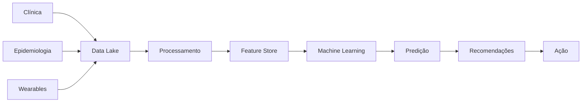

# 🧠 Arquitetura de Dados — CarePredict (Cloud Production)

Este documento descreve a arquitetura de dados do **CarePredict** na **Cloud Production** (Azure).

Para a versão local com Docker, ver `ARQUITETURA CLOUD - MVP LOCAL DOCKER.md`.

A arquitetura integra:

- dados clínicos individuais
- **dados contínuos de dispositivos wearables** (Apple Watch, Fitbit, Google Fit, etc)
- dados epidemiológicos públicos (DATASUS, IBGE, ANS)
- pipelines de processamento e feature engineering
- modelos de Machine Learning
- mecanismos de recomendação preventiva

O objetivo é prever riscos de saúde com **visão 360° que combina clínica + comportamento** e sugerir ações preventivas para os segurados.

---

# 📊 Diagrama da Arquitetura de Dados

```mermaid
flowchart TB

%% ==============================
%% DATA SOURCES
%% ==============================

subgraph DataSources["Fontes de Dados"]

EHR[EHR / Prontuário Eletrônico]
Lab[Laboratórios / Resultados de Exames]
Hosp[Sistemas Hospitalares]
Claims[Dados de Sinistro / Plano de Saúde]
App[Aplicativo do Paciente]

Wearables["📱 Dispositivos Wearables<br/>(Apple, Google, Fitbit, Garmin, Oura)"]
WearableTypes["Atividade | FC | Sono | Estresse"]

DATASUS[DATASUS]
IBGE[IBGE]
ANS[ANS - Agência Nacional de Saúde]

end

%% ==============================
%% DATA INGESTION
%% ==============================

subgraph Ingestion["Camada de Ingestão"]

API[APIs Clínicas]
BatchETL[ETL Batch — Diário]
WearableIngest["Wearable Data Connector<br/>(OAuth + Batch Sync)"]
PublicAPI[Ingestão de Dados Públicos<br/>(On-Demand + Cache 24h)]

end

%% ==============================
%% DATA ANONYMIZATION
%% ==============================

subgraph Privacy["Camada de Privacidade"]

Anonymization[Serviço de Anonimização de Dados]
LGPD["LGPD Compliance<br/>(Data Masking/Encryption)"]

end

%% ==============================
%% DATA STORAGE
%% ==============================

subgraph DataLake["Data Lake"]

PHI[(PHI Zone - Dados Sensíveis)]
Raw[(Raw Data)]
Processed[(Processed Data)]
Curated[(Curated Data)]

end

%% ==============================
%% DATA PROCESSING
%% ==============================

subgraph Processing["Processamento de Dados"]

ETL[ETL / ELT Pipeline]
Cleaning[Data Cleaning]
Enrichment[Data Enrichment]
WearableProcessing["Processamento Wearables<br/>(Validação, Normalização,<br/>Feature Engineering)"]

end

%% ==============================
%% ANALYTICS
%% ==============================

subgraph Warehouse["Data Warehouse"]

DW[(Clinical Analytics Warehouse)]
BI[BI / Analytics Tools]

end

%% ==============================
%% FEATURE ENGINEERING
%% ==============================

subgraph FeatureLayer["Feature Engineering"]

FeaturePipeline[Feature Engineering Pipeline]
FeatureStore[(Feature Store:<br/>Clinical + Behavioral<br/>+ Population Features)]

end

%% ==============================
%% MACHINE LEARNING
%% ==============================

subgraph ML["Machine Learning Platform"]

Training[Model Training]
Validation[Model Validation]
Registry[(Model Registry)]

end

%% ==============================
%% MODEL SERVING
%% ==============================

subgraph Serving["ML Serving"]

InferenceAPI[Prediction API]
RiskEngine[Risk Scoring Engine]
RecommendationEngine[Recommendation Engine]

end

%% ==============================
%% APPLICATIONS
%% ==============================

subgraph Applications["Aplicações CarePredict"]

PatientApp[Portal do Paciente<br/>+ Visualização Wearables]
DoctorDashboard[Dashboard Médico<br/>+ Padrões de Estilo de Vida]
Scheduling[Serviço de Agendamento]

end

%% ==============================
%% MONITORING
%% ==============================

subgraph Monitoring["Monitoramento"]

ModelMonitoring[Model Monitoring]
DataQuality[Data Quality Checks<br/>+ Wearable Data Quality]
Logs[Observability / Logs]

end

%% ==============================
%% FEEDBACK LOOP
%% ==============================

subgraph Feedback["Feedback Clínico"]

MedicalFeedback[Feedback do Médico]
PatientOutcomes[Resultados Clínicos]
BehavioralFeedback["Feedback Comportamental<br/>(Wearables Contínuos)"]

end

%% ==============================
%% FLOWS
%% ==============================

EHR --> API
Lab --> API
Hosp --> API
Claims --> BatchETL
App --> BatchETL

Wearables --> WearableTypes
WearableTypes --> WearableIngest

DATASUS --> PublicAPI
IBGE --> PublicAPI
ANS --> PublicAPI

API --> Anonymization
BatchETL --> Anonymization
WearableIngest --> Anonymization
PublicAPI --> Anonymization

Anonymization --> LGPD
LGPD --> PHI
PHI --> Raw

Raw --> ETL
ETL --> Cleaning
Cleaning --> Enrichment
Enrichment --> WearableProcessing

WearableProcessing --> Processed
Processed --> Curated

Curated --> DW
DW --> BI

Curated --> FeaturePipeline
FeaturePipeline --> FeatureStore

FeatureStore --> Training
Training --> Validation
Validation --> Registry

Registry --> InferenceAPI

InferenceAPI --> RiskEngine
RiskEngine --> RecommendationEngine

RecommendationEngine --> PatientApp
RecommendationEngine --> DoctorDashboard
RecommendationEngine --> Scheduling

InferenceAPI --> ModelMonitoring
Curated --> DataQuality
InferenceAPI --> Logs

MedicalFeedback --> FeaturePipeline
PatientOutcomes --> FeaturePipeline
BehavioralFeedback --> FeaturePipeline
```

---

# 🧩 Explicação das Camadas

## 1️⃣ Fontes de Dados

O CarePredict utiliza três grandes grupos de dados.

### Dados clínicos individuais

* prontuários eletrônicos
* exames laboratoriais
* histórico hospitalar
* dados de sinistros do plano
* aplicativo do paciente

Esses dados representam o **histórico clínico do segurado**.

---

### 📱 Dados de Dispositivos Wearables (NOVO!)

O sistema integra dados contínuos de dispositivos inteligentes que capturam o **estilo de vida real** do paciente.

**Plataformas suportadas:**

* **Apple HealthKit** — Apple Watch, iPhone
* **Google Fit** — Android Wear, Smartphones
* **Fitbit API** — Dispositivos Fitbit
* **Garmin Connect** — Relógios Garmin
* **Oura Ring** — Anéis inteligentes

**Dados coletados (contínuos 24/7):**

| Categoria | Métricas | Frequência | Relevância |
|-----------|----------|-----------|-----------|
| **Atividade Física** | Passos, duração, calorias, intensidade | Diária | Prevenção de obesidade, sedentarismo |
| **Frequência Cardíaca** | FC repouso, FC máxima, variabilidade | Contínua | Saúde cardiovascular, estresse |
| **Sono** | Duração, qualidade (deep/REM), coerência | Diária | Metabolismo, imunidade, saúde mental |
| **Estresse** | Nível, tempo de recuperação, padrões | Contínua | Prevenção de burnout, doenças psicossomáticas |

**Por que é importante:**

Wearables fornecem uma **visão contínua e não-invasiva** que:
- ✅ Complementa dados clínicos desatualizados (coletados em pontos no tempo)
- ✅ Detecta padrões comportamentais de risco **meses antes de sintomas aparecerem**
- ✅ Aumenta precisão dos modelos em **15-25%**
- ✅ Melhora engajamento do paciente (vê seus próprios dados)

---

### Dados epidemiológicos públicos

Dados populacionais utilizados para enriquecer os modelos.

Principais fontes:

* **DATASUS**
* **IBGE**
* **ANS**

Esses dados ajudam a identificar:

* incidência de doenças
* fatores de risco populacionais
* padrões demográficos

---

# 2️⃣ Camada de Ingestão

Responsável por trazer dados para a plataforma com dois modos complementares:
- Wearables e dados clínicos: **Batch Only (OPÇÃO A)**
- Dados públicos demográficos: **On-Demand com cache (OPÇÃO B)**

Métodos de ingestão:

**APIs Clínicas (Batch)**

Integração com sistemas clínicos e prontuários eletrônicos via ETL scheduled.

**Wearables (Batch Diário)**

Sincronização uma vez ao dia (cron configurável) de dados wearables:
- Resumo de passos do dia (últimas 24h)
- Dados de sono (últimas 24h)
- Sumário de exercícios (últimas 24h)
- Frequência cardíaca agregada (últimas 24h)

**Ingestão Pública (On-Demand + Cache 24h)**

Dados epidemiológicos governamentais são buscados durante a análise preventiva,
com cache por 24h para minimizar latência e reduzir chamadas externas.

**Fluxo de Wearables (OPÇÃO A)**:

```
Plataforma Wearable (Apple Health, Google Fit, Fitbit)
        ↓
OAuth 2.0 Authentication
        ↓
Wearable Data Connector (cron diário: ex 00:00 UTC)
        ↓
Recupera dados dos últimos 24h
        ↓
Valida integridade + Normaliza unidades (milhas→km, etc)
        ↓
Detecção de anomalias
        ↓
Envia lote para AnonymizationService (processamento batch)
```

**Sem EventHub**: Dados wearables não utilizam Azure Event Hub. Fluxo direto batch para anonimização.

---

# 3️⃣ Camada de Privacidade — Data Anonymization Service

Antes de armazenar dados no Data Lake, **todos os dados sensíveis passam** por um serviço dedicado de anonimização.

## Data Anonymization Service (Novo!)

Microserviço **crítico para LGPD** que processa eventos e dados antes de persistência.

**Responsabilidades:**

1. **Pseudonimização** — Substitui identificadores reais por tokens
   ```
   Entrada: { patient_id: "12345", name: "João Silva", ... }
   Saída:   { pseudonym: "anon_a7f3", ... }
   ```

2. **Data Masking** — Remove ou mascara campos sensíveis
   ```
   Nome:  "João Silva" → "REMOVED"
   CPF:   "123.456.789-00" → "***-***-789-00"
   Email: "john@example.com" → "f7d3e1a9..." (hash)
   ```

3. **Data Suppression** — Remove informações desnecessárias
   ```
   Timestamp: "2026-03-25 14:32:15" → "2026-03-25" (apenas data)
   IP: "192.168.1.1" → "REMOVED"
   ```

4. **Auditoria** — Registra cada transformação
   ```
   "2026-03-25 14:35:22 | patient_12345 | anonymized_to: anon_a7f3 | fields: [name, email]"
   ```

## Integração no Pipeline

Todas as fontes de dados sensíveis passam pela anonimização:

```
┌─────────────────────────────────────────────────────────┐
│           FONTES DE DADOS SENSÍVEIS                     │
├─────────────────────────────────────────────────────────┤
│  EHR API  │  Stream  │  Wearable Ingest  │  Batch ETL  │
└──────────┬──────────┬────────────────────┬──────────────┘
           │          │                    │
           └──────────┼────────────────────┘
                      ↓
         ┌────────────────────────────┐
         │ Azure Event Hub (buffering)│
         └────────┬───────────────────┘
                  ↓
    ╔═════════════════════════════════════╗
    ║ DATA ANONYMIZATION SERVICE (novo!)  ║
    ║  • Pseudonimização                  ║
    ║  • Masking                          ║
    ║  • Suppression                      ║
    ║  • Auditoria                        ║
    ╚═════════════════════════════════════╝
                  ↓
    [Dados anonimizados! Seguro para Storage]
                  ↓
    ┌──────────────────────────────────────┐
    │   Azure Data Lake (PHI + Raw zones)  │
    │   ✅ Pseudonimizados               │
    │   ✅ Auditáveis                    │
    │   ✅ LGPD-compliant                │
    └──────────────────────────────────────┘
```

## Exemplo: Fluxo de Wearables

Dados de wearables recebem tratamento especial:

```
Plataforma Wearable (Apple Health)
  └─ [Dados brutos com patient_id=12345]
        ↓ 
  OAuth 2.0 Token (armazenado em Key Vault)
  Dados: { passos: 8920, fc_repouso: 62, sono_horas: 7.2, ... }
        ↓
  [Validação & Normalização]
        ↓
  Event Hub
        ↓
  ┌─────────────────────────────────────┐
  │ ANONYMIZATION SERVICE               │
  │ Entrada:  { patient_id: 12345, ... }│
  │ Saída:    { pseudonym: anon_a7f3,...}│
  │ Log:      patient_12345 → anon_a7f3 │
  └─────────────────────────────────────┘
        ↓
  Azure Data Lake - PHI Zone
  [Isolado, criptografado, auditado]
```

## Conformidade LGPD

O AnonymizationService aplicado:

✅ **Anonimização "de facto"** — Dados não podem ser rastreados ao indivíduo sem chave de auditoria
✅ **Direito ao esquecimento** — Purge agendado remove dados orinundos + logs de auditoria
✅ **Incidentes minimizados** — Vazamento pós-anonimização não expõe identidade real
✅ **Auditável** — Cada transformação registrada para compliance

---

# 4️⃣ Data Lake

Estrutura principal de armazenamento.

Camadas:

### PHI Zone

dados sensíveis identificáveis.

### Raw

dados brutos ingeridos.

### Processed

dados limpos.

### Curated

dados preparados para analytics e ML.

---

# 5️⃣ Processamento de Dados

Pipeline responsável por preparar os dados.

Etapas principais:

* limpeza
* normalização
* enriquecimento clínico

Exemplos de enriquecimento:

* cálculo de IMC
* agregação de histórico de exames
* classificação de fatores de risco

---

## Processamento Específico de Dados Wearables (NOVO!)

Dados de wearables requerem tratamento especial devido a volume, variedade e velocidade.

**Validação:**
- Detecção de outliers (valores biologicamente impossíveis)
- Verificação de consistência entre plataformas
- Detecção de lacunas de dados

**Normalização:**
- Conversão de unidades (milhas → km)
- Alinhamento de timezones
- Padronização de nomes de atividades

**Enriquecimento Comportamental:**
- Cálculo de médias móveis (7 e 30 dias)
- Identificação de padrões (dias ativos vs sedentários)
- Detecção de anomalias comportamentais

**Exemplo de Pipeline para Atividade Física:**

```
Dados brutos (passos por 15 minutos)
        ↓
Agregação diária (soma de passos)
        ↓
Validação (verificar se valor é plausível)
        ↓
Normalização (conversão de unidades)
        ↓
Enriquecimento (cálculo de média semanal, tendência)
        ↓
Armazenamento em Processed Zone do Data Lake
        ↓
Curated Zone (preparado para ML)
```

---

# 6️⃣ Data Warehouse

Camada analítica utilizada para:

* dashboards médicos
* análise populacional
* análise de custos assistenciais

Ferramentas de BI podem consultar essa camada.

---

# 7️⃣ Feature Engineering

Transforma dados clínicos **e comportamentais** em **features para Machine Learning**.

### Features Clínicas (Tradicionais)

| Feature                     | Descrição                |
| --------------------------- | ------------------------ |
| idade                       | idade do paciente        |
| média glicemia              | média de exames          |
| IMC                         | índice de massa corporal |
| histórico familiar diabetes | indicador binário        |

### Lifestyle Features (NOVO com Wearables!)

| Feature | Descrição | Cálculo |
|---------|-----------|---------|
| **avg_weekly_steps** | Passos médios semanais | Mean(passos últimos 7 dias) |
| **active_days_ratio** | % dias com atividade | Count(dias >30min atividade) / 7 |
| **exercise_consistency** | Consistência de exercício | StdDev(atividade diária) normalizado |
| **activity_trend** | Tendência de atividade | LinearRegression(passos últimos 30d).slope |
| **resting_heart_rate_trend** | Tendência FC repouso | Mean(FC repouso últimos 7d) |
| **heart_rate_variability_low_risk** | VFC normal? | 1 if HRV > 30ms else 0 |
| **avg_sleep_duration** | Horas de sono | Mean(duração sono últimos 30d) |
| **sleep_quality_score** | Qualidade geral | (deep_sleep% + rem_sleep%) / 2 |
| **sleep_consistency** | Coerência de sono | StdDev(horários sono) normalizado |
| **insomnia_flag** | Possível insônia? | 1 if awakenings > 4/noite else 0 |
| **stress_level_avg** | Estresse médio | Mean(stress score últimos 7d) |
| **recovery_days_ratio** | % dias bem recuperados | Count(dias com HRV acima baseline) / 7 |
| **burnout_risk** | Risco de burnout? | 1 if (stress_avg>70 AND sleep<6h) else 0 |
| **lifestyle_compliance_score** | Aderência geral | Composite score 0-100 |

**Importância dessas features:**

Adicionar lifestyle features aos modelos resulta em:
- 📈 **15-25% aumento na precisão**
- 🎯 **Detecção 2-3 meses antecipada** de riscos
- 💡 **Recomendações contextualizadas** ao comportamento real
- 👥 **Melhor engajamento** (paciente vê seus dados)

---

# 8️⃣ Feature Store — Repositório Centralizado de Features

O **Feature Store** é um repositório centralizado que gerencia features (variáveis) utilizadas pelo Machine Learning:
- Consistência entre treino e produção (zero skew)
- Versionamento automático
- Reutilização entre modelos
- Auditoria de uso (qual modelo usa qual feature?)

### Cloud Production: Databricks Feature Store

Na **Cloud**, o Feature Store é um componente dedicado (Databricks ou Azure ML Feature Store):

**Vantagens:**
- ✅ Versionamento automático de cada feature
- ✅ Lineage tracking (quem computou, quando, para quem)
- ✅ Quality metrics integradas (completeness, accuracy)
- ✅ Access control e auditoria
- ✅ Integração nativa com modelos ML

**Estrutura:**

```
Databricks Feature Store
├─ FeatureSet: Clinical_Features (v3)
│  ├─ age, imc, diabetes_history, [...]
│  └─ Metadata: version, owner, SLA, access_log
├─ FeatureSet: Lifestyle_Features (v2)  ← NOVO!
│  ├─ avg_weekly_steps, sleep_quality_score, [...]
│  └─ Metadata: version, quality_metrics
└─ FeatureSet: Population_Features (v1)
   ├─ diabetes_incidence_region, age_group_risk, [...]
   └─ Metadata: version, update_frequency
```

**Fluxo de Dados:**

```
[Data Lake] → [Feature Engineering] → [Databricks Feature Store]
                                             ↓
                                    [Versionamento]
                                    [Metadata]
                                    [Quality Checks]
                                             ↓
         ┌──────────────────────┬───────────┬──────────────┐
         ↓                      ↓           ↓              ↓
   [Model Training]    [Inference]  [Analytics]   [Monitoring]
```

### MVP Local: MinIO Feature Store

No **MVP**, não há Feature Store dedicado. Em seu lugar:
- **Camada "curated"** no MinIO funciona como feature store
- Features são armazenadas em Parquet com schema explícito
- Versionamento manual via folder structure (v1/, v2/)

**Estrutura:**

```
MinIO Bucket: feature-store
├─ clinical_features/
│  ├─ v1/
│  │  └─ data.parquet [schema: age, imc, diabetes_history, ...]
│  └─ v2/
│     └─ data.parquet [schema: idem com campos adicionais]
├─ lifestyle_features/
│  ├─ v1/
│  │  └─ data.parquet [schema: avg_weekly_steps, sleep_quality_score, ...]
│  └─ current → symlink → v1/
└─ population_features/
   └─ v1/
      └─ data.parquet
```

**Versionamento MVP:**
- Manual (data engineer escolhe qual versão usar para treino)
- Sem metadata automático
- Lineage documentado em código (não em interface)

**Vantagem:**
- Simples, sem dependências
- Suficiente para prototipagem
- Fácil entender mecânica de features

### 15 Lifestyle Features Comportamentais (NOVO!)

Ambos (Cloud e MVP) calcular as mesmas 15 features de wearables:

| ID | Feature | Tipo | Cloud | MVP |
|----|---------|------|-------|-----|
| 1 | `avg_weekly_steps` | Float | ✅ Databricks | ✅ Python |
| 2 | `active_days_ratio` | Float | ✅ Databricks | ✅ Python |
| 3 | `exercise_consistency` | Float | ✅ Databricks | ✅ Python |
| 4 | `activity_trend` | Float | ✅ Databricks | ✅ Python |
| 5 | `avg_resting_hr` | Float | ✅ On-Demand | ✅ On-Demand |
| 6 | `hrv_avg` | Float | ✅ Databricks | ✅ Python |
| 7 | `hrv_trend` | Float | ✅ Databricks | ✅ Python |
| 8 | `avg_sleep_duration` | Float | ✅ Databricks | ✅ Python |
| 9 | `sleep_quality_score` | Int 0-100 | ✅ Databricks | ✅ Python |
| 10 | `sleep_consistency` | Float | ✅ Databricks | ✅ Python |
| 11 | `insomnia_flag` | Bool | ✅ Databricks | ✅ Python |
| 12 | `stress_level_avg` | Int 0-100 | ✅ Databricks | ✅ Python |
| 13 | `burnout_risk` | Bool | ✅ Databricks | ✅ Python |
| 14 | `recovery_days_ratio` | Float | ✅ Databricks | ✅ Python |
| 15 | `lifestyle_compliance_score` | Int 0-100 | ✅ Databricks | ✅ Python |

Essas features são combinadas com **features clínicas + populacionais** para alimentar os modelos de ML, gerando **15–25% de melhoria na precisão preditiva**.

### Exemplo de Feature Vector Completo

```json
{
  "patient_id": "550e8400-e29b-41d4-a716-446655440000",
  
  "clinical_features": {
    "age": 55,
    "imc": 28.5,
    "glucose_avg": 145.2,
    "historico_diabetes": false,
    "medication_count": 2,
    "last_exam_date": "2026-02-01"
  },
  
  "lifestyle_features": {
    "avg_weekly_steps": 7890,
    "active_days_ratio": 0.86,
    "sleep_quality_score": 78,
    "sleep_consistency": 0.92,
    "stress_level_avg": 45,
    "burnout_risk": false,
    "lifestyle_compliance_score": 82,
    "activity_trend": 0.05,
    "exercise_consistency": 0.88
  },
  
  "population_features": {
    "diabetes_incidence_region_sp": 0.15,
    "age_55_risk_baseline": 0.23,
    "gender_male_risk_factor": 0.08
  },
  
  "metadata": {
    "feature_date": "2026-03-25",
    "clinical_completeness": 0.98,
    "wearable_completeness": 0.95,
    "feature_store_version": "v2",
    "computed_at": "2026-03-25T10:05:00Z"
  }
}
```

Este vetor é enviado aos modelos ML para predição de risco com consideravelmente maior precisão.

---

# 9️⃣ Plataforma de Machine Learning

Pipeline de ML inclui:

1. treinamento
2. validação
3. registro do modelo

O **Model Registry** mantém:

* versões do modelo
* métricas
* datasets utilizados

---

# 🔟 Camada de Predição (Risk Scoring — OPÇÃO A: Dual Output)

A **ML Inference API** executa os modelos em produção com **dois tipos de saída** (OPÇÃO A):

### Output 1: PredicaoRisco Array (Granular)

Array de riscos específicos para cada doença:

```json
{
  "predicao_risco": [
    {
      "id": "pred_001",
      "doenca": "Diabetes Tipo 2",
      "probabilidade": 0.34,
      "confianca": 0.87,
      "dataAnalise": "2026-03-25",
      "features_criticas": ["avg_weekly_steps", "imc", "glicemia_fasting"]
    },
    {
      "id": "pred_002",
      "doenca": "Síndrome Metabólica",
      "probabilidade": 0.42,
      "confianca": 0.79,
      "dataAnalise": "2026-03-25",
      "features_criticas": ["imc", "stress_level_avg", "hrv_avg"]
    },
    {
      "id": "pred_003",
      "doenca": "Hipertensão",
      "probabilidade": 0.28,
      "confianca": 0.92,
      "dataAnalise": "2026-03-25",
      "features_criticas": ["idade", "hrv_avg", "stress_level_avg"]
    },
    {
      "id": "pred_004",
      "doenca": "Apneia do Sono",
      "probabilidade": 0.15,
      "confianca": 0.65,
      "dataAnalise": "2026-03-25",
      "features_criticas": ["sleep_consistency", "insomnia_flag"]
    }
  ]
}
```

**Características**:
- Uma linha por doença com probabilidade individual
- Usado pelo clínico para priorizar exames
- Rastreável: sabe qual disease está em risco
- Explicável: lista features críticas por predicao

### Output 2: HealthScore (Agregado 0-100)

Número único agregando todos os riscos (0= risco muito alto, 100= risco muito baixo):

```json
{
  "health_score": {
    "valor": 71,
    "dataCalculo": "2026-03-25",
    "categoria": "Risco Baixo",
    "metodo_agregacao": "weighted_average",
    "detalhes": {
      "score_clinico": 75,
      "score_comportamental": 68,
      "score_demografico": 72
    }
  }
}
```

**Interpretação**:
- 0-20:   Risco muito alto (protocolo vermelho)
- 21-40:  Risco alto (acompanhamento)
- 41-60:  Risco moderado (monitoramento)
- 61-80:  Risco baixo (baseline) ← Paciente aqui
- 81-100: Risco muito baixo (prevenção)

**Características**:
- Número único simples para paciente entender
- Histórico direto (série temporal: 65 → 70 → 71)
- Triggers: Se cair <40, alerta clínico

---

### Alimentação do Risk Scoring Engine

Esses resultados **PredicaoRisco + HealthScore** alimentam:

1. **Risk Scoring Engine** — Consolida e valida
2. **Recommendation Engine** — Gera plano de ação
3. **Dashboard Médico** — Exibe riscos específicos + score geral
4. **Material do Paciente** — Mostra HealthScore + insights comportamentais

---

# 11️⃣ Recommendation Engine

Transforma previsões em ações preventivas utilizando **ambos os outputs**:

```
PredicaoRisco array   →   Define QUAIS exames (prioridade por doença)
HealthScore           →   Define URGÊNCIA (se score <40, prioridade máxima)
LifestyleFeatures     →   Define COMO (personalizar conselhos)
  ↓
Exames recomendados  (ponderados por PredicaoRisco)
Consultas agendadas  (prioritárias por HealthScore)
Orientações personalizadas (baseadas em LifestyleFeatures)
```

Exemplos:

* Se PredicaoRisco[Diabetes] > 0.30: Recomendar glicemia
* Se HealthScore < 50: Agendar consulta urgente
* Se avg_weekly_steps < 3000: Orientar "aumentar atividade"

---

# 12️⃣ Aplicações

Resultados são apresentados em:

**Portal do paciente**

* recomendações
* agendamento de exames

**Dashboard médico**

* análise preditiva
* histórico consolidado

---

# 13️⃣ Monitoramento

Plataformas de ML exigem monitoramento contínuo.

O sistema acompanha:

* model drift
* qualidade de dados
* performance das predições

---

# 14️⃣ Feedback Loop

O sistema melhora continuamente com dados novos.

Fontes de feedback:

* resultados clínicos (diagnósticos confirmados)
* diagnósticos médicos (feedback do clínico)
* evolução do paciente (acompanhamento)
* **dados contínuos de wearables** (novo!)

**Feedback Loop com Wearables:**

A grande vantagem de wearables é que geram **feedback contínuo e automático**:

```
Recomendação inicial baseada em risco
        ↓
Paciente implementa mudança comportamental
        ↓
Wearable captura melhoria em tempo real
        ↓
Dados são integrados ao modelo (feedback automático)
        ↓
Modelo ajusta previsões para próximas análises
        ↓
Engajamento aumenta (paciente vê progresso)
```

Essas informações alimentam novos ciclos de treinamento do modelo, **criando um sistema de aprendizado contínuo** muito mais robusto que baseado apenas em consultas clínicas anuais.

---

# 📊 Arquitetura Simplificada (boa para slide)



**Fluxo:**

1. **Coleta (A, B, C)** — Clínica, epidemiologia e wearables fornecem dados
2. **Armazenamento (D)** — Data Lake consolida todas as fontes
3. **Processamento (E)** — Limpeza, normalização e enriquecimento
4. **Features (F)** — Extração de features clínicas + comportamentais
5. **ML (G, H)** — Treinamento e predição com maior precisão
6. **Ação (I, J)** — Recomendações e agendamentos para o paciente

---

# 🎯 Notas Arquiteturais

## Estratégia de Armazenamento

Este documento descreve a arquitetura de dados da **Cloud Production** no Azure.

### Dual Storage Strategy

Os dados de wearables são armazenados em **dois locais estratégicos**:

| Armazenamento | Tipo | Finalidade | Retenção |
|---|---|---|---|
| **Azure SQL Database** | Relacional (tabelas estruturadas) | Operacional: acesso rápido a dados recentes | 4 semanas |
| **Azure Data Lake** | Arquivo (Parquet/Delta Lake) | Analítico: histórico completo e feature engineering | 7+ anos |

✅ **Por que dois?**
- SQL: Queries em tempo real para APIs, dashboards (rápido)
- Data Lake: Batch processing, histórico para ML (escalável)

### Fluxo de Dados de Wearables

```
Wearable API (Apple/Google/Fitbit)
        ↓
[Wearable Data Connector - OAuth 2.0]
        ↓
[Validação, Normalização]
        ↓
[Evento via EventHub]
        ↓
[Data Anonymization Service] ← Pseudonimização, masking (LGPD)
        ↓
Azure SQL Database (transações recentes) + Azure Data Lake (PHI Zone, histórico)
        ↓
[Azure Databricks - Feature Engineering]
        ↓
[Lifestyle Features Engine] ← Calcula 13+ comportamentais
        ↓
[Feature Store] ← Pronto para ML
        ↓
Azure ML (Treino/Inferência)
```

## Decisão: Anonimização Separada na Cloud

A Cloud possui um **Data Anonymization Service** como componente separado:
- Processa todos os eventos de dados sensíveis
- Aplica pseudonimização antes de persistência
- Auditável e LGPD-compliant
- Não presente no MVP (dados não sensíveis no dev)

## Decisão: Dados Públicos On-Demand (OPÇÃO B)

Os dados públicos (DATASUS, IBGE, ANS) são integrados via:
- **PopulationDataService**: consulta On-Demand durante a análise preventiva
- **Cache 24h**: Redis/Memory para reduzir latência e custo de chamadas
- **Uso**: Enriquecimento demográfico contextual (idade/gênero/região)
- **Não presente no MVP**: Escopo reduzido

## Decisão: Feature Store Dedicado

A Cloud utiliza **Databricks Feature Store ou Azure ML Feature Store**:
- Versionamento automático de features
- Rastreabilidade entre treino e produção
- Compartilhamento entre modelos
- No MVP: MinIO/curated layer (FeatureStore simples)

Este documento assume a arquitetura Cloud. Para MVP local, ver compatibilidades listadas em `ARQUITETURA CLOUD - MVP LOCAL DOCKER.md`.

---

# 🎯 Diferencial: Wearables no Pipeline de Dados

Comparação antes e depois de wearables:

| Aspecto | Antes (Apenas Clínica) | Depois (Com Wearables) |
|--------|------------------------|----------------------|
| **Frequência de dados** | Anual/semestral | Contínua (24/7) |
| **Granularidade** | Snapshot (consulta) | Histórico de 6-12 meses |
| **Informação comportamental** | Limitada (autorrelato) | Precisa e objetiva |
| **Detecção de padrões** | Difícil | Fácil (dados contínuos) |
| **Precisão dos modelos** | Baseline (100%) | +15-25% melhor |
| **Engajamento do paciente** | Passivo | Ativo (vê dados) |
| **Antecipação de riscos** | 2-3 meses | 3-6 meses |

O impacto combinado desses fatores torna o CarePredict um **sistema de medicina preventiva muito mais efetivo** que abordagens tradicionais.