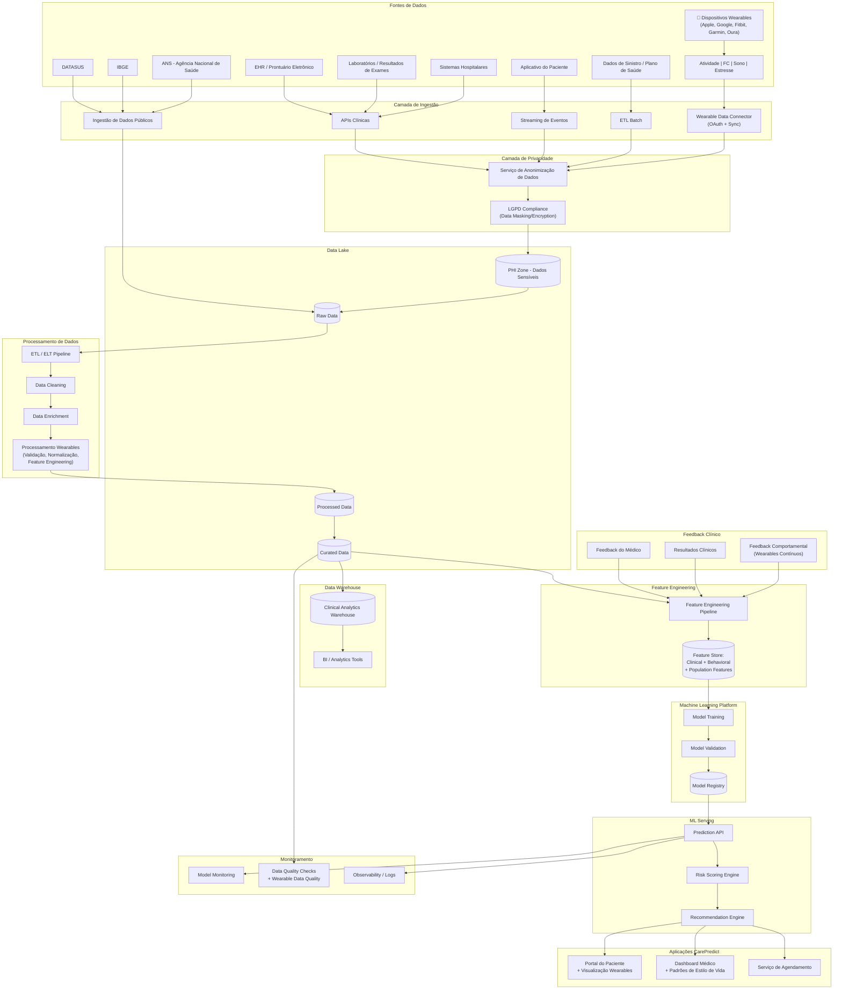
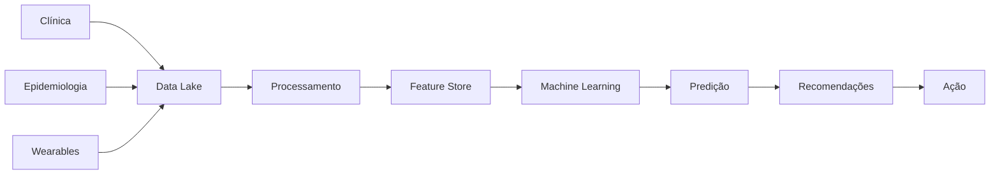

# 🧠 Arquitetura de Dados — CarePredict (Versão Revisada)

Este documento descreve a arquitetura de dados do **CarePredict**, sistema de medicina preventiva baseado em Machine Learning desenvolvido para a CarePlus.

A arquitetura integra:

- dados clínicos individuais
- **dados contínuos de dispositivos wearables** (Apple Watch, Fitbit, Google Fit, etc)
- dados epidemiológicos públicos
- pipelines de processamento e feature engineering
- modelos de Machine Learning
- mecanismos de recomendação preventiva

O objetivo é prever riscos de saúde com **visão 360° que combina clínica + comportamento** e sugerir ações preventivas para os segurados.

---

# 📊 Diagrama da Arquitetura de Dados



---

# 🧩 Explicação das Camadas

## 1️⃣ Fontes de Dados

O CarePredict utiliza três grandes grupos de dados.

### Dados clínicos individuais

* prontuários eletrônicos
* exames laboratoriais
* histórico hospitalar
* dados de sinistros do plano
* aplicativo do paciente

Esses dados representam o **histórico clínico do segurado**.

---

### 📱 Dados de Dispositivos Wearables (NOVO!)

O sistema integra dados contínuos de dispositivos inteligentes que capturam o **estilo de vida real** do paciente.

**Plataformas suportadas:**

* **Apple HealthKit** — Apple Watch, iPhone
* **Google Fit** — Android Wear, Smartphones
* **Fitbit API** — Dispositivos Fitbit
* **Garmin Connect** — Relógios Garmin
* **Oura Ring** — Anéis inteligentes

**Dados coletados (contínuos 24/7):**

| Categoria | Métricas | Frequência | Relevância |
|-----------|----------|-----------|-----------|
| **Atividade Física** | Passos, duração, calorias, intensidade | Diária | Prevenção de obesidade, sedentarismo |
| **Frequência Cardíaca** | FC repouso, FC máxima, variabilidade | Contínua | Saúde cardiovascular, estresse |
| **Sono** | Duração, qualidade (deep/REM), coerência | Diária | Metabolismo, imunidade, saúde mental |
| **Estresse** | Nível, tempo de recuperação, padrões | Contínua | Prevenção de burnout, doenças psicossomáticas |

**Por que é importante:**

Wearables fornecem uma **visão contínua e não-invasiva** que:
- ✅ Complementa dados clínicos desatualizados (coletados em pontos no tempo)
- ✅ Detecta padrões comportamentais de risco **meses antes de sintomas aparecerem**
- ✅ Aumenta precisão dos modelos em **15-25%**
- ✅ Melhora engajamento do paciente (vê seus próprios dados)

---

### Dados epidemiológicos públicos

Dados populacionais utilizados para enriquecer os modelos.

Principais fontes:

* **DATASUS**
* **IBGE**
* **ANS**

Esses dados ajudam a identificar:

* incidência de doenças
* fatores de risco populacionais
* padrões demográficos

---

# 2️⃣ Camada de Ingestão

Responsável por trazer dados para a plataforma.

Métodos de ingestão:

**APIs Clínicas**

Integração com sistemas clínicos e prontuários eletrônicos.

**Streaming (NOVO com Wearables)**

Eventos em tempo real de:
- Frequência cardíaca
- Notificações de estresse
- Alertas de anomalias

**Batch (NOVO com Wearables)**

Sincronização diária/horária de dados wearables:
- Resumo de passos do dia
- Dados de sono da noite
- Sumário de exercícios

**Ingestão pública**

Dados epidemiológicos governamentais.

**Fluxo de Wearables:**

```
Plataforma Wearable (Apple Health, Google Fit, Fitbit)
        ↓
OAuth 2.0 Authentication + Sincronização
        ↓
Batch Diário (últimas 24h de dados)
        ↓
Streaming em Tempo Real (opcional - eventos críticos)
        ↓
Azure Event Hub (fila de eventos)
        ↓
Validação de Integridade
        ↓
Normalização de Unidades (milhas→km, etc)
```

---

# 3️⃣ Camada de Privacidade

Antes de armazenar dados no Data Lake, o sistema aplica:

* anonimização
* pseudonimização
* mascaramento de dados

Isso garante conformidade com:

**LGPD (Lei Geral de Proteção de Dados)**.

---

# 4️⃣ Data Lake

Estrutura principal de armazenamento.

Camadas:

### PHI Zone

dados sensíveis identificáveis.

### Raw

dados brutos ingeridos.

### Processed

dados limpos.

### Curated

dados preparados para analytics e ML.

---

# 5️⃣ Processamento de Dados

Pipeline responsável por preparar os dados.

Etapas principais:

* limpeza
* normalização
* enriquecimento clínico

Exemplos de enriquecimento:

* cálculo de IMC
* agregação de histórico de exames
* classificação de fatores de risco

---

## Processamento Específico de Dados Wearables (NOVO!)

Dados de wearables requerem tratamento especial devido a volume, variedade e velocidade.

**Validação:**
- Detecção de outliers (valores biologicamente impossíveis)
- Verificação de consistência entre plataformas
- Detecção de lacunas de dados

**Normalização:**
- Conversão de unidades (milhas → km)
- Alinhamento de timezones
- Padronização de nomes de atividades

**Enriquecimento Comportamental:**
- Cálculo de médias móveis (7 e 30 dias)
- Identificação de padrões (dias ativos vs sedentários)
- Detecção de anomalias comportamentais

**Exemplo de Pipeline para Atividade Física:**

```
Dados brutos (passos por 15 minutos)
        ↓
Agregação diária (soma de passos)
        ↓
Validação (verificar se valor é plausível)
        ↓
Normalização (conversão de unidades)
        ↓
Enriquecimento (cálculo de média semanal, tendência)
        ↓
Armazenamento em Processed Zone do Data Lake
        ↓
Curated Zone (preparado para ML)
```

---

# 6️⃣ Data Warehouse

Camada analítica utilizada para:

* dashboards médicos
* análise populacional
* análise de custos assistenciais

Ferramentas de BI podem consultar essa camada.

---

# 7️⃣ Feature Engineering

Transforma dados clínicos **e comportamentais** em **features para Machine Learning**.

### Features Clínicas (Tradicionais)

| Feature                     | Descrição                |
| --------------------------- | ------------------------ |
| idade                       | idade do paciente        |
| média glicemia              | média de exames          |
| IMC                         | índice de massa corporal |
| histórico familiar diabetes | indicador binário        |

### Lifestyle Features (NOVO com Wearables!)

| Feature | Descrição | Cálculo |
|---------|-----------|---------|
| **avg_weekly_steps** | Passos médios semanais | Mean(passos últimos 7 dias) |
| **active_days_ratio** | % dias com atividade | Count(dias >30min atividade) / 7 |
| **exercise_consistency** | Consistência de exercício | StdDev(atividade diária) normalizado |
| **activity_trend** | Tendência de atividade | LinearRegression(passos últimos 30d).slope |
| **resting_heart_rate_trend** | Tendência FC repouso | Mean(FC repouso últimos 7d) |
| **heart_rate_variability_low_risk** | VFC normal? | 1 if HRV > 30ms else 0 |
| **avg_sleep_duration** | Horas de sono | Mean(duração sono últimos 30d) |
| **sleep_quality_score** | Qualidade geral | (deep_sleep% + rem_sleep%) / 2 |
| **sleep_consistency** | Coerência de sono | StdDev(horários sono) normalizado |
| **insomnia_flag** | Possível insônia? | 1 if awakenings > 4/noite else 0 |
| **stress_level_avg** | Estresse médio | Mean(stress score últimos 7d) |
| **recovery_days_ratio** | % dias bem recuperados | Count(dias com HRV acima baseline) / 7 |
| **burnout_risk** | Risco de burnout? | 1 if (stress_avg>70 AND sleep<6h) else 0 |
| **lifestyle_compliance_score** | Aderência geral | Composite score 0-100 |

**Importância dessas features:**

Adicionar lifestyle features aos modelos resulta em:
- 📈 **15-25% aumento na precisão**
- 🎯 **Detecção 2-3 meses antecipada** de riscos
- 💡 **Recomendações contextualizadas** ao comportamento real
- 👥 **Melhor engajamento** (paciente vê seus dados)

---

# 8️⃣ Feature Store

Armazena features reutilizáveis para ML.

**Features armazenadas:**

- **Clinical Features** — dados de saúde clássicos
- **Behavioral Features** — dados derivados de wearables (novo!)
- **Population Features** — indicadores epidemiológicos

Benefícios:

* consistência entre treino e produção
* performance (evita recálculo)
* reutilização entre modelos
* rastreabilidade de features (qual modelo usa qual feature?)

**Exemplo de vetor de features para um paciente:**

```
{
  "patient_id": "550e8400-e29b-41d4-a716-446655440000",
  "idade": 55,
  "imc": 28.5,
  "historico_diabetes": false,
  
  # Behavior Features (NOVO)
  "avg_weekly_steps": 7890,
  "active_days_ratio": 0.86,
  "sleep_quality_score": 78,
  "stress_level_avg": 45,
  "burnout_risk": false,
  "lifestyle_compliance_score": 82,
  
  # Population Features
  "diabetes_incidence_region": 0.15,
  "age_group_risk": 0.63,
  
  # Timestamp
  "feature_date": "2026-03-18",
  "data_completeness": 0.95
}
```

Este vetor é enviado aos modelos ML para predição de risco.

---

# 9️⃣ Plataforma de Machine Learning

Pipeline de ML inclui:

1. treinamento
2. validação
3. registro do modelo

O **Model Registry** mantém:

* versões do modelo
* métricas
* datasets utilizados

---

# 🔟 Camada de Predição

A **Prediction API** executa os modelos em produção.

Saída:

```
risco cardiovascular
risco diabetes
risco hipertensão
```

Esses resultados alimentam o **Risk Scoring Engine**.

---

# 11️⃣ Recommendation Engine

Transforma previsões em ações preventivas.

Exemplos:

* recomendar exames
* recomendar consultas
* priorizar pacientes de risco

---

# 12️⃣ Aplicações

Resultados são apresentados em:

**Portal do paciente**

* recomendações
* agendamento de exames

**Dashboard médico**

* análise preditiva
* histórico consolidado

---

# 13️⃣ Monitoramento

Plataformas de ML exigem monitoramento contínuo.

O sistema acompanha:

* model drift
* qualidade de dados
* performance das predições

---

# 14️⃣ Feedback Loop

O sistema melhora continuamente com dados novos.

Fontes de feedback:

* resultados clínicos (diagnósticos confirmados)
* diagnósticos médicos (feedback do clínico)
* evolução do paciente (acompanhamento)
* **dados contínuos de wearables** (novo!)

**Feedback Loop com Wearables:**

A grande vantagem de wearables é que geram **feedback contínuo e automático**:

```
Recomendação inicial baseada em risco
        ↓
Paciente implementa mudança comportamental
        ↓
Wearable captura melhoria em tempo real
        ↓
Dados são integrados ao modelo (feedback automático)
        ↓
Modelo ajusta previsões para próximas análises
        ↓
Engajamento aumenta (paciente vê progresso)
```

Essas informações alimentam novos ciclos de treinamento do modelo, **criando um sistema de aprendizado contínuo** muito mais robusto que baseado apenas em consultas clínicas anuais.

---

# 📊 Arquitetura Simplificada (boa para slide)



**Fluxo:**

1. **Coleta (A, B, C)** — Clínica, epidemiologia e wearables fornecem dados
2. **Armazenamento (D)** — Data Lake consolida todas as fontes
3. **Processamento (E)** — Limpeza, normalização e enriquecimento
4. **Features (F)** — Extração de features clínicas + comportamentais
5. **ML (G, H)** — Treinamento e predição com maior precisão
6. **Ação (I, J)** — Recomendações e agendamentos para o paciente

---

# 🎯 Diferencial: Wearables no Pipeline de Dados

Comparação antes e depois de wearables:

| Aspecto | Antes (Apenas Clínica) | Depois (Com Wearables) |
|--------|------------------------|----------------------|
| **Frequência de dados** | Anual/semestral | Contínua (24/7) |
| **Granularidade** | Snapshot (consulta) | Histórico de 6-12 meses |
| **Informação comportamental** | Limitada (autorrelato) | Precisa e objetiva |
| **Detecção de padrões** | Difícil | Fácil (dados contínuos) |
| **Precisão dos modelos** | Baseline (100%) | +15-25% melhor |
| **Engajamento do paciente** | Passivo | Ativo (vê dados) |
| **Antecipação de riscos** | 2-3 meses | 3-6 meses |

O impacto combinado desses fatores torna o CarePredict um **sistema de medicina preventiva muito mais efetivo** que abordagens tradicionais.