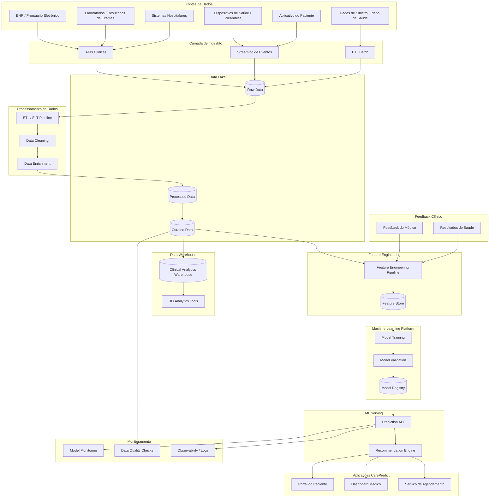
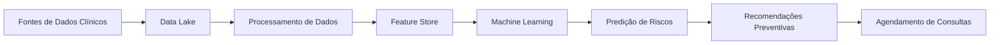

# 🧠 Arquitetura de Dados Completa — CarePredict



---

# 🧩 Explicação das Camadas

## 1️⃣ Fontes de Dados

Dados vêm de vários sistemas:

* prontuário eletrônico (EHR)
* laboratórios
* sistemas hospitalares
* dados de sinistros
* dispositivos de saúde
* aplicativo do paciente

Esses dados alimentam o sistema de prevenção.

---

# 2️⃣ Ingestão de Dados

Dados entram por três formas:

**APIs**

* integração com sistemas clínicos

**Streaming**

* eventos do app
* dados de wearables

**Batch**

* dados históricos do plano de saúde

---

# 3️⃣ Data Lake

Armazena dados em três níveis:

**Raw**

dados brutos.

**Processed**

dados limpos.

**Curated**

dados preparados para analytics e ML.

---

# 4️⃣ Processamento de Dados

Pipeline responsável por:

* limpeza
* normalização
* enriquecimento clínico

Exemplo:

* cálculo de IMC
* agregação de histórico de exames

---

# 5️⃣ Data Warehouse

Camada usada para:

* analytics
* dashboards
* relatórios médicos

Exemplo:

* análise de população
* incidência de doenças
* custos assistenciais

---

# 6️⃣ Feature Engineering

Transforma dados clínicos em **features para ML**.

Exemplo:

| Feature                     | Descrição         |
| --------------------------- | ----------------- |
| idade                       | idade do paciente |
| média glicemia              | média exames      |
| histórico familiar diabetes | binário           |
| IMC                         | calculado         |

---

# 7️⃣ Feature Store

Armazena features reutilizáveis.

Benefícios:

* consistência entre treino e produção
* alta performance
* reuso entre modelos

---

# 8️⃣ Machine Learning Platform

Pipeline de ML:

1️⃣ treinamento
2️⃣ validação
3️⃣ registro do modelo

O **Model Registry** guarda:

* versões
* métricas
* datasets usados

---

# 9️⃣ Serving / Predição

A **Prediction API** roda o modelo.

Saída:

```text
risco cardiovascular
risco diabetes
risco hipertensão
```

---

# 🔟 Recommendation Engine

Transforma previsões em ações:

* recomendar exames
* recomendar consultas
* priorizar pacientes

---

# 11️⃣ Aplicações

Resultados aparecem em:

**Paciente**

* recomendações
* agendamento

**Médico**

* dashboard clínico
* análise preditiva

---

# 12️⃣ Monitoramento

Sistemas de IA precisam monitorar:

* **model drift**
* qualidade de dados
* erros de predição

---

# 13️⃣ Feedback Loop

Sistema melhora com feedback:

* resultados clínicos reais
* avaliação do médico
* evolução do paciente

Isso permite **re-treinar os modelos continuamente**.

---

# 📊 Versão resumida (boa para slide)

