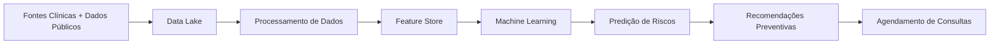

# 🧠 Arquitetura de Dados — CarePredict (Versão Revisada)

Este documento descreve a arquitetura de dados do **CarePredict**, sistema de medicina preventiva baseado em Machine Learning desenvolvido para a CarePlus.

A arquitetura integra:

- dados clínicos individuais
- dados epidemiológicos públicos
- pipelines de processamento e feature engineering
- modelos de Machine Learning
- mecanismos de recomendação preventiva

O objetivo é prever riscos de saúde e sugerir ações preventivas para os segurados.

---

# 📊 Diagrama da Arquitetura de Dados

```mermaid
flowchart TB

%% ==============================
%% DATA SOURCES
%% ==============================

subgraph DataSources["Fontes de Dados"]

EHR[EHR / Prontuário Eletrônico]
Lab[Laboratórios / Resultados de Exames]
Hosp[Sistemas Hospitalares]
Claims[Dados de Sinistro / Plano de Saúde]
Wearables[Dispositivos de Saúde]
App[Aplicativo do Paciente]

DATASUS[DATASUS]
IBGE[IBGE]
ANS[ANS - Agência Nacional de Saúde]

end

%% ==============================
%% DATA INGESTION
%% ==============================

subgraph Ingestion["Camada de Ingestão"]

API[APIs Clínicas]
Stream[Streaming de Eventos]
Batch[ETL Batch]
PublicAPI[Ingestão de Dados Públicos]

end

%% ==============================
%% DATA ANONYMIZATION
%% ==============================

subgraph Privacy["Camada de Privacidade"]

Anonymization[Serviço de Anonimização de Dados]

end

%% ==============================
%% DATA STORAGE
%% ==============================

subgraph DataLake["Data Lake"]

PHI[(PHI Zone - Dados Sensíveis)]
Raw[(Raw Data)]
Processed[(Processed Data)]
Curated[(Curated Data)]

end

%% ==============================
%% DATA PROCESSING
%% ==============================

subgraph Processing["Processamento de Dados"]

ETL[ETL / ELT Pipeline]
Cleaning[Data Cleaning]
Enrichment[Data Enrichment]

end

%% ==============================
%% ANALYTICS
%% ==============================

subgraph Warehouse["Data Warehouse"]

DW[(Clinical Analytics Warehouse)]
BI[BI / Analytics Tools]

end

%% ==============================
%% FEATURE ENGINEERING
%% ==============================

subgraph FeatureLayer["Feature Engineering"]

FeaturePipeline[Feature Engineering Pipeline]
FeatureStore[(Feature Store)]

end

%% ==============================
%% MACHINE LEARNING
%% ==============================

subgraph ML["Machine Learning Platform"]

Training[Model Training]
Validation[Model Validation]
Registry[(Model Registry)]

end

%% ==============================
%% MODEL SERVING
%% ==============================

subgraph Serving["ML Serving"]

InferenceAPI[Prediction API]
RiskEngine[Risk Scoring Engine]
RecommendationEngine[Recommendation Engine]

end

%% ==============================
%% APPLICATIONS
%% ==============================

subgraph Applications["Aplicações CarePredict"]

PatientApp[Portal do Paciente]
DoctorDashboard[Dashboard Médico]
Scheduling[Serviço de Agendamento]

end

%% ==============================
%% MONITORING
%% ==============================

subgraph Monitoring["Monitoramento"]

ModelMonitoring[Model Monitoring]
DataQuality[Data Quality Checks]
Logs[Observability / Logs]

end

%% ==============================
%% FEEDBACK LOOP
%% ==============================

subgraph Feedback["Feedback Clínico"]

MedicalFeedback[Feedback do Médico]
PatientOutcomes[Resultados Clínicos]

end

%% ==============================
%% FLOWS
%% ==============================

EHR --> API
Lab --> API
Hosp --> API
Claims --> Batch
Wearables --> Stream
App --> Stream

DATASUS --> PublicAPI
IBGE --> PublicAPI
ANS --> PublicAPI

API --> Anonymization
Stream --> Anonymization
Batch --> Anonymization
PublicAPI --> Raw

Anonymization --> PHI
PHI --> Raw

Raw --> ETL
ETL --> Cleaning
Cleaning --> Enrichment

Enrichment --> Processed
Processed --> Curated

Curated --> DW
DW --> BI

Curated --> FeaturePipeline
FeaturePipeline --> FeatureStore

FeatureStore --> Training
Training --> Validation
Validation --> Registry

Registry --> InferenceAPI

InferenceAPI --> RiskEngine
RiskEngine --> RecommendationEngine

RecommendationEngine --> PatientApp
RecommendationEngine --> DoctorDashboard
RecommendationEngine --> Scheduling

InferenceAPI --> ModelMonitoring
Curated --> DataQuality
InferenceAPI --> Logs

MedicalFeedback --> FeaturePipeline
PatientOutcomes --> FeaturePipeline
````

---

# 🧩 Explicação das Camadas

## 1️⃣ Fontes de Dados

O CarePredict utiliza dois grandes grupos de dados.

### Dados clínicos individuais

* prontuários eletrônicos
* exames laboratoriais
* histórico hospitalar
* dados de sinistros do plano
* dispositivos de saúde
* aplicativo do paciente

Esses dados representam o **histórico clínico do segurado**.

---

### Dados epidemiológicos públicos

Dados populacionais utilizados para enriquecer os modelos.

Principais fontes:

* **DATASUS**
* **IBGE**
* **ANS**

Esses dados ajudam a identificar:

* incidência de doenças
* fatores de risco populacionais
* padrões demográficos

---

# 2️⃣ Camada de Ingestão

Responsável por trazer dados para a plataforma.

Métodos de ingestão:

**APIs**

integração com sistemas clínicos.

**Streaming**

eventos em tempo real.

**Batch**

dados históricos do plano.

**Ingestão pública**

dados epidemiológicos governamentais.

---

# 3️⃣ Camada de Privacidade

Antes de armazenar dados no Data Lake, o sistema aplica:

* anonimização
* pseudonimização
* mascaramento de dados

Isso garante conformidade com:

**LGPD (Lei Geral de Proteção de Dados)**.

---

# 4️⃣ Data Lake

Estrutura principal de armazenamento.

Camadas:

### PHI Zone

dados sensíveis identificáveis.

### Raw

dados brutos ingeridos.

### Processed

dados limpos.

### Curated

dados preparados para analytics e ML.

---

# 5️⃣ Processamento de Dados

Pipeline responsável por preparar os dados.

Etapas principais:

* limpeza
* normalização
* enriquecimento clínico

Exemplos de enriquecimento:

* cálculo de IMC
* agregação de histórico de exames
* classificação de fatores de risco

---

# 6️⃣ Data Warehouse

Camada analítica utilizada para:

* dashboards médicos
* análise populacional
* análise de custos assistenciais

Ferramentas de BI podem consultar essa camada.

---

# 7️⃣ Feature Engineering

Transforma dados clínicos em **features para Machine Learning**.

Exemplos de features:

| Feature                     | Descrição                |
| --------------------------- | ------------------------ |
| idade                       | idade do paciente        |
| média glicemia              | média de exames          |
| IMC                         | índice de massa corporal |
| histórico familiar diabetes | indicador binário        |

---

# 8️⃣ Feature Store

Armazena features reutilizáveis para ML.

Benefícios:

* consistência entre treino e produção
* performance
* reutilização entre modelos

---

# 9️⃣ Plataforma de Machine Learning

Pipeline de ML inclui:

1. treinamento
2. validação
3. registro do modelo

O **Model Registry** mantém:

* versões do modelo
* métricas
* datasets utilizados

---

# 🔟 Camada de Predição

A **Prediction API** executa os modelos em produção.

Saída:

```
risco cardiovascular
risco diabetes
risco hipertensão
```

Esses resultados alimentam o **Risk Scoring Engine**.

---

# 11️⃣ Recommendation Engine

Transforma previsões em ações preventivas.

Exemplos:

* recomendar exames
* recomendar consultas
* priorizar pacientes de risco

---

# 12️⃣ Aplicações

Resultados são apresentados em:

**Portal do paciente**

* recomendações
* agendamento de exames

**Dashboard médico**

* análise preditiva
* histórico consolidado

---

# 13️⃣ Monitoramento

Plataformas de ML exigem monitoramento contínuo.

O sistema acompanha:

* model drift
* qualidade de dados
* performance das predições

---

# 14️⃣ Feedback Loop

O sistema melhora continuamente com dados novos.

Fontes de feedback:

* resultados clínicos
* diagnósticos médicos
* evolução do paciente

Esses dados alimentam novos ciclos de treinamento do modelo.

---

# 📊 Arquitetura Simplificada (boa para slide)

