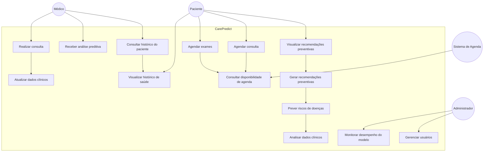

# 🏥 Diagrama de Caso de Uso Completo — CarePredict

Sistema de medicina preventiva com Machine Learning proposto para a **Care Plus**.

---

# 👥 Atores do Sistema

### Paciente

Interage com a plataforma para:

* visualizar recomendações de saúde
* agendar consultas
* agendar exames
* acompanhar histórico clínico

---

### Médico

* consulta histórico do paciente
* recebe análises preditivas
* realiza consulta
* atualiza dados clínicos

---

### Administrador

* gerencia usuários
* monitora modelos de ML
* supervisiona dados

---

### Sistema de Agenda Externo

* fornece disponibilidade de médicos
* permite agendamento de exames e consultas

---

# 📊 Diagrama UML de Caso de Uso — CarePredict



---

# 🔄 Fluxo Principal do Sistema

### Fluxo preventivo

```
Paciente entra no sistema
        ↓
CarePredict analisa dados clínicos
        ↓
Modelo de ML calcula risco de doenças
        ↓
Sistema gera recomendações preventivas
        ↓
Paciente agenda exame ou consulta
```

---

# 🩺 Fluxo de Consulta Médica

```
Paciente agenda consulta
        ↓
Médico acessa histórico consolidado
        ↓
CarePredict mostra análise preditiva
        ↓
Consulta é realizada
        ↓
Dados clínicos são atualizados
```

---

# ⚙️ Fluxo de Machine Learning

```
Dados clínicos do paciente
        ↓
Análise de dados
        ↓
Modelo preditivo
        ↓
Cálculo de risco de doenças
        ↓
Recomendação de exames e consultas
```
