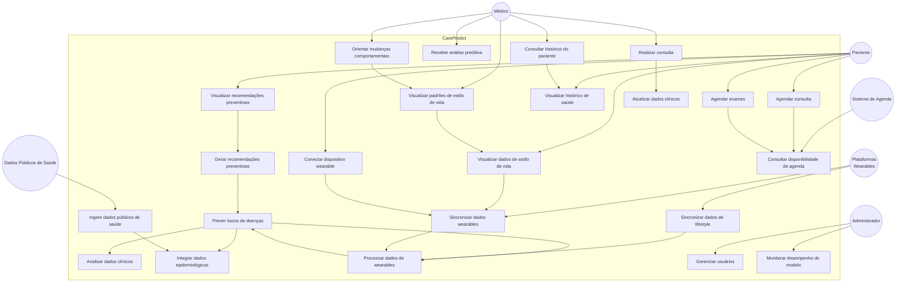

# 🏥 Diagrama de Caso de Uso — CarePredict (Versão Revisada)

Sistema de medicina preventiva baseado em dados clínicos, epidemiológicos e comportamentais proposto para a **CarePlus**.

O CarePredict utiliza:

- dados clínicos do paciente
- **dados contínuos de dispositivos wearables** (Apple Watch, Fitbit, Google Fit, etc)
- dados populacionais públicos
- modelos de Machine Learning

para prever riscos de saúde e recomendar exames preventivos com **visão 360° do estilo de vida**.

---

# 👥 Atores do Sistema

## Paciente

Interage com a plataforma para:

- visualizar recomendações preventivas
- **conectar e gerenciar dispositivos wearables** (novo!)
- **visualizar dados de estilo de vida** (atividade, sono, frequência cardíaca)
- **receber insights baseados em comportamento**
- agendar consultas
- agendar exames
- acompanhar histórico de saúde

---

## Médico

Utiliza o sistema para apoio clínico.

Pode:

- acessar histórico do paciente
- **visualizar padrões de estilo de vida** (dados de wearables)
- visualizar análises preditivas enriquecidas com dados comportamentais
- realizar consultas
- registrar diagnósticos
- orientar mudanças comportamentais baseado em dados reais

---

## Administrador

Responsável por manter o sistema operacional.

Pode:

- gerenciar usuários
- monitorar desempenho dos modelos
- supervisionar qualidade dos dados

---

## Sistema de Agenda Externo

Sistema responsável por:

- fornecer horários disponíveis de médicos
- permitir agendamento de exames e consultas

---

## Sistemas de Dados Públicos de Saúde

Fontes externas utilizadas para enriquecer o modelo:

- DATASUS
- IBGE
- ANS

Esses dados ajudam a melhorar a análise de risco populacional.

---

## Plataformas de Wearables (Novo!)

Dispositivos inteligentes e suas APIs que fornecem dados contínuos de estilo de vida:

- **Apple HealthKit** — Apple Watch, iPhone
- **Google Fit** — Android Wear, Smartphones
- **Fitbit API** — Dispositivos Fitbit
- **Garmin Connect** — Relógios Garmin
- **Oura Ring** — Anéis inteligentes

Fornecem dados de:
- Atividade física (passos, exercício)
- Frequência cardíaca (repouso, máxima, variabilidade)
- Qualidade de sono (duração, profundidade)
- Nível de estresse e recuperação

---

# 📊 Diagrama UML de Caso de Uso — CarePredict



---

# 🔄 Fluxo Preventivo Principal

Este é o fluxo central do CarePredict, agora potencializado com dados de wearables.

```
Paciente acessa o sistema
        ↓
Paciente conecta dispositivos wearables (Apple Watch, Fitbit, etc)
        ↓
CarePredict coleta dados clínicos
        ↓
CarePredict sincroniza dados de estilo de vida (atividade, sono, FC, estresse)
        ↓
Sistema integra dados epidemiológicos públicos
        ↓
Modelo de Machine Learning calcula risco de doenças (com 15-25% mais precisão!)
        ↓
Sistema gera recomendações preventivas contextualizadas ao comportamento real
        ↓
Paciente agenda exames ou consultas
        ↓
Médico visualiza padrões de estilo de vida na consulta
        ↓
Consulta é realizada com dados comportamentais como contexto
```

---

# 📱 Fluxo de Integração com Wearables (Novo!)

```
Paciente autoriza acesso a dispositivo via OAuth
        ↓
CarePredict conecta com plataforma (Apple Health, Google Fit, Fitbit)
        ↓
Sistema sincroniza dados históricos (últimas 4 semanas)
        ↓
Dados são anonimizados e processados
        ↓
Features de estilo de vida são extraídas
        ↓
Modelos ML são enriquecidos com dados comportamentais
        ↓
Dashboard do paciente exibe gráficos de atividade, sono, FC, estresse
        ↓
Sincronização contínua (diária ou em tempo real)
        ↓
Recomendações são adaptadas ao estilo de vida real do paciente
```

---

# 🩺 Fluxo de Consulta Médica (Atualizado com Wearables)

```
Paciente agenda consulta
        ↓
Médico acessa histórico clínico consolidado
        ↓
Médico visualiza gráficos de estilo de vida (atividade, sono, FC, estresse)
        ↓
CarePredict apresenta análise preditiva enriquecida com dados comportamentais
        ↓
Consulta é realizada (contexto clínico + comportamental)
        ↓
Médico pode orientar mudanças específicas baseadas em dados reais
        ↓
Dados clínicos + feedback comportamental são atualizados no sistema
```

---

# ⚙️ Fluxo de Machine Learning (Atualizado com Wearables)

```
Dados clínicos do paciente
        ↓
Sincronização de dados de wearables (atividade, sono, FC, estresse)
        ↓
Integração com dados populacionais
        ↓
Feature Engineering:
  - Features clínicas (idade, diagnósticos, exames)
  - Features comportamentais (atividade, consistência de sono, VFC)
  - Features epidemiológicas (incidência na população)
        ↓
Análise de dados multidimensional
        ↓
Modelo preditivo enriquecido (com 15-25% mais precisão!)
        ↓
Cálculo de risco de doenças (com confiança aumentada)
        ↓
Geração de recomendações preventivas contextualizadas
```

---

# 🧠 Objetivo do Sistema

O CarePredict busca **identificar riscos de saúde antes que se tornem problemas clínicos graves**, permitindo:

* **diagnóstico precoce** com visão 360° do paciente (clínica + comportamento)
* **detecção de padrões de risco** através de dados contínuos de wearables
* **aumento de exames preventivos** baseado em riscos reais
* **redução de internações evitáveis** através de prevenção proativa
* **diminuição de custos assistenciais** da operadora
* **maior engajamento do paciente** ao visualizar seus próprios dados de estilo de vida
* **orientações clínicas mais precisas** baseadas em comportamento real, não apenas em referência populacional

**Diferencial:** Integração com wearables permite capturar dados contínuos (24/7) que revelam padrões não detectáveis em consultas clínicas, aumentando precisão dos modelos em 15-25%.