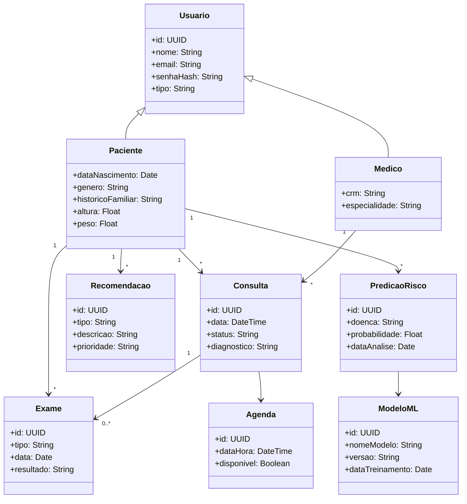
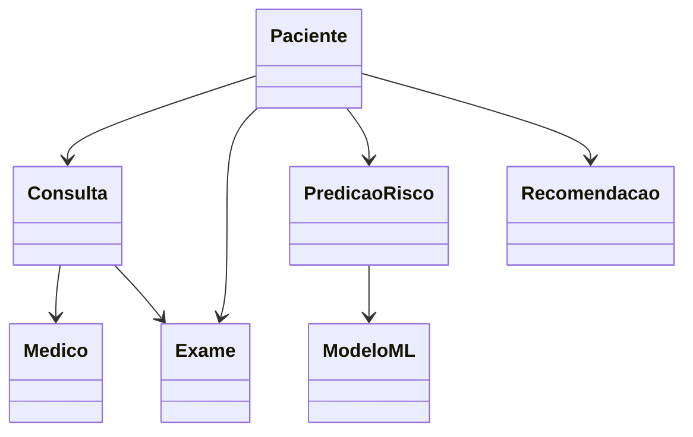

# 🏥 Diagrama de Classes — CarePredict



---

# 🧠 Explicação das Classes

## 👤 Usuario (classe base)

Classe genérica para autenticação.

Atributos:

* id
* nome
* email
* senha

Especializações:

* **Paciente**
* **Medico**

---

# 🧑‍⚕️ Paciente

Representa o segurado do plano.

Dados importantes para ML:

* idade
* gênero
* histórico familiar
* altura
* peso

Relacionamentos:

Paciente pode ter:

* várias consultas
* vários exames
* várias predições de risco
* várias recomendações

---

# 👨‍⚕️ Medico

Representa o profissional de saúde.

Atributos:

* CRM
* especialidade

Relacionamento:

* médico realiza várias consultas.

---

# 🩺 Consulta

Representa uma consulta médica.

Contém:

* data
* diagnóstico
* status

Relacionamentos:

* consulta pertence a **um paciente**
* consulta é realizada por **um médico**
* consulta pode gerar **exames**

---

# 🧪 Exame

Representa exames laboratoriais ou clínicos.

Atributos:

* tipo de exame
* data
* resultado

Relacionamentos:

* associado a consultas
* associado ao paciente

---

# 🤖 PredicaoRisco

Representa a análise de risco gerada pelo ML.

Exemplo:

```
Doença: Diabetes
Probabilidade: 0.72
```

Relacionamentos:

* pertence a um paciente
* é gerada por um modelo de ML

---

# 🧠 ModeloML

Representa o modelo de machine learning.

Atributos:

* versão do modelo
* data de treinamento
* nome do modelo

Serve para **rastreabilidade e auditoria do modelo**.

---

# 📋 Recomendacao

Representa sugestões do sistema.

Exemplos:

* exame de colesterol
* consulta cardiológica
* check-up anual

Atributos:

* tipo
* prioridade
* descrição

---

# 📅 Agenda

Representa horários disponíveis para consultas ou exames.

Atributos:

* data e hora
* disponibilidade

Relacionamento:

* usado para agendar consultas.

---

# 📊 Visão conceitual simplificada


