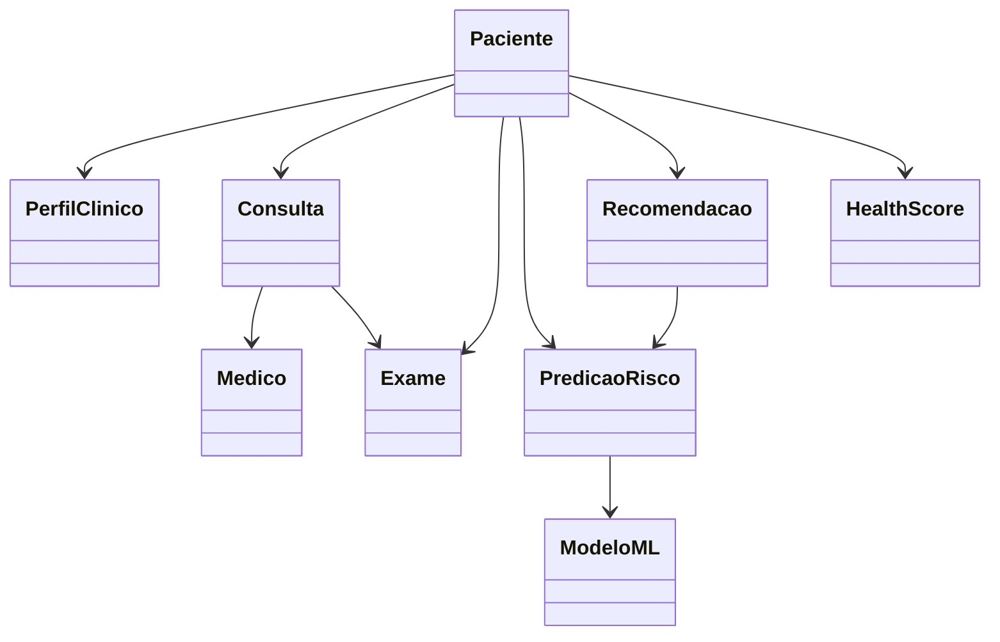

# 🏥 Diagrama de Classes — CarePredict (Versão Revisada)

Este diagrama representa o modelo conceitual do sistema **CarePredict**, incluindo:

- domínio clínico do paciente
- componentes de inteligência artificial
- recomendações preventivas
- rastreabilidade dos modelos de Machine Learning

---

# 📊 Diagrama UML

```mermaid
classDiagram

class Usuario {
  +id: UUID
  +nome: String
  +email: String
  +senhaHash: String
  +tipo: String
}

class Paciente {
  +dataNascimento: Date
  +genero: String
  +altura: Float
  +peso: Float
}

class Medico {
  +crm: String
  +especialidade: String
}

class PerfilClinico {
  +idade: Int
  +imc: Float
  +historicoFamiliar: String
  +fatoresRisco: String
}

class Consulta {
  +id: UUID
  +data: DateTime
  +status: String
  +diagnostico: String
}

class Exame {
  +id: UUID
  +tipo: TipoExame
  +data: Date
  +resultado: String
}

class TipoExame {
  <<enumeration>>
  Hemograma
  Glicemia
  PerfilLipidico
  Eletrocardiograma
  Ultrassom
}

class PredicaoRisco {
  +id: UUID
  +doenca: String
  +probabilidade: Float
  +dataAnalise: Date
}

class HealthScore {
  +valor: Float
  +dataCalculo: Date
}

class Recomendacao {
  +id: UUID
  +tipo: String
  +descricao: String
  +prioridade: String
  +origem: String
  +explicacao: String
}

class ModeloML {
  +id: UUID
  +nomeModelo: String
  +versao: String
  +dataTreinamento: Date
}

class Agenda {
  +id: UUID
  +dataHora: DateTime
  +disponivel: Boolean
}

Usuario <|-- Paciente
Usuario <|-- Medico

Paciente "1" --> "1" PerfilClinico
Paciente "1" --> "*" Consulta
Paciente "1" --> "*" Exame
Paciente "1" --> "*" PredicaoRisco
Paciente "1" --> "*" Recomendacao
Paciente "1" --> "1" HealthScore

Medico "1" --> "*" Consulta

Consulta --> Agenda
Consulta --> "0..*" Exame

PredicaoRisco --> ModeloML

Recomendacao --> PredicaoRisco
````

---

# 🧠 Explicação das Classes

## 👤 Usuario

Classe base utilizada para autenticação e identificação no sistema.

Atributos:

* id
* nome
* email
* senhaHash
* tipo de usuário

Especializações:

* Paciente
* Médico

---

# 🧑 Paciente

Representa o segurado do plano de saúde.

Atributos principais:

* data de nascimento
* gênero
* altura
* peso

Relacionamentos:

* possui um perfil clínico
* possui consultas médicas
* possui exames realizados
* recebe recomendações preventivas
* possui análises de risco
* possui um score de saúde

---

# 🧠 PerfilClinico

Representa um **resumo clínico estruturado do paciente**, utilizado pelos modelos de Machine Learning.

Atributos importantes:

* idade
* IMC
* histórico familiar
* fatores de risco

Essa classe representa a **camada de feature engineering no domínio clínico**.

---

# 👨‍⚕️ Medico

Representa profissionais de saúde.

Atributos:

* CRM
* especialidade

Relacionamento:

* médico realiza consultas.

---

# 🩺 Consulta

Representa uma consulta médica.

Atributos:

* data
* diagnóstico
* status

Relacionamentos:

* associada a um paciente
* realizada por um médico
* pode gerar exames

---

# 🧪 Exame

Representa exames laboratoriais ou clínicos.

Atributos:

* tipo de exame
* data
* resultado

Relacionamentos:

* associado a um paciente
* pode estar ligado a uma consulta médica.

---

# 🧬 PredicaoRisco

Representa uma previsão gerada por um modelo de Machine Learning.

Exemplo:

```
Doença: Diabetes
Probabilidade: 0.72
```

Relacionamentos:

* pertence a um paciente
* é gerada por um modelo de ML

---

# 📊 HealthScore

Indicador geral de risco do paciente.

Exemplo:

```
HealthScore: 64 / 100
```

Esse score é calculado considerando:

* histórico clínico
* exames
* predições de risco
* fatores populacionais

Ele ajuda o sistema a **priorizar pacientes para ações preventivas**.

---

# 📋 Recomendacao

Representa sugestões geradas pelo sistema.

Exemplos:

* exame de glicemia
* perfil lipídico
* consulta cardiológica
* check-up anual

Atributos importantes:

* prioridade
* origem da recomendação
* explicação da decisão

Isso permite **explicabilidade da IA (Explainable AI)**.

---

# 🤖 ModeloML

Representa o modelo de Machine Learning utilizado pelo sistema.

Atributos:

* nome do modelo
* versão
* data de treinamento

Serve para **auditoria e rastreabilidade do modelo**.

---

# 📅 Agenda

Representa horários disponíveis para consultas ou exames.

Atributos:

* data e hora
* disponibilidade

Usado pelo sistema de agendamento.

---

# 📊 Visão conceitual simplificada

