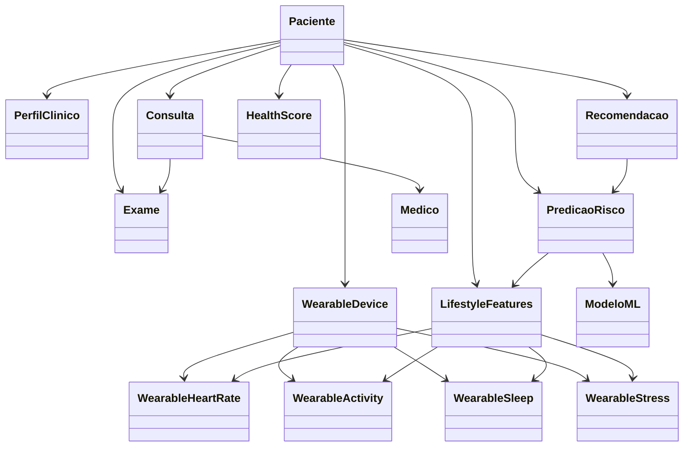

# 🏥 Diagrama de Classes — CarePredict (Versão Revisada)

Este diagrama representa o modelo conceitual do sistema **CarePredict**, incluindo:

- domínio clínico do paciente
- **dados contínuos de dispositivos wearables** (novo!)
- **lifestyle features engenheirizadas** (novo!)
- componentes de inteligência artificial
- recomendações preventivas
- rastreabilidade dos modelos de Machine Learning

---

# 📊 Diagrama UML

```mermaid
classDiagram

class Usuario {
  +id: UUID
  +nome: String
  +email: String
  +senhaHash: String
  +tipo: String
}

class Paciente {
  +dataNascimento: Date
  +genero: String
  +altura: Float
  +peso: Float
}

class Medico {
  +crm: String
  +especialidade: String
}

class PerfilClinico {
  +idade: Int
  +imc: Float
  +historicoFamiliar: String
  +fatoresRisco: String
}

class Consulta {
  +id: UUID
  +data: DateTime
  +status: String
  +diagnostico: String
}

class Exame {
  +id: UUID
  +tipo: TipoExame
  +data: Date
  +resultado: String
}

class TipoExame {
  <<enumeration>>
  Hemograma
  Glicemia
  PerfilLipidico
  Eletrocardiograma
  Ultrassom
}

class PredicaoRisco {
  +id: UUID
  +doenca: String
  +probabilidade: Float
  +dataAnalise: Date
}

class HealthScore {
  +valor: Float
  +dataCalculo: Date
}

class Recomendacao {
  +id: UUID
  +tipo: String
  +descricao: String
  +prioridade: String
  +origem: String
  +explicacao: String
}

class ModeloML {
  +id: UUID
  +nomeModelo: String
  +versao: String
  +dataTreinamento: Date
}

class Agenda {
  +id: UUID
  +dataHora: DateTime
  +disponivel: Boolean
}

class WearablePlataforma {
  <<enumeration>>
  AppleHealth
  GoogleFit
  Fitbit
  Garmin
  Oura
}

class WearableDevice {
  +id: UUID
  +plataforma: WearablePlataforma
  +tipoDispositivo: String
  +accessTokenVaultKey: String
  +refreshTokenVaultKey: String
  +tokenExpiry: DateTime
  +lastSync: DateTime
  +isActive: Boolean
  +connectedAt: DateTime
}

class WearableHeartRate {
  +id: UUID
  +timestamp: DateTime
  +heartRate: Int
  +heartRateVariability: Float
  +restingHeartRate: Int
  +sourcePlatform: String
  +dataQualityScore: Float
}

class WearableActivity {
  +id: UUID
  +date: Date
  +steps: Int
  +distanceKm: Float
  +activeMinutes: Int
  +caloriesBurned: Float
  +exerciseDuration: Int
  +activityType: String
  +intensityLevel: String
}

class WearableSleep {
  +id: UUID
  +date: Date
  +sleepStart: DateTime
  +sleepEnd: DateTime
  +totalSleepMinutes: Int
  +deepSleepMinutes: Int
  +lightSleepMinutes: Int
  +remSleepMinutes: Int
  +sleepScore: Int
  +awakenings: Int
}

class WearableStress {
  +id: UUID
  +timestamp: DateTime
  +stressLevel: Int
  +stressCategory: String
  +hrvIndicator: Float
  +recoveryTimeMinutes: Int
}

class LifestyleFeatures {
  +id: UUID
  +date: Date
  +avgWeeklySteps: Float
  +activeDaysRatio: Float
  +exerciseConsistency: Float
  +activityTrend: Float
  +restingHeartRateTrend: Float
  +heartRateVariabilityLowRisk: Boolean
  +avgSleepDuration: Float
  +sleepQualityScore: Float
  +sleepConsistency: Float
  +insomniaFlag: Boolean
  +stressLevelAvg: Float
  +stressVariability: Float
  +recoveryDaysRatio: Float
  +burnoutRisk: Boolean
  +lifestyleComplianceScore: Float
  +dataCompleteness: Float
  +lastUpdated: DateTime
}

Usuario <|-- Paciente
Usuario <|-- Medico

Paciente "1" --> "1" PerfilClinico
Paciente "1" --> "*" Consulta
Paciente "1" --> "*" Exame
Paciente "1" --> "*" PredicaoRisco
Paciente "1" --> "*" Recomendacao
Paciente "1" --> "1" HealthScore
Paciente "1" --> "*" WearableDevice
Paciente "1" --> "*" WearableHeartRate
Paciente "1" --> "*" WearableActivity
Paciente "1" --> "*" WearableSleep
Paciente "1" --> "*" WearableStress
Paciente "1" --> "*" LifestyleFeatures

WearableDevice --> WearablePlataforma

PredicaoRisco --> ModeloML
PredicaoRisco --> LifestyleFeatures

LifestyleFeatures --> WearableHeartRate
LifestyleFeatures --> WearableActivity
LifestyleFeatures --> WearableSleep
LifestyleFeatures --> WearableStress

Recomendacao --> PredicaoRisco
Recomendacao --> ClinicalGuideline

Medico "1" --> "*" Consulta

Consulta --> Agenda
Consulta --> "0..*" Exame

%% COMPONENTES DE ML E INFRAESTRUTURA

class RiskScore {
  +id: UUID
  +paciente_id: UUID
  +scoreValue: Float
  +scoreType: String
  +riskLevel: String
  +calculatedAt: DateTime
  +modelVersion: String
  +confidenceScore: Float
}

class FeatureStore {
  +id: UUID
  +featureName: String
  +featureValue: Float
  +timestamp: DateTime
  +dataSource: String
  +computationMethod: String
  +isActive: Boolean
}

class ModelRegistry {
  +id: UUID
  +modelName: String
  +modelVersion: String
  +modelType: String
  +trainedAt: DateTime
  +performance: Dict
  +hyperparameters: Dict
  +isProduction: Boolean
  +registry_metadata: Dict
}

class ClinicalGuideline {
  +id: UUID
  +guidelineCode: String
  +doenca: String
  +protocoloRastreamento: String
  +critériosExame: String
  +frequênciaExame: String
  +contraindications: List
  +referenceSource: String
  +lastUpdated: DateTime
}

class WearableSync {
  +id: UUID
  +paciente_id: UUID
  +plataforma: String
  +lastSync: DateTime
  +nextSync: DateTime
  +syncStatus: String
  +dataPointsSync: Int
  +errorCount: Int
  +tokenRefreshed: DateTime
}

%% RELACIONAMENTOS

PredicaoRisco --> RiskScore
RiskScore --> HealthScore

FeatureStore --> LifestyleFeatures
FeatureStore --> PerfilClinico

ModeloML --> ModelRegistry
ModelRegistry --> FeatureStore

WearableDevice --> WearableSync
WearableSync --> WearableHeartRate
WearableSync --> WearableActivity
WearableSync --> WearableSleep
WearableSync --> WearableStress

ClinicalGuideline --> PredicaoRisco

Paciente "1" --> "*" RiskScore
Paciente "1" --> "*" WearableSync
Paciente "1" --> "1" FeatureStore
````

---

# 🧠 Explicação das Classes

## 👤 Usuario

Classe base utilizada para autenticação e identificação no sistema.

Atributos:

* id
* nome
* email
* senhaHash
* tipo de usuário

Especializações:

* Paciente
* Médico

---

# 🧑 Paciente

Representa o segurado do plano de saúde.

Atributos principais:

* data de nascimento
* gênero
* altura
* peso

Relacionamentos:

* possui um perfil clínico
* possui consultas médicas
* possui exames realizados
* recebe recomendações preventivas
* possui análises de risco
* possui um score de saúde

---

# 🧠 PerfilClinico

Representa um **resumo clínico estruturado do paciente**, utilizado pelos modelos de Machine Learning.

Atributos importantes:

* idade
* IMC
* histórico familiar
* fatores de risco

Essa classe representa a **camada de feature engineering no domínio clínico**.

---

# 👨‍⚕️ Medico

Representa profissionais de saúde.

Atributos:

* CRM
* especialidade

Relacionamento:

* médico realiza consultas.

---

# 🩺 Consulta

Representa uma consulta médica.

Atributos:

* data
* diagnóstico
* status

Relacionamentos:

* associada a um paciente
* realizada por um médico
* pode gerar exames

---

# 🧪 Exame

Representa exames laboratoriais ou clínicos.

Atributos:

* tipo de exame
* data
* resultado

Relacionamentos:

* associado a um paciente
* pode estar ligado a uma consulta médica.

---

# 🧬 PredicaoRisco

Representa uma previsão gerada por um modelo de Machine Learning.

Exemplo:

```
Doença: Diabetes
Probabilidade: 0.72
```

Relacionamentos:

* pertence a um paciente
* é gerada por um modelo de ML

---

# 📊 HealthScore

Indicador geral de risco do paciente.

Exemplo:

```
HealthScore: 64 / 100
```

Esse score é calculado considerando:

* histórico clínico
* exames
* predições de risco
* fatores populacionais

Ele ajuda o sistema a **priorizar pacientes para ações preventivas**.

---

# 📋 Recomendacao

Representa sugestões geradas pelo sistema.

Exemplos:

* exame de glicemia
* perfil lipídico
* consulta cardiológica
* check-up anual

Atributos importantes:

* prioridade
* origem da recomendação
* explicação da decisão

Isso permite **explicabilidade da IA (Explainable AI)**.

---

# 🤖 ModeloML

Representa o modelo de Machine Learning utilizado pelo sistema.

Atributos:

* nome do modelo
* versão
* data de treinamento

Serve para **auditoria e rastreabilidade do modelo**.

---

# 📅 Agenda

Representa horários disponíveis para consultas ou exames.

Atributos:

* data e hora
* disponibilidade

Usado pelo sistema de agendamento.

---

# � Wearables — Classes para Integração com Dispositivos Inteligentes

As classes de wearables representam a integração contínua com dispositivos inteligentes (smartwatches, pulseiras, anéis) para capturar dados de estilo de vida em tempo real.

## 🔌 WearableDevice

Representa um dispositivo wearable conectado ao paciente.

Atributos:

* **plataforma** — Apple Health, Google Fit, Fitbit, Garmin, Oura
* **tipoDispositivo** — Apple Watch, Fitbit Sense, etc
* **accessTokenVaultKey** — Referência segura ao Azure Key Vault (não armazena o token!)
* **refreshTokenVaultKey** — Token de renovação (igualmente seguro)
* **tokenExpiry** — Data de expiração do token
* **lastSync** — Última sincronização com a plataforma
* **isActive** — Flag de ativação/desativação
* **connectedAt** — Data de conexão

**Importância:** Gerencia credenciais seguras usando padrão vault para conformidade LGPD.

---

## ❤️ WearableHeartRate

Representa dados de frequência cardíaca contínuos.

Atributos:

* **heartRate** — BPM instantâneo
* **heartRateVariability** — Variabilidade da FC (indicador de estresse)
* **restingHeartRate** — FC em repouso (indicador de condição cardiovascular)
* **timestamp** — Quando foi medido
* **dataQualityScore** — 0-1, indicando qualidade da medição

**Importância clínica:**
* FC em repouso elevada → estresse crônico, hipertensão
* VFC baixa → fadiga, estresse
* Padrão anormal → aviso de arritmias

Exemplo de detecção de risco: Paciente com FC repouso aumentando gradualmente pode indicar desenvolvimento de hipertensão **meses antes de apresentar sintomas**.

---

## 🏃‍♂️ WearableActivity

Representa dados de atividade física diária.

Atributos:

* **steps** — Passos do dia
* **distanceKm** — Distância percorrida
* **activeMinutes** — Minutos de atividade
* **caloriesBurned** — Calorias queimadas
* **exerciseDuration** — Duração de exercício estruturado
* **activityType** — Tipo (caminhada, corrida, ginástica)
* **intensityLevel** — Leve, moderada, vigorosa

**Importância clínica:**
* Atividade muito baixa → risco de obesidade, diabetes tipo 2
* Intensidade insuficiente → não atinge recomendações de saúde
* Consistência → aderência a estilo de vida saudável

Estudos mostram que **atividade <5.000 passos/dia** está associada a risco 2x maior de problemas cardiovasculares.

---

## 😴 WearableSleep

Representa dados de qualidade de sono.

Atributos:

* **totalSleepMinutes** — Duração total
* **deepSleepMinutes** — Sono profundo (recuperação)
* **lightSleepMinutes** — Sono leve
* **remSleepMinutes** — REM (consolidação de memória)
* **sleepScore** — 0-100 (qualidade geral)
* **awakenings** — Número de despertares

**Importância clínica:**
* Sono < 6h ou > 9h → risco de mortalidade aumentado
* Baixa porcentagem de deep sleep → recuperação inadequada
* Despertares frequentes → apneia do sono, insônia

Sono ruim é preditor de diabetes, obesidade, doenças cardiovasculares com **até 3 meses de antecedência**.

---

## 😰 WearableStress

Representa indicadores de estresse/recuperação.

Atributos:

* **stressLevel** — 0-100 (nível de estresse)
* **stressCategory** — Baixo, médio, alto
* **hrvIndicator** — Heart Rate Variability (proxy de estresse)
* **recoveryTimeMinutes** — Tempo necessário para recuperação

**Importância clínica:**
* Estresse crônico > 70 → hipertensão, doenças cardíacas
* Recuperação inadequada → burnout, depressão
* Padrão elevado + sono ruim → risco composto

**Vantagem única:** Wearables capturam estresse **não-invasivamente e continuamente**, algo impossível em consultas clínicas.

---

## 🧬 LifestyleFeatures

Representa **features engenheirizadas** derivadas dos dados brutos de wearables.

Atributos chave:

* **avgWeeklySteps** — Média de passos semanais
* **activeDaysRatio** — Percentual de dias com atividade (0-1)
* **exerciseConsistency** — Desvio padrão da atividade (consistência)
* **activityTrend** — Tendência semanal (subindo/estável/descendo)
* **restingHeartRateTrend** — Tendência de FC repouso
* **heartRateVariabilityLowRisk** — Flag se VFC está dentro do normal
* **avgSleepDuration** — Média de horas de sono
* **sleepQualityScore** — Score composto de qualidade
* **sleepConsistency** — Coerência dos horários de sono
* **insomniaFlag** — Flag de possível insônia
* **stressLevelAvg** — Estresse médio
* **stressVariability** — Variação de estresse
* **recoveryDaysRatio** — % de dias com boa recuperação
* **burnoutRisk** — Flag de risco de burnout
* **lifestyleComplianceScore** — 0-100, aderência geral ao estilo saudável

**Importância:** Essas features **alimentam diretamente os modelos de Machine Learning**, aumentando a precisão em **15-25%** comparado a apenas dados clínicos.

---

## Relacionamentos de Wearables

```
Paciente --> WearableDevice (1 para *)
  └─ Cada paciente pode ter múltiplos dispositivos

WearableDevice --> WearablePlataforma
  └─ Cada dispositivo conecta com uma plataforma

Paciente --> WearableHeartRate (1 para *)
Paciente --> WearableActivity (1 para *)
Paciente --> WearableSleep (1 para *)
Paciente --> WearableStress (1 para *)
  └─ Acumula dados históricos

LifestyleFeatures --> WearableHeartRate, WearableActivity, WearableSleep, WearableStress
  └─ Features são CALCULADAS a partir dos dados brutos

PredicaoRisco --> LifestyleFeatures
  └─ Modelos ML usam lifestyle features para predição
```

---

# �📊 Visão conceitual simplificada



---

# � Componentes de ML e Infraestrutura (OPÇÃO A)

## 🎯 RiskScore

Classe intermediária que consolida múltiplos scores de risco em um único valor agregado.

**Atributos**:
- scoreValue: Valor numérico do score
- scoreType: Tipo de score (global, por doença, contextual)
- riskLevel: Categoria (muito alto, alto, moderado, baixo, muito baixo)
- modelVersion: Qual versão do modelo gerou este score
- confidenceScore: Confiança do score (0-1)

**Relacionimentos**:
- Agrega múltiplas `PredicaoRisco`
- Relacionado a `HealthScore` para contextualização

**Uso**: Intermediário entre PredicaoRisco (granular) e HealthScore (agregado).

---

## 📦 FeatureStore

Sistema centralizado de features engenheirizadas, utilizado por todos os modelos ML.

**Atributos**:
- featureName: Nome da feature (ex: "avg_weekly_steps")
- featureValue: Valor calculado
- dataSource: Origem (wearable, clínico, populacional)
- computationMethod: Como foi calculada
- isActive: Se está sendo usada

**Responsabilidades**:
- Armazena 15 lifestyle features de forma centralizada
- Permite reutilização por múltiplos modelos
- Controla versões de features (ex: avg_weekly_steps v1, v2)
- Casa de verdade para feature engineering

**Uso**: Todo modelo ML consulta FeatureStore, não recalcula.

---

## 🗂️ ModelRegistry

Registro centralizado de todos os modelos ML em produção e experimentação.

**Atributos**:
- modelName: Nome descritivo
- modelVersion: Versão semântica (v1.2.3)
- modelType: Tipo (RandomForest, XGBoost, NeuralNetwork)
- trainedAt: Quando foi treinado
- performance: Métricas (precision, recall, AUC)
- hyperparameters: Configuração do modelo
- isProduction: Flag para saber qual usar

**Responsabilidades**:
- Rastreia histórico completo de modelos
- Permite rollback se novo modelo falhar
- Documenta performance e hyperparameters
- Governa qual modelo usar em produção

**Uso**: Antes de usar um modelo, verifica ModelRegistry.

---

## 📋 ClinicalGuideline

Diretrizes clínicas estruturadas para cada doença suportada.

**Atributos**:
- guidelineCode: Código único (ex: "HTN_2024_BR")
- doenca: Doença alvo (ex: "Hipertensão")
- protocoloRastreamento: Qual exame fazer
- critériosExame: Quando fazer (idade, valores)
- frequênciaExame: Com que frequência (anual, a cada 2 anos)
- contraindications: Quando NÃO fazer
- referenceSource: Origem (SBC, ADA, OMS)
- lastUpdated: Quando foi atualizado

**Responsabilidades**:
- Valida clinicamente cada risco recomendado
- Garante conformidade com protocolos atualizados
- Previne recomendações inadequadas
- Auditável: referência explícita

**Uso**: ClinicalGuideline valida PredicaoRisco antes de Recomendacao.

---

## 🔄 WearableSync

Orquestra a sincronização de dados wearables de forma segura e confiável.

**Atributos**:
- paciente_id: Qual paciente
- plataforma: Qual wearable (Apple, Fitbit, etc)
- lastSync: Último sincronização com sucesso
- nextSync: Próxima sincronização planejada
- syncStatus: Estado (pending, syncing, success, failed)
- dataPointsSync: Quantos pontos foram sincronizados
- errorCount: Quantas tentativas falharam
- tokenRefreshed: Quando token OAuth foi renovado

**Responsabilidades**:
- Recupera token do Key Vault
- Consulta plataforma wearable
- Valida e normaliza dados
- Detecta anomalias
- Armazena em WearableX tables
- Registra auditoria

**Uso**: Executa diariamente (OPÇÃO A - Batch Only).

---

# �🔄 Fluxo de Dados: Do Wearable ao Modelo ML

```
Dispositivo Wearable (Apple Watch, Fitbit, etc)
    ↓
WearableDevice + [HeartRate, Activity, Sleep, Stress]
    ↓
Validação & Normalização
    ↓
LifestyleFeatures (Features Engenheirizadas)
    ↓
Modelos ML (Predição de Risco + 15-25% precisão extra)
    ↓
PredicaoRisco (com confiança aumentada)
    ↓
Recomendacao (contextualizada com estilo de vida real)
    ↓
Paciente & Médico (insights acionáveis)
```

---

# 💡 Diferencial do CarePredict

A integração de **wearables em modelos preditivos** oferece:

✅ **Visão 360° do paciente** — Combina clínico + comportamental  
✅ **Detecção precoce** — Identifica riscos meses antes de sintomas  
✅ **Precisão aumentada** — Modelos 15-25% mais precisos  
✅ **Engajamento** — Paciente vê seus próprios dados  
✅ **LGPD Compliant** — OAuth, consentimento, criptografia  
✅ **Escalável** — Múltiplas plataformas suportadas  
✅ **Explicável** — Clínico entende decisões da IA

---

# 🎯 Notas Arquiteturais

## Escopo do Diagrama

Este diagrama representa um modelo **completo (OPÇÃO A)** do CarePredict:
- Entidades de domínio clínico e comportamental
- Relacionamentos entre pacientes e dados
- Componentes de apoio de ML/infraestrutura essenciais para rastreabilidade

## Classes de Infraestrutura Incluídas (OPÇÃO A)

As seguintes classes/componentes estão **incluídas intencionalmente** para alinhamento com a arquitetura cloud:
- `FeatureStore` — armazenamento e versionamento de features
- `ModelRegistry` — registro de modelos (Azure ML, Databricks, etc)
- `RiskScore` — camada intermediária de score entre risco granular e score agregado
- `ClinicalGuideline` — base estruturada de protocolos clínicos
- `WearableSync` — orquestração de sincronização e auditoria de wearables

Os serviços operacionais de infraestrutura permanecem fora do escopo do diagrama de classe:
- `AnonymizationService`
- `WearableConnector`
- `PopulationDataService`

**Separação de responsabilidades:**
- Este diagrama: O QUE o sistema sabe (dados de domínio)
- Diagrama de Sequência: COMO o sistema funciona (componentes)
- Diagrama de Arquitetura: ONDE os componentes vivem (infraestrutura)

## Decisões de Modelagem

### 1. Dual PredicaoRisco + HealthScore

Mantidas ambas as classes:
- `PredicaoRisco`: Detalhado por doença (array de {doença, probabilidade})
- `HealthScore`: Agregado único (0-100)

Justificativa: Permite tanto detalhamento clínico quanto resumo para usuário final.

### 2. LifestyleFeatures como Classe Explícita

Adicionada como entidade porque:
- Ponte entre dados brutos de wearables e modelos ML
- Rastreabilidade: qual feature foi usada em qual predição
- Versionamento: features mudam ao longo do tempo

### 3. WearableDevice com Tokens Armazenados

Campos especiais:
- `accessTokenVaultKey`, `refreshTokenVaultKey`: Referências ao Azure Key Vault (não tokens em texto)
- `tokenExpiry`: Controle de expiração
- `lastSync`: Auditoria de sincronizações
- `isActive`: Permissão revogada (LGPD)

Representam o fluxo OAuth 2.0 completo.

### 4. Modelo Suporta Múltiplas Plataformas

Enum `WearablePlataforma`:
```
AppleHealth, GoogleFit, Fitbit, Garmin, Oura
```

Cada paciente pode ter múltiplos `WearableDevice` (um por plataforma).

## Extensões Potenciais

Para aprofundar o modelo, você pode adicionar classes técnicas de implementação específica (não conceituais), por exemplo:

```mermaid
class FeatureStore {
  +id: UUID
  +name: String
  +version: String
  +features: List~Feature~
}

class ModelRegistry {
  +id: UUID
  +modelName: String
  +version: String
  +metrics: Metrics
  +featuresUsed: List~String~
}

class RiskScoringEngine {
  +calculateScore(PredicaoRisco): HealthScore
}

class Anonymization {
  +pseudonymize(data): PseudonymizedData
  +decrypt(key): OriginalData
}
```

Mas esses **não pertencem ao diagrama de domínio principal**.

---