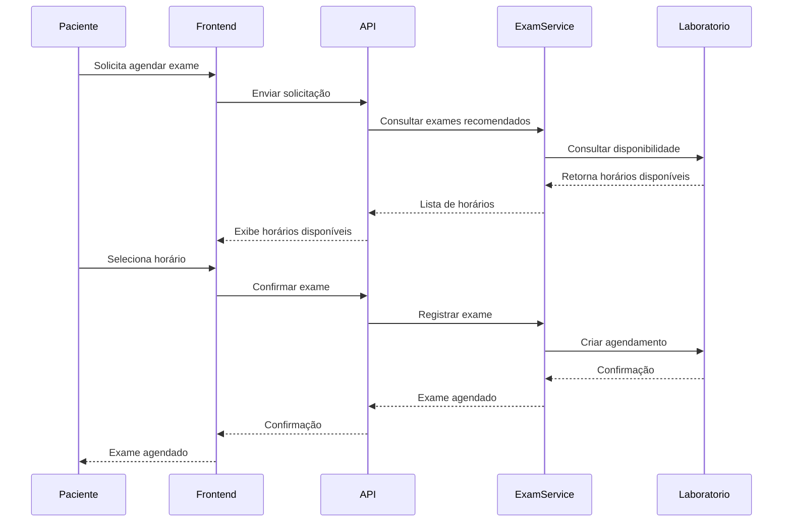
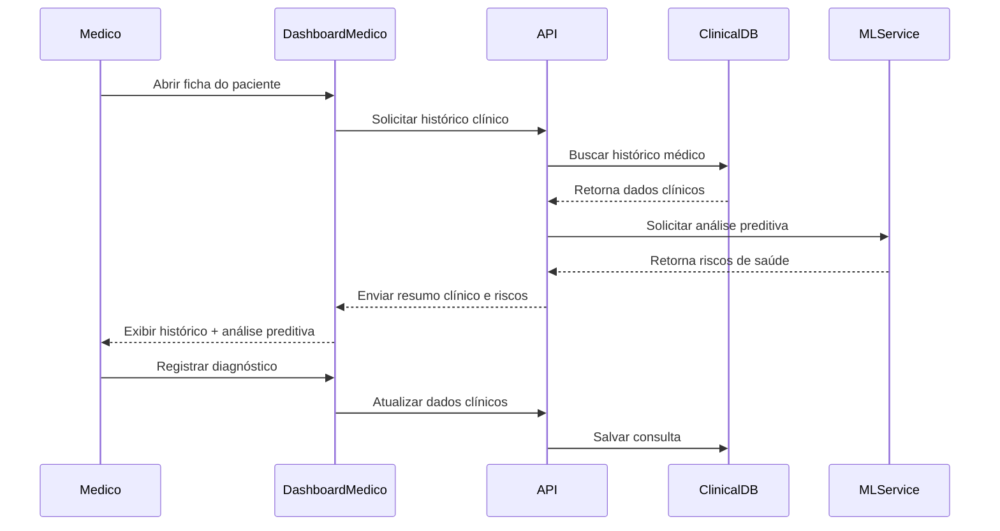
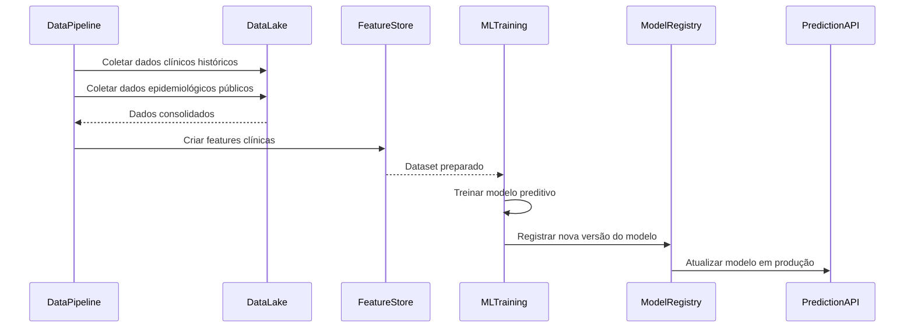

# 🧠 Diagrama de Sequência — CarePredict (Versão Revisada)

Este documento descreve os principais fluxos de interação do sistema **CarePredict**, incluindo:

1. Análise preventiva com dados clínicos e epidemiológicos
2. Agendamento de consulta
3. Agendamento de exames
4. Consulta médica com apoio da IA
5. Pipeline de treinamento do modelo de Machine Learning

---

# 1️⃣ Análise de risco e geração de recomendações

Fluxo central do sistema.  
O modelo utiliza **dados clínicos do paciente + dados epidemiológicos populacionais** para prever riscos e gerar recomendações preventivas.

```mermaid
sequenceDiagram

participant Paciente
participant Frontend
participant API
participant ClinicalDB
participant PopulationData
participant MLService
participant RiskEngine
participant ClinicalGuidelines
participant RecommendationEngine

Paciente->>Frontend: Acessa dashboard de saúde
Frontend->>API: Solicita análise preventiva

API->>ClinicalDB: Buscar histórico clínico do paciente
ClinicalDB-->>API: Retorna dados clínicos

API->>PopulationData: Buscar dados epidemiológicos
PopulationData-->>API: Retorna indicadores populacionais

API->>MLService: Enviar dados clínicos + populacionais
MLService->>MLService: Executar modelo preditivo

MLService-->>RiskEngine: Retorna probabilidades de risco

RiskEngine->>ClinicalGuidelines: Consultar protocolos médicos
ClinicalGuidelines-->>RiskEngine: Regras clínicas

RiskEngine->>RecommendationEngine: Gerar recomendações preventivas
RecommendationEngine-->>API: Lista de exames e consultas sugeridos

API-->>Frontend: Retorna recomendações
Frontend-->>Paciente: Exibe recomendações preventivas
````

---

# 2️⃣ Agendamento de consulta

Fluxo onde o paciente agenda uma consulta médica com base em recomendações do sistema ou iniciativa própria.

```mermaid
sequenceDiagram

participant Paciente
participant Frontend
participant API
participant SchedulingService
participant AgendaExterna

Paciente->>Frontend: Solicita agendar consulta
Frontend->>API: Enviar pedido de agendamento

API->>SchedulingService: Solicitar horários disponíveis
SchedulingService->>AgendaExterna: Consultar agenda médica

AgendaExterna-->>SchedulingService: Retorna horários disponíveis
SchedulingService-->>API: Lista de horários

API-->>Frontend: Exibir horários disponíveis

Paciente->>Frontend: Seleciona horário
Frontend->>API: Confirmar agendamento

API->>SchedulingService: Criar agendamento
SchedulingService->>AgendaExterna: Registrar consulta

AgendaExterna-->>SchedulingService: Confirma agendamento
SchedulingService-->>API: Agendamento confirmado

API-->>Frontend: Confirmação
Frontend-->>Paciente: Consulta agendada
```

---

# 3️⃣ Agendamento de exames preventivos

Fluxo semelhante ao agendamento de consulta, porém voltado para exames recomendados pelo CarePredict.



---

# 4️⃣ Consulta médica com apoio da IA

Fluxo onde o médico recebe suporte analítico durante a consulta, incluindo riscos preditivos calculados pelo sistema.



---

# 5️⃣ Treinamento e atualização do modelo de Machine Learning

Fluxo interno responsável por atualizar continuamente os modelos preditivos.



---

# 🧠 Observação importante

O CarePredict utiliza **dois tipos de dados para análise preditiva**:

### Dados clínicos individuais

* histórico médico
* exames
* consultas
* diagnósticos

### Dados populacionais públicos

* indicadores epidemiológicos
* incidência de doenças
* fatores demográficos

Essas informações combinadas permitem gerar **modelos mais robustos de medicina preventiva**.