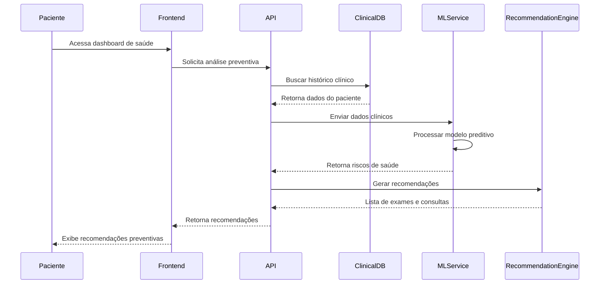
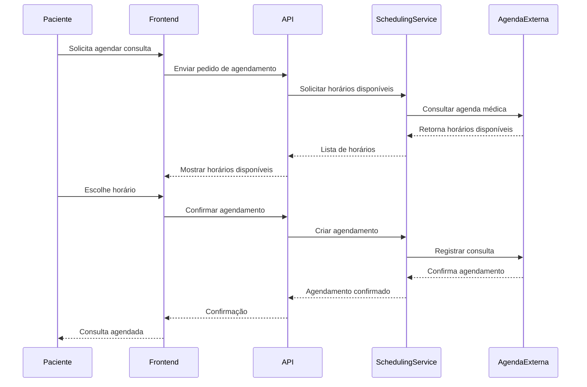
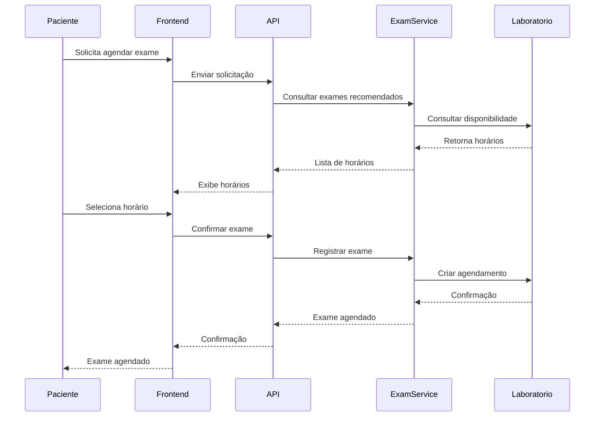
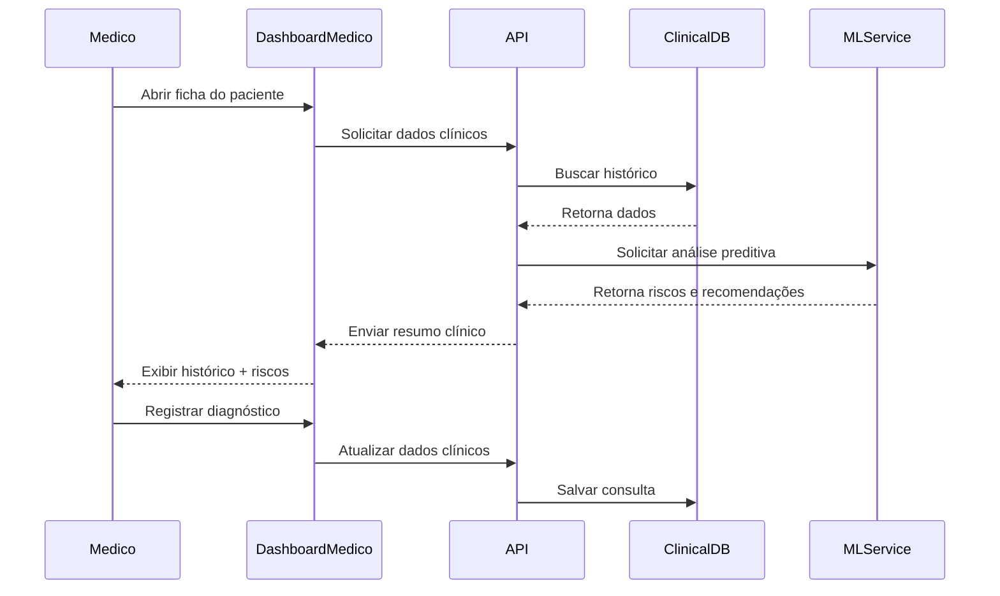
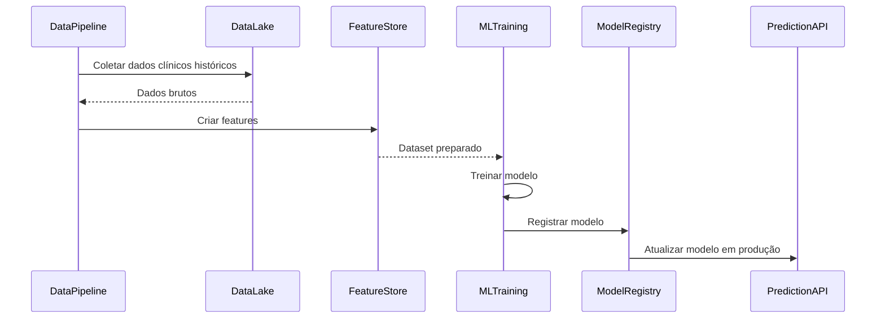

# 1️⃣ Análise de risco e geração de recomendações

Esse é o **fluxo central do CarePredict**, onde o ML analisa os dados do paciente.

---

# 2️⃣ Agendamento de consulta

Fluxo onde o paciente agenda consulta recomendada.

---

# 3️⃣ Agendamento de exames preventivos

Fluxo semelhante ao anterior, mas com exames.

---

# 4️⃣ Consulta médica com apoio da IA

Fluxo que ajuda na **anamnese do médico**.

---

# 5️⃣ Treinamento e atualização do modelo de Machine Learning

Fluxo interno de **treinamento do modelo**.

