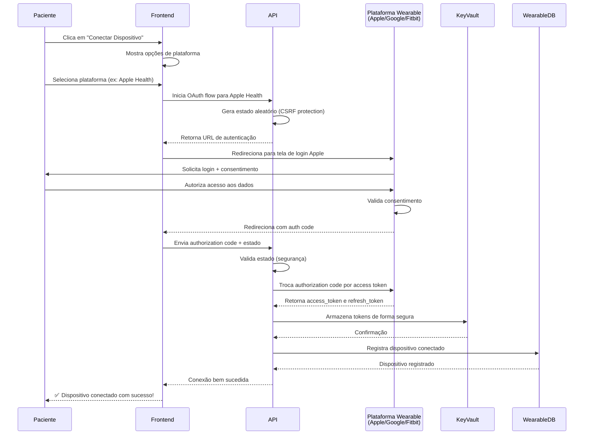
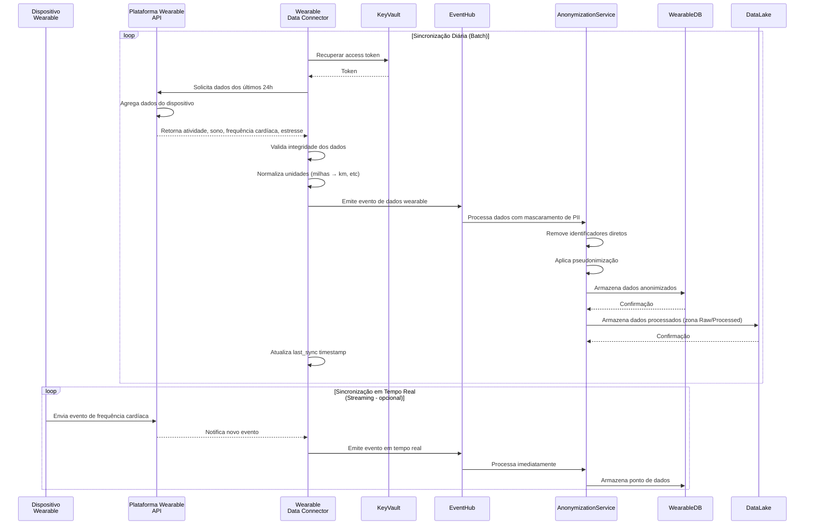
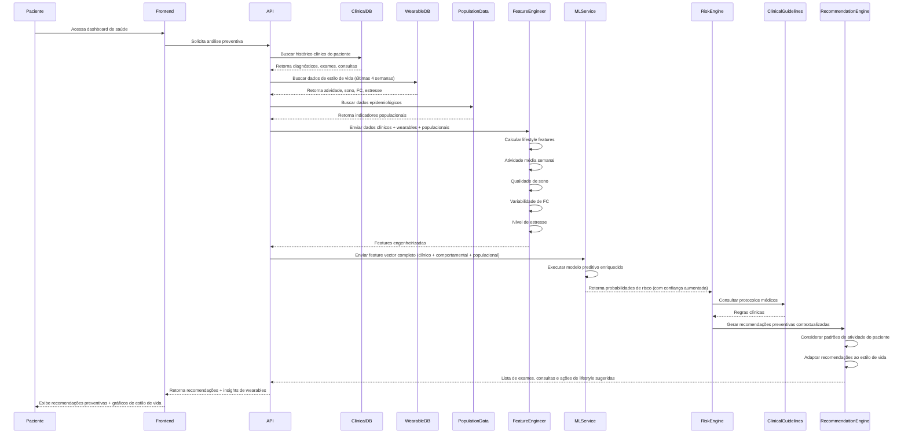
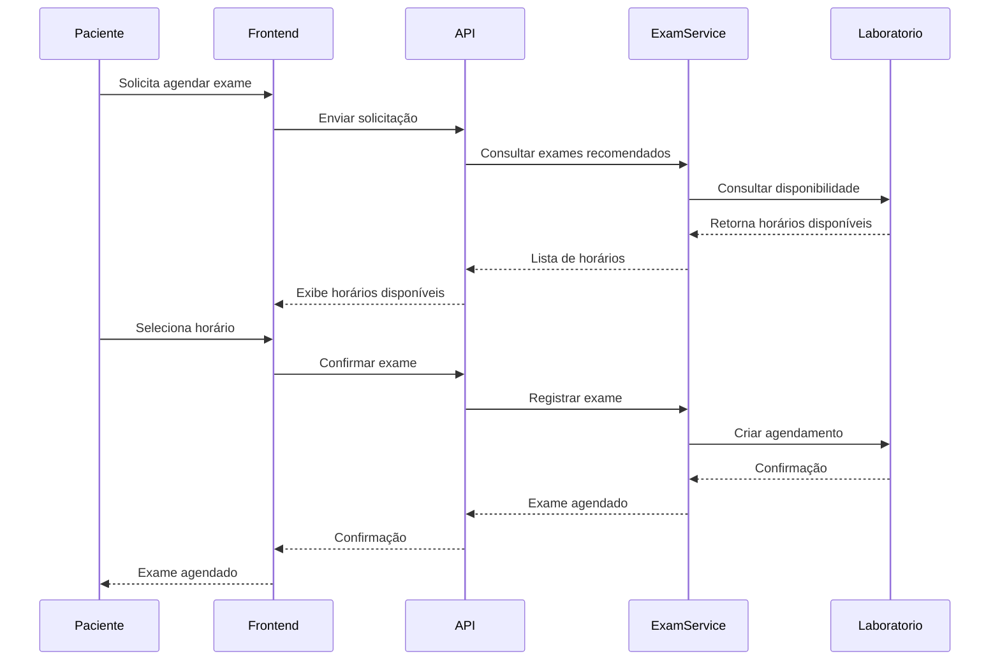
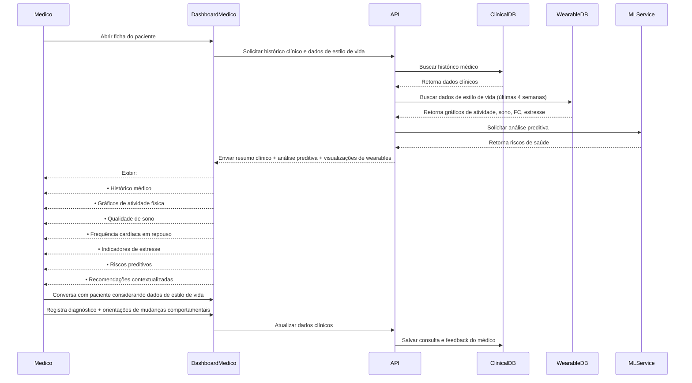
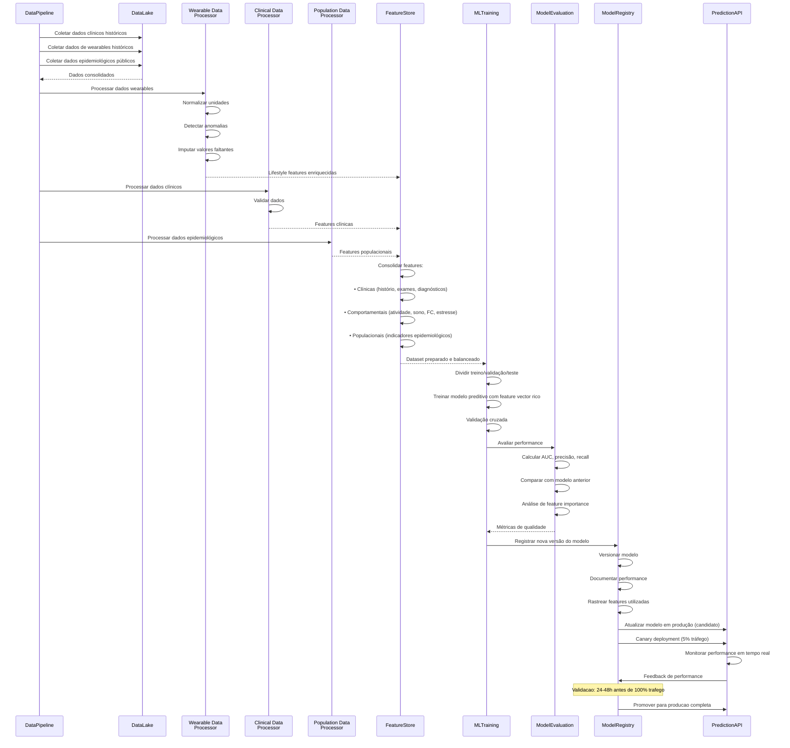

# 🧠 Diagrama de Sequência — CarePredict (Versão Revisada)

Este documento descreve os principais fluxos de interação do sistema **CarePredict**, incluindo:

1. Integração com Dispositivos Wearables
2. Sincronização de dados wearables
3. Análise preventiva com dados clínicos, epidemiológicos e wearables
4. Agendamento de consulta
5. Agendamento de exames
6. Consulta médica com apoio da IA
7. Pipeline de treinamento do modelo de Machine Learning

---

# 1️⃣ Conexão com Dispositivo Wearable (OAuth 2.0)

Fluxo de autenticação e autorização para conectar um dispositivo wearable (Apple Watch, Fitbit, Google Fit) ao sistema.

---

# 2️⃣ Sincronização de Dados Wearables

Fluxo de coleta e sincronização de dados contínuos do dispositivo wearable.

---

# 3️⃣ Análise de Risco com Integração de Wearables

Fluxo central do sistema.  
O modelo utiliza **dados clínicos do paciente + dados epidemiológicos populacionais + dados contínuos de wearables** para prever riscos e gerar recomendações preventivas.

---

# 4️⃣ Agendamento de consulta

Fluxo onde o paciente agenda uma consulta médica com base em recomendações do sistema ou iniciativa própria.

---

# 5️⃣ Agendamento de exames preventivos

Fluxo semelhante ao agendamento de consulta, porém voltado para exames recomendados pelo CarePredict.

---

# 6️⃣ Consulta médica com apoio da IA

Fluxo onde o médico recebe suporte analítico durante a consulta, incluindo riscos preditivos calculados pelo sistema.

---

# 7️⃣ Treinamento e atualização do modelo de Machine Learning

Fluxo interno responsável por atualizar continuamente os modelos preditivos com dados clínicos, comportamentais e epidemiológicos.

---

# 🧠 Observação importante

O CarePredict utiliza **três tipos de dados para análise preditiva**:

### Dados clínicos individuais

* histórico médico
* exames
* consultas
* diagnósticos

### Dados comportamentais (Wearables)

* atividade física (passos, exercício)
* frequência cardíaca (repouso, máxima, variabilidade)
* qualidade de sono (duração, composição, coerência)
* nível de estresse e padrões de recuperação

**Importância:** Wearables fornecem uma **visão contínua e não-invasiva** do estilo de vida real do paciente, permitindo detecção de riscos **meses antes** de apresentarem sintomas clínicos.

### Dados populacionais públicos

* indicadores epidemiológicos
* incidência de doenças
* fatores demográficos

Essas informações combinadas permitem gerar **modelos muito mais robustos de medicina preventiva** com **precisão 15-25% superior** em relação a modelos que usam apenas dados clínicos.