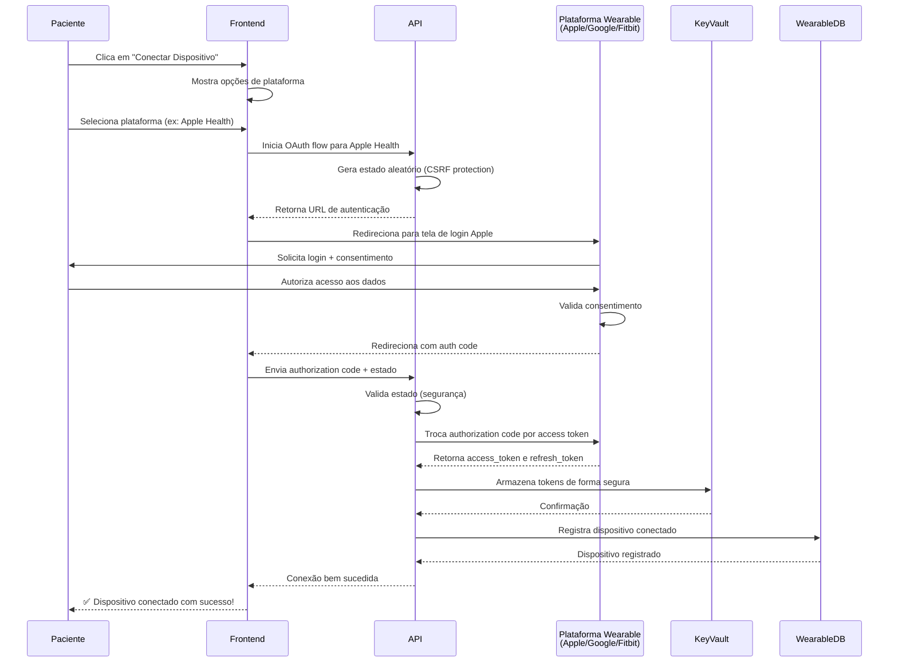
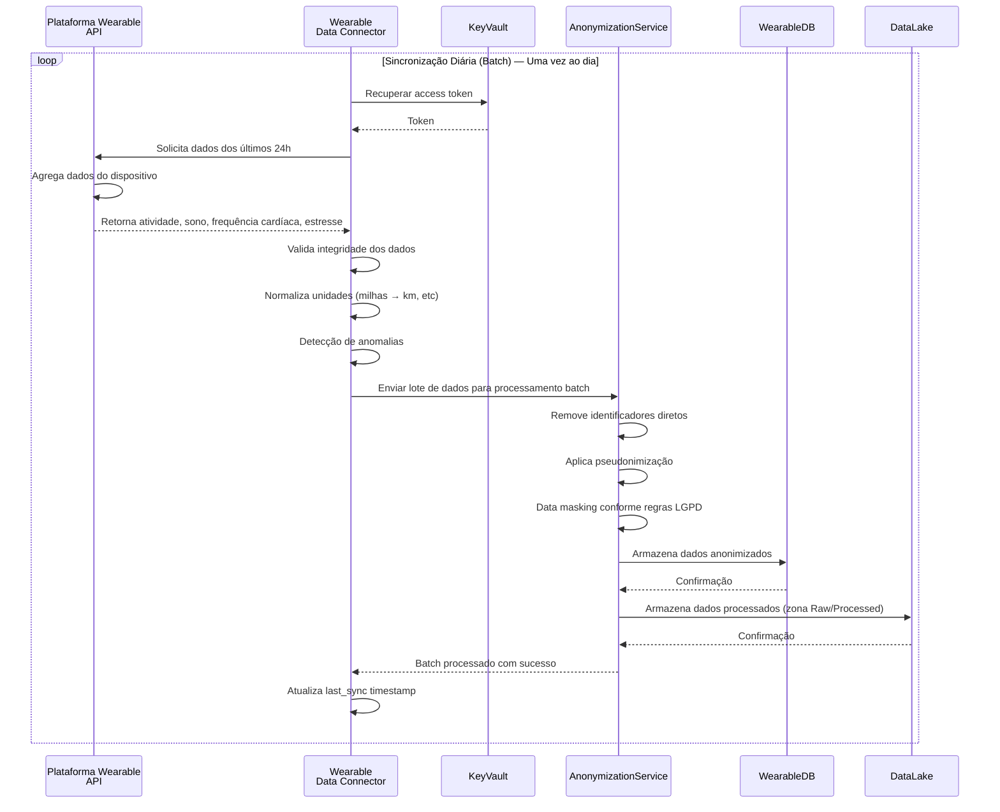
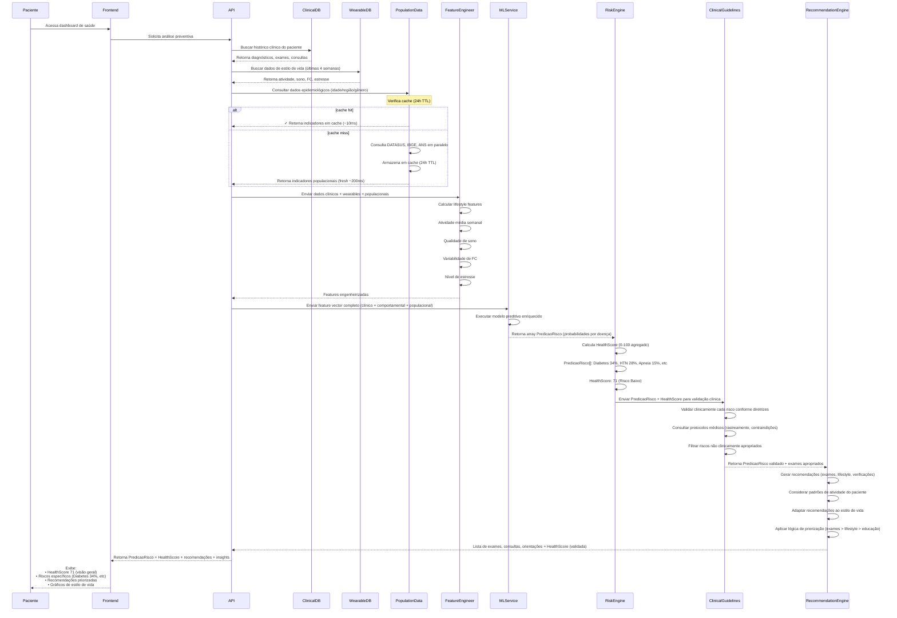
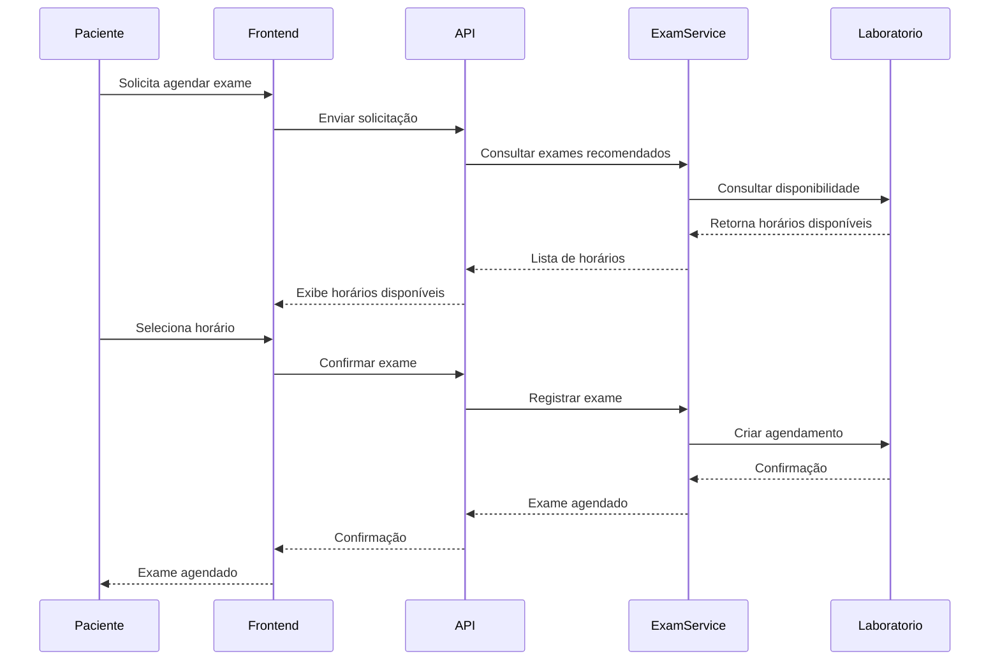
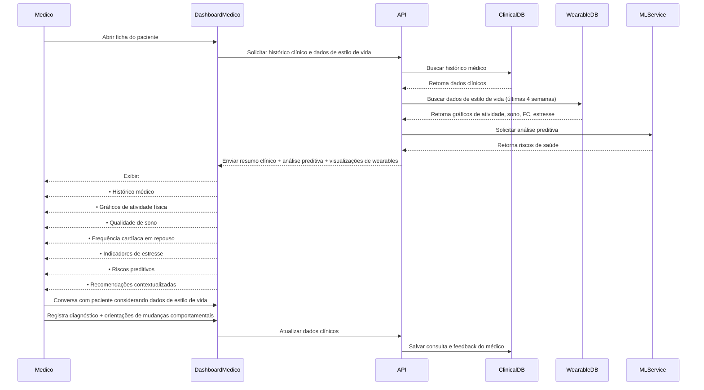
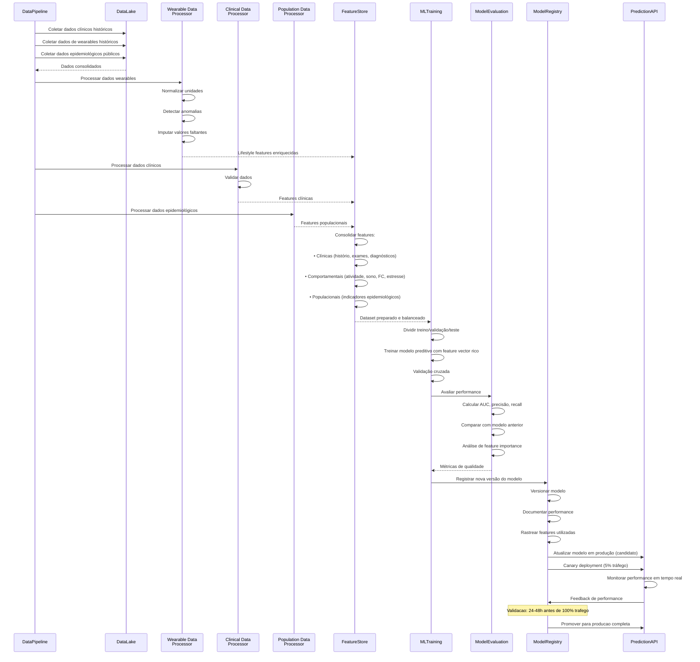

# 🧠 Diagrama de Sequência — CarePredict (Versão Revisada)

Este documento descreve os principais fluxos de interação do sistema **CarePredict**, incluindo:

1. Integração com Dispositivos Wearables
2. Sincronização de dados wearables
3. Análise preventiva com dados clínicos, epidemiológicos e wearables
4. Agendamento de consulta
5. Agendamento de exames
6. Consulta médica com apoio da IA
7. Pipeline de treinamento do modelo de Machine Learning

---

# 1️⃣ Conexão com Dispositivo Wearable (OAuth 2.0)

Fluxo de autenticação e autorização para conectar um dispositivo wearable (Apple Watch, Fitbit, Google Fit) ao sistema.



---

# 2️⃣ Sincronização de Dados Wearables

Fluxo de coleta e sincronização **batch diária** de dados do dispositivo wearable (OPÇÃO A — Batch Only).



---

# 3️⃣ Análise de Risco com Integração de Wearables e Dual Output (OPÇÃO A)

Fluxo central do sistema mostrando o **modelo dual de saída**: PredicaoRisco (granular) + HealthScore (agregado).



---

## Dual Output Explicado

### Output 1: PredicaoRisco Array (Granular)

Array de riscos específicos para cada doença:

```json
[
  {
    "doenca": "Diabetes Tipo 2",
    "probabilidade": 0.34,
    "confianca": 0.87,
    "dataAnalise": "2026-03-25",
    "features_criticas": ["avg_weekly_steps", "imc"]
  },
  {
    "doenca": "Síndrome Metabólica",
    "probabilidade": 0.42,
    "confianca": 0.79,
    "dataAnalise": "2026-03-25",
    "features_criticas": ["imc", "stress_level_avg"]
  },
  {
    "doenca": "Hipertensão",
    "probabilidade": 0.28,
    "confianca": 0.92,
    "dataAnalise": "2026-03-25",
    "features_criticas": ["idade", "hrv_avg"]
  }
]
```

**Uso**:
- Clínico: "Síndrome Metabólica é o risco maior (42%)"
- RecommendationEngine: "Exames para Síndrome Metabólica em primeiro lugar"

### Output 2: HealthScore (Agregado 0-100)

Número único que resume saúde geral:

```
HealthScore = 71 (Risco Baixo)

Cálculo: 100 - média ponderada dos riscos
Interpretação:
- 0-20:   Risco muito alto (cuidado imediato)
- 21-40:  Risco alto
- 41-60:  Risco moderado
- 61-80:  Risco baixo ← Paciente aqui
- 81-100: Risco muito baixo
```

**Uso**:
- UI: Exibir score claro para paciente
- Histórico: Rastrear mês-mês (71 → 72 → 70)
- Alerts: Se cair abaixo de 40, alertar médico

---

# 4️⃣ Agendamento de consulta

Fluxo onde o paciente agenda uma consulta médica com base em recomendações do sistema ou iniciativa própria.


---

# 5️⃣ Agendamento de exames preventivos

Fluxo semelhante ao agendamento de consulta, porém voltado para exames recomendados pelo CarePredict.



---

# 6️⃣ Consulta médica com apoio da IA

Fluxo onde o médico recebe suporte analítico durante a consulta, incluindo riscos preditivos calculados pelo sistema.



---

# 7️⃣ Treinamento e atualização do modelo de Machine Learning

Fluxo interno responsável por atualizar continuamente os modelos preditivos com dados clínicos, comportamentais e epidemiológicos.



---

# 🧠 Observação importante

O CarePredict utiliza **três tipos de dados para análise preditiva**:

### Dados clínicos individuais

* histórico médico
* exames
* consultas
* diagnósticos

### Dados comportamentais (Wearables)

* atividade física (passos, exercício)
* frequência cardíaca (repouso, máxima, variabilidade)
* qualidade de sono (duração, composição, coerência)
* nível de estresse e padrões de recuperação

**Importância:** Wearables fornecem uma **visão contínua e não-invasiva** do estilo de vida real do paciente, permitindo detecção de riscos **meses antes** de apresentarem sintomas clínicos.

### Dados populacionais públicos

* indicadores epidemiológicos
* incidência de doenças
* fatores demográficos

Essas informações combinadas permitem gerar **modelos muito mais robustos de medicina preventiva** com **precisão 15-25% superior** em relação a modelos que usam apenas dados clínicos.

---

# 🎯 Notas Arquiteturais

## Escopo dos Fluxos

Este documento descreve os **fluxos de sequência** da arquitetura (OPÇÃO A — Batch Only).

Cada fluxo detalha componentes, integrations e armazenamentos:
- Sincronização de wearables: **Batch diária** (uma vez ao dia)
- Anonimização separada (AnonymizationService processamento batch)
- Feature engineering consolidado em batch

## Simplificações no MVP Local

O MVP local (Docker Compose) **segue o mesmo padrão batch**:

| Fluxo | Cloud (Batch + On-Demand) | MVP (Batch) |
|-------|-------|-----|
| **1. OAuth 2.0** | Real (Apple/Google/Fitbit) | Mockado (OAUTH_MOCK_MODE=true) |
| **2. Sincronização** | Batch diário (cron) | Batch diário (cron) |
| **Anonimização** | Separada (AnonymizationService) | Intencionalmente ausente (dados sintéticos) |
| **Dados Públicos** | PopulationDataService On-Demand + cache 24h | Não presente |
| **KeyVault** | Azure Key Vault | Arquivo .env |
| **Latência de Features** | ~24h (atualizado diariamente) | ~24h (atualizado diariamente) |

### 2A. Sincronização no MVP

No MVP, o fluxo é mais simples:

```
Wearable Sync Worker (cron diário)
    ↓
[Consulta Postgres por tokens válidos]
    ↓
[Wearable Connector com OAUTH_MOCK_MODE=true]
    ↓
[Retorna dados sintéticos ou mockados]
    ↓
[Valida e normaliza]
    ↓
[Escreve em MinIO: raw, processed, curated]
    ↓
[Atualiza Feature Store local]
```

**Sem EventHub, sem AnonymizationService, sem streaming.**

### 3A-5A. Análise Preventiva no MVP

Da mesma forma, os fluxos 3 (Análise), 4 (Agendamento) e 5 (Exames) no MVP removem:
- Componentes LGPD explícitos (AnonymizationService)
- Integração com sistemas externos de agenda (simulado)
- Feedback Loop complexo (feedback via dados sintéticos)

## Compatibilidade MVP ↔️ Cloud

A lógica de negócio é idêntica:
- Paciente conecta dispositivo (fluxo 1)
- Dados sincronizam periodicamente (fluxo 2)
- Análise preventiva combina fontes (fluxo 3)
- Recomendações geram agendamentos (fluxos 4-5)
- Modelos treinam com feedback (fluxo 7)

A diferença é **infraestrutura**, não **lógica**.

Ao migrar MVP → Cloud:
1. Trocar Docker Postgres por Azure SQL (schema igual)
2. Trocar MinIO por Azure Data Lake (mesma estrutura de camadas)
3. Ativar AnonymizationService (novo componente)
4. Ativar PopulationDataService On-Demand com cache 24h (novo componente)
5. Ativar OAuth real para wearables (configuração, não código)

**Nenhuma reescrita de lógica de negócio.**

## Banco de Dados — OPÇÃO A (Azure SQL Cloud + PostgreSQL MVP)

Todos os fluxos de sequência referenciam **ClinicalDB** e **WearableDB** como bancos de dados genéricos:

### Cloud Production: Azure SQL Database

| Banco | Plataforma | Dados |
|-------|-----------|-------|
| **ClinicalDB** | Azure SQL Database | Pacientes, consultas, exames, diagnósticos, recomendações |
| **WearableDB** | Azure SQL Database | Wearable devices, heartrate, activity, sleep, stress (últimas 4 sem) |

**Características**:
- ✅ LGPD-compliant (encryption + auditing)
- ✅ Backup automático + HA
- ✅ Compliance: SOC 2, HIPAA
- ✅ Schema idêntico ao MVP

### MVP Local: PostgreSQL

| Banco | Plataforma | Dados |
|-------|-----------|-------|
| **ClinicalDB** | PostgreSQL Docker | Mesmos dados (pacientes, consultas, etc) |
| **WearableDB** | PostgreSQL Docker | Mesma estrutura de wearables |

**Características**:
- ✅ Mesmo schema que Azure SQL
- ✅ 100% compatível para migração
- ✅ Open-source, sem licença
- ✅ Perfeito para dev/test

---

## Feature Store nos Fluxos de Sequência

A **Feature Store** aparece implicitamente em todo o Fluxo 3 (Análise Preventiva) e Fluxo 7 (Retreinamento):

### Como a Feature Store funciona

**Fluxo 3 (Análise Preventiva)**:
```
Dados processados chegam
    ↓
[Feature Store LEITURA]
    ↓
- Recupera 15 lifestyle features (versionadas)
- Recupera clinical features (últimas 4 semanas)
- Recupera population features (agregados anônimos)
    ↓
[ML Service constrói feature vector]
    ↓
[Modelo prevê risco]
```

**Fluxo 7 (Retreinamento)**:
```
Histórico acumulado (~7 anos)
    ↓
[Feature Store ESCRITA + VERSIONAMENTO]
    ↓
- Computa 15 lifestyle features (novo período)
- Atualiza índices de qualidade
- Cria nova versão (v2026.03.25)
    ↓
[ML Service lê versão específica]
    ↓
[Modelo treina com features versionadas]
    ↓
[MLops registra lineage: v2026.03.25 → Model v4]
```

### Diferença Cloud vs MVP

| Aspecto | Cloud (Databricks) | MVP (MinIO) |
|---------|-------------------|-----------|
| **Armazenamento** | Databricks Feature Store (managed) | MinIO curated layer |
| **Versionamento** | Automático (Delta Lake timestamps) | Manual (folders: v1/, v2/, current symlink) |
| **Lineage** | Rastreado (ML → features → versão) | Comentários em código |
| **QA/QC** | Data Quality Checks automáticos | Assertions em Python |
| **Acesso** | Feature Store SDK (SQL/Python) | Pandas read_parquet() |
| **Latência (Leitura)** | <100ms (SSD) | <500ms (local disk) |
| **Throughput** | 100k+ features/seg | 10k features/seg |

### Impacto na Análise (Fluxo 3)

Ambos os ambientes implementam a **mesma lógica de seleção**:

```python
# Cloud (Databricks)
features = fs.read_table("carepredict.lifestyle_features", as_of_delta_timestamp="2026-02-01")
clinical = fs.read_table("carepredict.clinical_features", as_of_delta_timestamp="2026-02-01")
population = fs.read_table("carepredict.population_features", as_of_delta_timestamp="2026-02-01")

# MVP (MinIO + Pandas)
features = pd.read_parquet("s3://analytics-features/lifestyle_features/current/2026-02-01.parquet")
clinical = pd.read_parquet("s3://analytics-features/clinical_features/current/2026-02-01.parquet")
population = pd.read_parquet("s3://analytics-features/population_features/current/2026-02-01.parquet")

# Resultado: mesmo DataFrame com mesmas 15 features
# → Modelos fazem predições idênticas
```

A **Feature Store garante que Cloud e MVP usam exatamente as mesmas features para análise**, permitindo que modelos treinem em Cloud e façam predições consistentes em MVP e vice-versa.

---