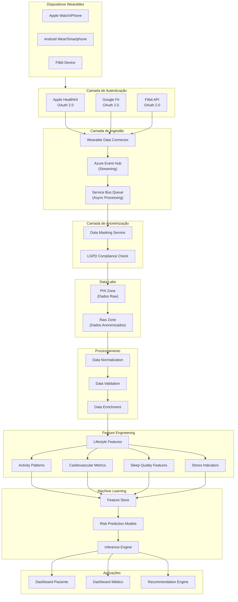

# 📱 Integração com Dispositivos Wearables — CarePredict

## Visão Geral

Este documento descreve a estratégia de integração com dispositivos wearables no CarePredict para capturar dados contínuos do estilo de vida (atividade física, frequência cardíaca, sono, estresse) e enriquecer os modelos preditivos de risco.

---

## Objetivos

- Capturar dados contínuos de dispositivos wearables (smartwatch, pulseiras de atividade, anéis inteligentes)
- Integrar dados comportamentais ao pipeline de feature engineering
- Aprimorar a precisão dos modelos preditivos com informações do estilo de vida
- Manter conformidade com LGPD e segurança de dados de saúde
- Suportar múltiplas plataformas (Apple Health, Google Fit, Fitbit API, Garmin Connect)

---

## Dispositivos e Plataformas Suportadas

### Fase 1 (MVP)

| Plataforma | Dispositivos | Dados Coletados |
|-----------|-----------|-------------------|
| **Apple Health** | Apple Watch, iPhone | Passos, VO2Max, Frequência Cardíaca, Sono, Exercício |
| **Google Fit** | Android Wear, Smartphones | Passos, Calorias, Frequência Cardíaca, Atividades |
| **Fitbit API** | Fitbit/Fitbit Sense | Passos, Monitores de sono, Frequência Cardíaca, Exercícios |

### Fase 2 (Expansão)

- **Garmin Connect** — Relógios Garmin
- **Oura Ring** — Dados biométricos avançados
- **Whoop** — Análise de recuperação e treino

---

## Arquitetura de Integração



---

## Fluxo de Dados

### 1️⃣ Autenticação e Autorização

**Fluxo OAuth 2.0:**

```
Paciente → CarePredict App → Plataforma Wearable
                            ↓
                     Tela de Autenticação
                            ↓
                    Consentimento de Acesso
                            ↓
                    Retorno de Access Token
                            ↓
                   Armazenamento Seguro em Vault
```

### 2️⃣ Coleta de Dados

**Em Tempo Real (Streaming):**
- Eventos de frequência cardíaca, GPS
- Alertas de anomalias
- Mudanças de status de atividade

**Batch (Diário/Horário):**
- Resumo de passos do dia
- Dados de sono
- Calorias queimadas
- Resumo de exercícios

### 3️⃣ Ingestão e Anonimização

```python
# Pseudocódigo
1. receive_wearable_data(patient_id, access_token)
2. fetch_data_from_api(access_token)
3. validate_data_integrity()
4. anonymize_pii(data)
5. store_in_data_lake(raw_zone)
6. emit_event_to_processing_pipeline()
```

### 4️⃣ Processamento e Feature Engineering

**Normalização:**
- Converter unidades (milhas → km)
- Sincronizar timestamps
- Lidar com lacunas de dados

**Enriquecimento:**
- Calcular médias móveis
- Identificar padrões
- Detectar anomalias

**Feature Engineering:**
- Atividade média semanal
- Variabilidade da frequência cardíaca
- Coerência do sono
- Índices de estresse

### 5️⃣ Alimentar Modelos Preditivos

Features geradas alimentam os modelos de:
- Risco de hipertensão
- Risco de diabetes
- Risco cardiovascular
- Recomendações de prevenção

---

## Modelos de Dados

### Tabela: `wearable_devices`

```sql
CREATE TABLE wearable_devices (
    id UUID PRIMARY KEY DEFAULT uuid_generate_v4(),
    patient_id UUID NOT NULL REFERENCES pacientes(id),
    platform VARCHAR(50),  -- 'apple_health', 'google_fit', 'fitbit'
    device_type VARCHAR(100),  -- 'Apple Watch', 'Fitbit Sense', etc
    access_token_vault_key VARCHAR(255),  -- Referência segura ao Azure Key Vault
    refresh_token_vault_key VARCHAR(255),
    token_expiry TIMESTAMP,
    last_sync TIMESTAMP,
    is_active BOOLEAN DEFAULT true,
    created_at TIMESTAMP DEFAULT CURRENT_TIMESTAMP,
    updated_at TIMESTAMP DEFAULT CURRENT_TIMESTAMP
);
```

### Tabela: `wearable_heartrate`

```sql
CREATE TABLE wearable_heartrate (
    id UUID PRIMARY KEY DEFAULT uuid_generate_v4(),
    patient_id UUID NOT NULL REFERENCES pacientes(id),
    timestamp TIMESTAMP NOT NULL,
    heart_rate INT,  -- BPM
    heart_rate_variability FLOAT,  -- Variabilidade da FC
    resting_heart_rate INT,  -- FC em repouso
    source_platform VARCHAR(50),
    data_quality_score FLOAT,  -- 0-1
    created_at TIMESTAMP DEFAULT CURRENT_TIMESTAMP,
    INDEX idx_patient_timestamp (patient_id, timestamp)
);
```

### Tabela: `wearable_activity`

```sql
CREATE TABLE wearable_activity (
    id UUID PRIMARY KEY DEFAULT uuid_generate_v4(),
    patient_id UUID NOT NULL REFERENCES pacientes(id),
    date DATE NOT NULL,
    steps INT,
    distance_km FLOAT,
    active_minutes INT,
    calories_burned FLOAT,
    exercise_duration_minutes INT,
    activity_type VARCHAR(100),  -- 'walking', 'running', 'cycling', etc
    intensity_level VARCHAR(20),  -- 'light', 'moderate', 'vigorous'
    source_platform VARCHAR(50),
    created_at TIMESTAMP DEFAULT CURRENT_TIMESTAMP,
    INDEX idx_patient_date (patient_id, date)
);
```

### Tabela: `wearable_sleep`

```sql
CREATE TABLE wearable_sleep (
    id UUID PRIMARY KEY DEFAULT uuid_generate_v4(),
    patient_id UUID NOT NULL REFERENCES pacientes(id),
    date DATE NOT NULL,
    sleep_start TIMESTAMP,
    sleep_end TIMESTAMP,
    total_sleep_minutes INT,
    deep_sleep_minutes INT,
    light_sleep_minutes INT,
    rem_sleep_minutes INT,
    sleep_score INT,  -- 0-100
    awakenings INT,
    source_platform VARCHAR(50),
    created_at TIMESTAMP DEFAULT CURRENT_TIMESTAMP,
    INDEX idx_patient_date (patient_id, date)
);
```

### Tabela: `wearable_stress`

```sql
CREATE TABLE wearable_stress (
    id UUID PRIMARY KEY DEFAULT uuid_generate_v4(),
    patient_id UUID NOT NULL REFERENCES pacientes(id),
    timestamp TIMESTAMP NOT NULL,
    stress_level INT,  -- 0-100
    stress_category VARCHAR(20),  -- 'low', 'medium', 'high'
    hrv_indicator FLOAT,  -- Heart Rate Variability
    recovery_time_minutes INT,
    source_platform VARCHAR(50),
    created_at TIMESTAMP DEFAULT CURRENT_TIMESTAMP,
    INDEX idx_patient_timestamp (patient_id, timestamp)
);
```

---

## APIs de Integração Wearable

### Endpoints Principais

#### 1. Conectar Dispositivo

```http
POST /api/v1/wearables/connect
Content-Type: application/json

{
  "platform": "apple_health",
  "authorization_code": "ABC123XYZ",
  "consent": true
}

Response:
{
  "device_id": "uuid",
  "platform": "apple_health",
  "status": "connected",
  "connected_at": "2026-03-18T10:30:00Z"
}
```

#### 2. Sincronizar Dados Wearable

```http
POST /api/v1/wearables/sync/{device_id}

Response:
{
  "device_id": "uuid",
  "last_sync": "2026-03-18T10:30:00Z",
  "data_points": 1250,
  "sync_status": "success"
}
```

#### 3. Obter Dados de Atividade (últimos 30 dias)

```http
GET /api/v1/wearables/activity?patient_id={id}&days=30

Response:
{
  "data": [
    {
      "date": "2026-03-18",
      "steps": 8432,
      "active_minutes": 45,
      "calories_burned": 520,
      "exercise_duration": 30,
      "activity_type": "gym_workout"
    }
  ],
  "summary": {
    "avg_daily_steps": 7890,
    "avg_active_minutes": 42,
    "total_exercise_hours": 22
  }
}
```

#### 4. Obter Dados de Sono

```http
GET /api/v1/wearables/sleep?patient_id={id}&days=30

Response:
{
  "data": [
    {
      "date": "2026-03-18",
      "total_sleep_minutes": 420,
      "deep_sleep_percentage": 15,
      "rem_sleep_percentage": 20,
      "sleep_score": 78,
      "awakenings": 2
    }
  ],
  "summary": {
    "avg_sleep_duration": 405,
    "sleep_consistency_score": 82,
    "trend": "improving"
  }
}
```

#### 5. Obter Dados de Frequência Cardíaca

```http
GET /api/v1/wearables/heartrate?patient_id={id}&days=7

Response:
{
  "data": [
    {
      "timestamp": "2026-03-18T14:30:00Z",
      "heart_rate": 72,
      "heart_rate_variability": 45.2,
      "resting_heart_rate": 58
    }
  ],
  "summary": {
    "avg_heart_rate": 68,
    "resting_heart_rate": 58,
    "max_heart_rate": 142,
    "hrv_trend": "stable"
  }
}
```

#### 6. Desconectar Dispositivo

```http
DELETE /api/v1/wearables/{device_id}

Response:
{
  "device_id": "uuid",
  "status": "disconnected",
  "data_retained": true
}
```

---

## Recursos de Estilo de Vida (Lifestyle Features)

### Dimensões de Dados

| Dimensão | Métricas | Relevância Clínica |
|----------|----------|-------------------|
| **Atividade Física** | Passos, duração de exercício, intensidade | Prevenção de obesidade, saúde cardiovascular |
| **Frequência Cardíaca** | FC média, FC em repouso, variabilidade | Saúde cardiovascular, estresse |
| **Sono** | Duração, qualidade, coerência | Metabolismo, imunidade, saúde mental |
| **Estresse** | Nível de estresse, VFC, tempo de recuperação | Saúde mental, doenças psicossomáticas |
| **Padrões Comportamentais** | Consistência de exercício, regularidade de sono | Aderência ao estilo de vida |

### Exemplos de Features Engenheiradas

```python
# Atividade
avg_weekly_steps = mean(steps_last_7_days)
active_days_ratio = count(days_with_activity > 30min) / 7
exercise_consistency = std(daily_active_minutes)
activity_trend = linear_regression(steps_last_30_days).slope

# Frequência Cardíaca
resting_heart_rate_trend = mean(rhr_last_7_days)
heart_rate_variability_low_risk = 1 if hrv > 30 else 0
max_heart_rate_capacity = percentile_95(heart_rate)

# Sono
avg_sleep_duration = mean(sleep_duration_last_30_days)
sleep_quality_score = (deep_sleep% + rem_sleep%) / 2
sleep_consistency = std(sleep_start_times)
insomnia_flag = 1 if awakenings > 4 else 0

# Estresse
stress_level_avg = mean(stress_last_7_days)
stress_variability = std(stress_scores)
recovery_days = count(hrv_above_baseline) / 7
burnout_risk = 1 if stress_avg > 70 and sleep_quality < 50 else 0
```

---

## Segurança e Conformidade

### LGPD - Lei Geral de Proteção de Dados

✅ **Consentimento Explícito**
- Usuário autoriza explicitamente via OAuth 2.0
- Consentimento registrado com timestamp
- Histórico auditável

✅ **Dados Sensíveis**
- Dados de saúde classificados como PHI (Protected Health Information)
- Armazenados em zona isolada (PHI Zone) do Data Lake
- Criptografia em repouso (AES-256) e em trânsito (TLS 1.3)

✅ **Anonimização**
- Identificadores médicos removidos após anonimização
- Token de paciente única via UUID
- Dados contextuais (datas, faixas etárias) generalizados

✅ **Direito ao Esquecimento**
- Exclusão de dados em cascata
- Conformidade com direito de retratação
- Log de exclusão para auditoria

### Segurança de Credenciais

```python
# Armazenamento seguro em Azure Key Vault
class WearableAuthManager:
    def store_token(self, patient_id: str, platform: str, access_token: str):
        """Armazena token no Azure Key Vault"""
        key_name = f"wearable-{platform}-{patient_id}"
        self.key_vault_client.set_secret(key_name, access_token)
        # Retorna referência, não o token
        return f"vault://{key_name}"
    
    def get_token(self, vault_key: str) -> str:
        """Recupera token do vault apenas quando necessário"""
        return self.key_vault_client.get_secret(vault_key)
    
    def revoke_token(self, vault_key: str):
        """Revoga access token na plataforma wearable"""
        token = self.get_token(vault_key)
        platform_api.revoke_auth(token)
        self.key_vault_client.delete_secret(vault_key)
```

---

## Implementação por Fase

### Fase 1 - MVP (3 semanas)

- [ ] Estrutura de dados (tabelas)
- [ ] Integração OAuth com Apple Health e Google Fit
- [ ] APIs de conexão e sincronização
- [ ] Processamento básico (normalização e armazenamento)
- [ ] 5 features de estilo de vida

### Fase 2 - Expansão (2-3 semanas)

- [ ] Integração Fitbit
- [ ] Feature engineering avançado
- [ ] Monitoramento de qualidade de dados
- [ ] Dashboard de dados wearables no portal do paciente

### Fase 3 - Otimização (2 semanas)

- [ ] Integração com modelos preditivos
- [ ] Recomendações personalizadas baseadas em wearables
- [ ] Alertas de anomalias
- [ ] Análise de impacto nos modelos

---

## Dependências e Bibliotecas

### Python

```
requests-oauthlib==1.3.0  # OAuth 2.0
apple-health-api==0.1.0   # Apple HealthKit API
google-auth-oauthlib==1.0.0
fitbit-api==0.3.0
pydantic==2.0.0           # Validação de dados
sqlalchemy==2.0.0         # ORM
python-dotenv==1.0.0
azure-keyvault-secrets    # Azure Key Vault
```

---

## Próximos Passos

1. Aprovar estratégia de integração com stakeholders
2. Criar chaves de API nas plataformas wearables
3. Implementar estrutura de dados
4. Desenvolver connectors OAuth
5. Testar pipeline end-to-end
6. Integrar com modelos preditivos

---

## Referências

- [Apple HealthKit Documentation](https://developer.apple.com/healthkit/)
- [Google Fit API](https://developers.google.com/fit)
- [Fitbit API Documentation](https://dev.fitbit.com/docs/)
- [LGPD - Lei Geral de Proteção de Dados](http://www.planalto.gov.br/ccivil_03/_ato2015-2018/2018/lei/l13709.htm)
- [Azure Key Vault Best Practices](https://learn.microsoft.com/en-us/azure/key-vault/general/best-practices)

