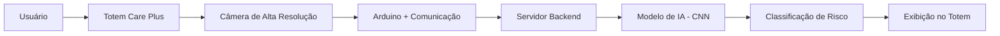
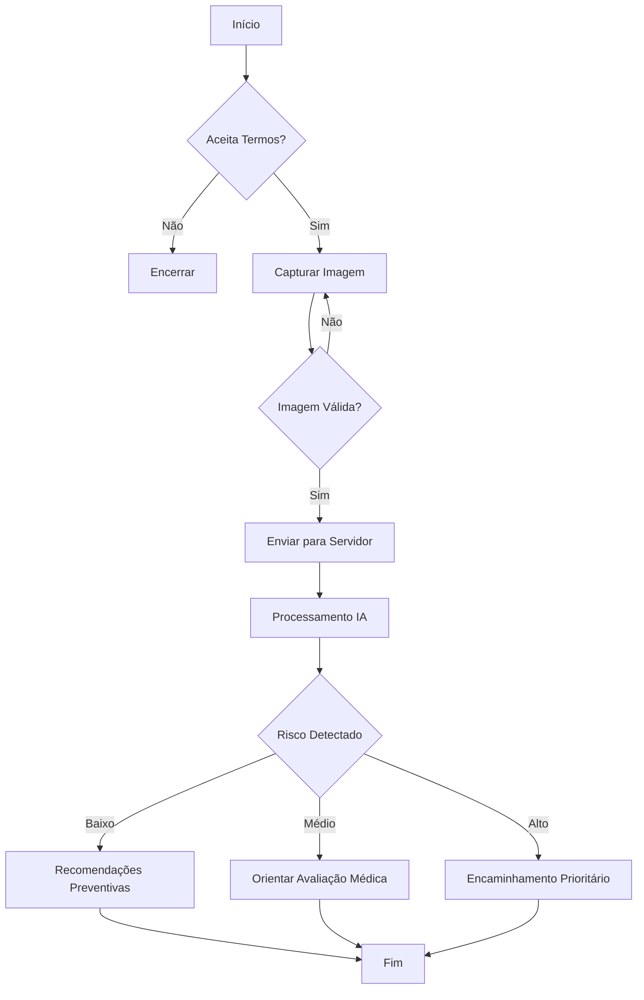

# 🩺 Care Plus

## Totem Inteligente para Triagem Dermatológica com IA

### Proposta Inicial de Projeto – FIAP

---

# 1️⃣ Contexto

O diagnóstico precoce de doenças de pele, especialmente câncer de pele, é um fator determinante para redução de mortalidade e custos de tratamento.

Entretanto:

* Falta de acompanhamento dermatológico regular
* Alto volume de pacientes em sistemas públicos
* Dificuldade de acesso a especialistas
* Baixa percepção de risco por parte da população

Existe uma oportunidade de aplicar **visão computacional e Machine Learning** para apoiar a triagem inicial.

---

# 2️⃣ Proposta

Desenvolver um **totem inteligente de autoatendimento**, capaz de:

* Capturar imagem da pele do usuário
* Enviar para processamento em servidor
* Classificar possíveis padrões dermatológicos
* Gerar orientação inicial automatizada

⚠️ O sistema não realiza diagnóstico médico — apenas triagem e orientação preventiva.

---

# 3️⃣ Visão Geral da Arquitetura

---

# 4️⃣ Fluxo de Funcionamento

---

# 5️⃣ Diferencial do Projeto

* Aplicação prática de IA em saúde preventiva
* Solução de baixo custo baseada em hardware acessível
* Escalável
* Pode ser adaptado para múltiplas aplicações médicas futuras
* Integração possível com sistemas hospitalares

---

# 6️⃣ Escopo Inicial (MVP)

Para início do projeto:

* Captura de imagem funcional
* Envio seguro para servidor
* Modelo treinado para classificação básica (ex: benigno vs suspeito)
* Interface simples no totem
* Registro opcional com consentimento
